# Motion Studio: what Claude can animate, what it is called, and how to ask for it

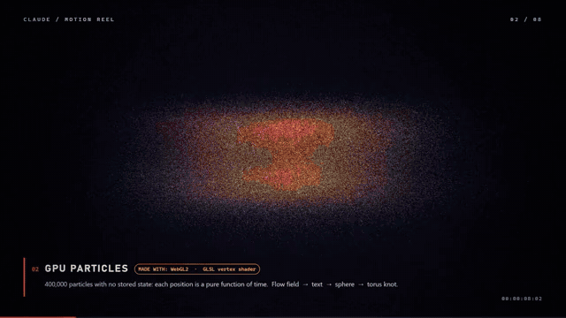

This repository is a complete, hands-on resource for motion design with Claude. It has three parts:

1. **Two motion reels** made entirely with code: the 60-second original (WebGL shaders, a Blender physics shot, a synthesized soundtrack, assembled with FFmpeg) and a 42-second second reel that cuts 29 clips of the second set to a synthesized beat.
2. **Motion Studio (`index.html`)**: one offline page that teaches the vocabulary of motion with live side-by-side demos, and runs every technique in a searchable catalog you can filter by kind (live, with sliders, clips) and by what it runs on. Most cards have sliders, and their prompt text updates as you move them.
3. **This README**: the tutorial and the cheat sheet in one place.

No stock footage, no templates and no AI video model were used. Every frame comes from code that Claude wrote, and all of that code is in this repository.

## Quick start

| I want to | Do this |
|---|---|
| See everything live | Open `index.html` in Chrome or Edge (works offline, no install) |
| Watch the reel | `media/reel/claude-motion-reel.mp4` (full-quality master: see Releases) |
| Watch the second reel | `media/reel/claude-motion-reel-2.mp4` (how it was cut: `source/reel2/README.md`) |
| Learn the words | Read the [tutorial](#tutorial) below, then the Learn part of `index.html` |
| Copy a prompt | Find the technique in the [catalog](#catalog) and copy its prompt |
| Write my own prompt | Use the [template](#cheat-sheet) or the Prompt builder in `index.html` |
| Rebuild anything | See [Reproduce](#reproduce) |

## Tutorial

### 1. How a video gets made

Claude does not paint pixels and does not generate video with an AI model. It writes a program or a scene file, a renderer runs that program once per frame, and FFmpeg joins the frames and the sound into a video file.

```
You describe it  ->  Claude writes code  ->  a renderer draws every frame  ->  FFmpeg makes the MP4
(length, look,       (shaders, Canvas,      (Chrome on the GPU,             (H.264, WebM,
 timing)              React, Python,         Blender, Remotion)               GIF, ProRes)
                      Blender scripts)
```

| Word | Meaning |
|---|---|
| Frame | One still picture. 60 seconds at 60 fps is 3,600 frames. |
| fps | Frames per second: 24 film, 30 web, 60 smooth UI and games. |
| Render | The computer drawing the frames. |
| Real-time vs offline | Real-time draws fast enough to watch live; offline takes as long as each frame needs and saves a file. |
| GPU vs CPU | The GPU draws millions of pixels or particles at once; the CPU does step-by-step work like physics and sound. |

### 2. Motion vocabulary

These are the words motion designers use. In `index.html` each one runs live, and most are shown twice: without the idea, and with it.

**Easing** is how speed changes during a move. All nine easings below start and end together:

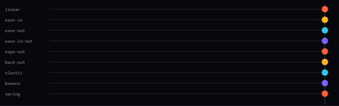

| Word | What it does | Say in a prompt |
|---|---|---|
| Linear | Constant speed, robotic | "linear scroll for the ticker" |
| Ease-in | Slow start, fast end (exits) | "ease-in exit" |
| Ease-out | Fast start, slow end (entrances) | "ease-out entrance, 400 ms" |
| Ease-in-out | Slow at both ends, calm | "smooth ease-in-out move" |
| Expo-out | Very fast start, long glide, snappy tech feel | "ease-out-expo" |
| Back / overshoot | Goes past the target and settles | "ease-out-back pop" |
| Elastic, bounce | Wobbles or bounces at the end | "small elastic settle" |
| Spring | Physics easing: stiffness and damping instead of duration | "spring, stiffness 300, damping 25" |

**The other principles**, each with a with-vs-without demo on the page:

| Word | Meaning | Say in a prompt |
|---|---|---|
| Timing | How long a move takes | "snappy timing, 250 ms moves" |
| Stagger | The same move on many items, offset in time | "stagger 40 ms from the center out" |
| Hold | A pause so people can read | "hold the title 1.5 s" |
| Squash and stretch | Flatten on impact, stretch at speed | "squash 40% on contact" |
| Anticipation and overshoot | Pull back before the move, pass the target after | "pull back, then shoot right and overshoot" |
| Follow-through and overlap | Loose parts keep moving after the body stops | "ribbons follow through when it stops" |
| Secondary motion | Small supporting moves: dust, wobble | "dust puff and a wobble on landing" |
| Arcs | Natural paths are curved | "move along an arc, not a straight line" |
| Beat sync | Changes land on the music beat (120 BPM = 0.5 s per beat) | "every cut lands on the beat at 120 BPM" |
| Seamless loop | The last frame flows into the first | "seamless 8 s loop" |
| Parallax | Near layers move faster than far ones | "three-layer parallax as the camera slides" |
| Staging | One clear action at a time; everything else calmer | "stage the hero: dim and still the background while it moves" |
| Exaggeration | Push a move past reality so it reads | "exaggerate the jump, a big stretch and a hard landing squash" |
| Pose to pose | Key poses first, then the frames between them | "block the key poses first, then ease the in-betweens" |
| Solid drawing | Shapes with volume, weight and perspective | "give it volume: three visible faces and a contact shadow" |

| Follow-through | Secondary motion | Arcs |
|---|---|---|
| 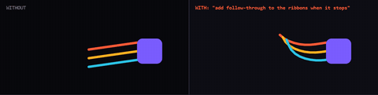 | 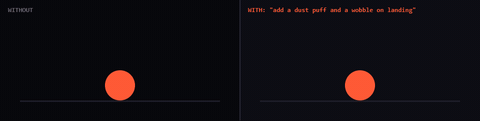 | 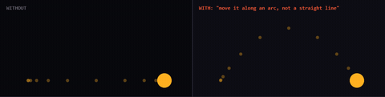 |

**Camera moves** (all 11 run in the page on the same scene): static, push-in, pull-out, orbit, pan, tilt, crane, whip pan, rack focus, camera shake, dolly zoom.
**Transitions** (11 in the page): hard cut, crossfade, dip to black, wipe, iris, push, zoom through, whip pan, glitch, blinds, match cut.
**Post effects** (toggle them on a reel frame in the page): bloom, film grain, vignette, chromatic aberration, color grade, depth of field, letterbox, scanlines.

| Camera orbit | Iris transition |
|---|---|
| 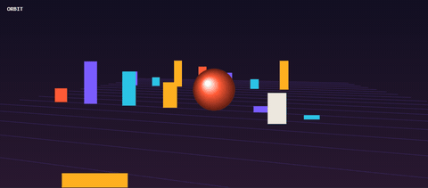 | 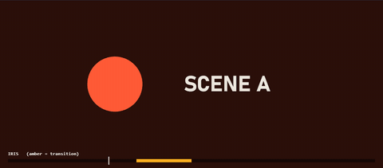 |

### 3. How to prompt for motion

A good motion prompt reads like a director's brief. These ten parts cover almost everything; the first five do most of the work.

1. **Deliverable**: length, resolution, fps, format, where to save.
2. **Purpose**: who watches and why.
3. **Look**: mood, palette (hex codes), fonts, references.
4. **Technique**: names from the catalog.
5. **Timeline**: what happens at which second.
6. **Motion feel**: easing, stagger, timing.
7. **Camera**: static, orbit, push-in, depth of field.
8. **Text on screen**: exact words and when.
9. **Sound**: none, synthesized, or your track with beat-synced cuts.
10. **Checks**: "show me test frames before the full render".

The "Your words, live" part of `index.html` lets you click prompt words and see the same title change:


**Mood to motion:**

| Mood | Ask for |
|---|---|
| Premium, calm | Long ease-in-out (1 to 1.5 s), blur-in, slow push-in, few colors, long holds |
| Energetic | Ease-out-expo, 200 to 300 ms moves, hard cuts on the beat, camera shake, glitch hits |
| Playful | Overshoot, elastic, squash and stretch, flat bright shapes |
| Technical | Mask reveals, monospace type, grids, typewriter text, cyan accents |
| Dreamy | Slow fades, domain-warped noise, glow, grain, pastel palette |
| Cinematic | Push-in or crane, depth of field, motion blur, letterbox, 24 fps |

**A full example**, played live in the page exactly as written:

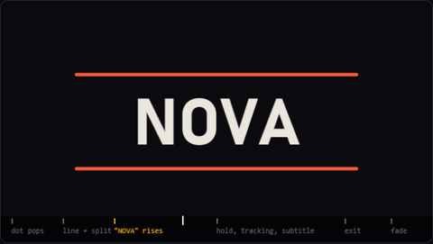

```
Make an 8-second 1080p60 logo reveal and save it to my desktop.
Look: dark background #0b0b10, coral #ff5a36 accent, Bahnschrift bold type.
Technique: shape layers and kinetic typography in Canvas 2D.
Timeline:
0.0-1.0 s  a coral dot pops in with ease-out-back
1.0-2.0 s  the dot stretches into a line, the line splits in two
2.0-4.0 s  "NOVA" rises through a mask, 45 ms stagger, ease-out-expo
4.0-6.5 s  hold, slow letter tracking, subtitle types on: "Launching March 3"
6.5-8.0 s  letters exit upward with stagger, fade to black
Post: light film grain, soft vignette.
Show me 6 test frames before the full render.
```

## Catalog

Every technique Claude made for this project. Click a name to open it live in `index.html` (open the file locally; links jump to the card). Highlights:

| Fluid simulation | Reaction-diffusion | Slime mold |
|---|---|---|
| 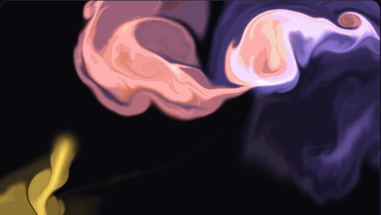 | 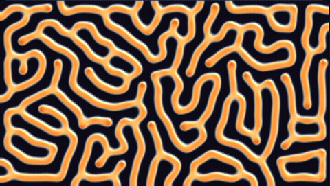 | 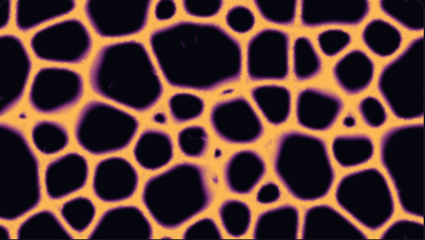 |
| **Black hole** | **Ocean** | **Isometric city** |
| 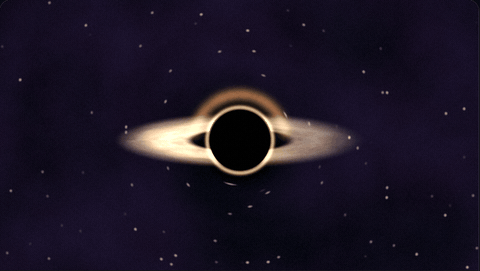 | 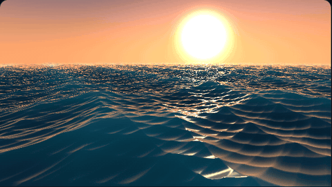 | 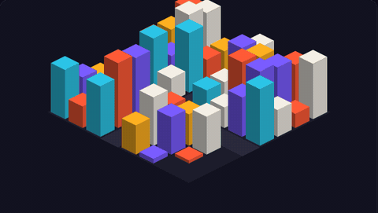 |
| **Particle text** | **Liquid type** | **Split-flap board** |
| 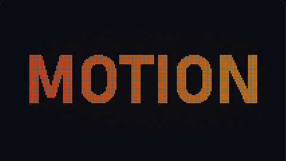 | 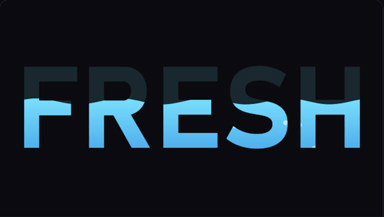 | 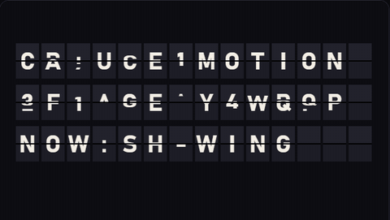 |
| **Soft-body blobs** | **Oscilloscope music** | **Like-button burst** |
|  | 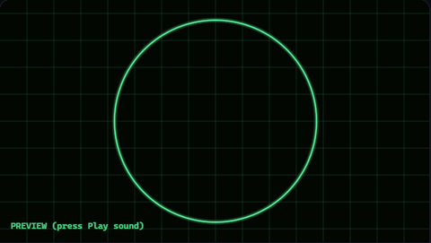 | 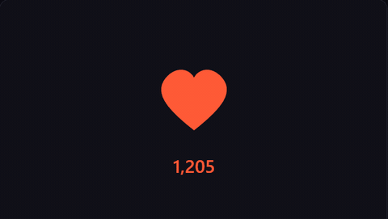 |
| **Blender liquid** | **Blender cloth** | **Unreal Niagara** |
| 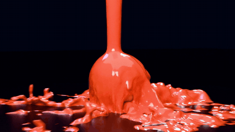 | 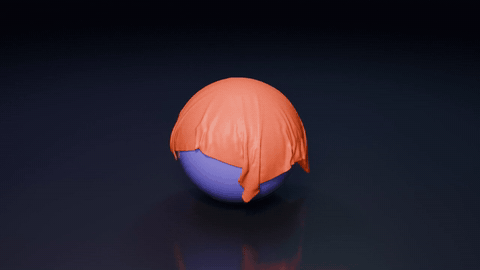 | 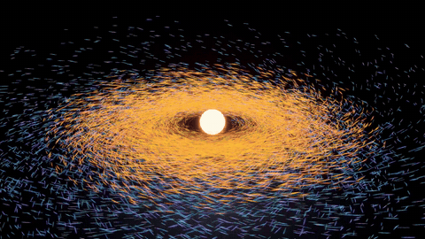 |
| **Blender shatter** | **Cycles photoreal** | **WebGPU, 1M particles** |
| 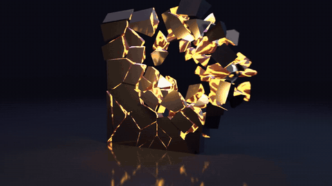 | 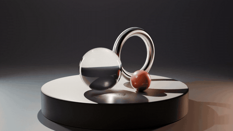 | 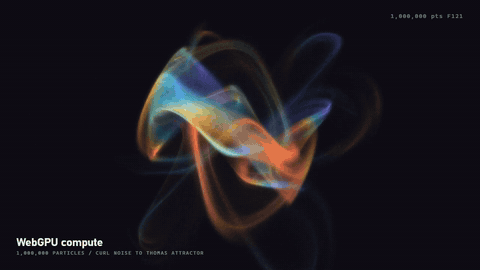 |
| **Three.js** | **Remotion** | **HyperFrames** |
| 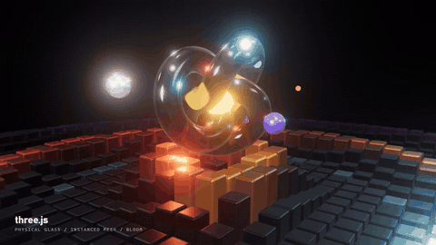 | 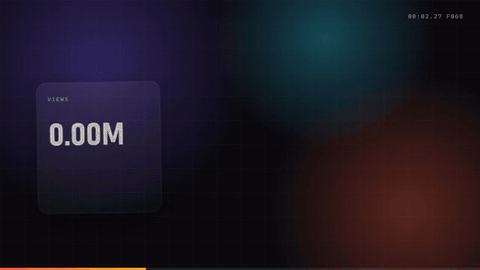 | 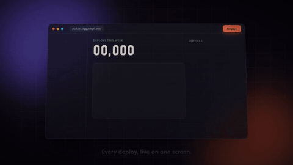 |
| **Manim** | **Speed ramp** | **Datamosh** |
| 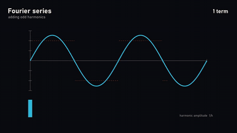 | 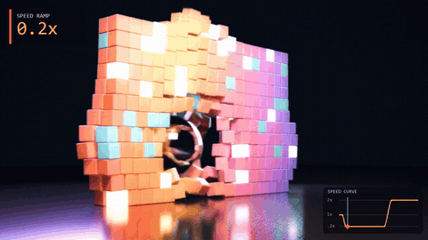 | 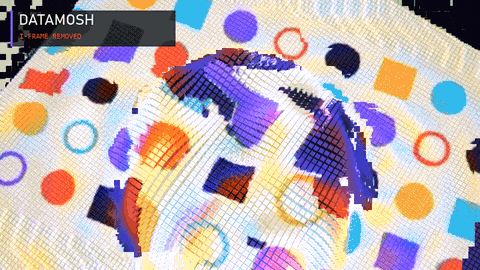 |

From the second set, which added the section "Built from scratch" (renderers, solvers and synths that Claude wrote without an engine or a library). The second reel cuts 29 of its clips to a synthesized beat (`media/reel/claude-motion-reel-2.mp4`):

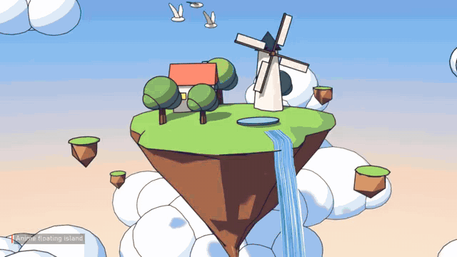

| Liquid glass lens | Living planet | Anime floating island |
|---|---|---|
| 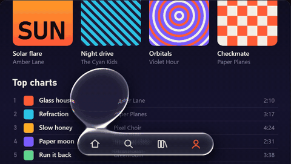 | 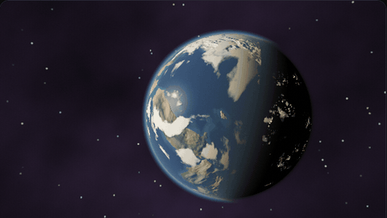 | 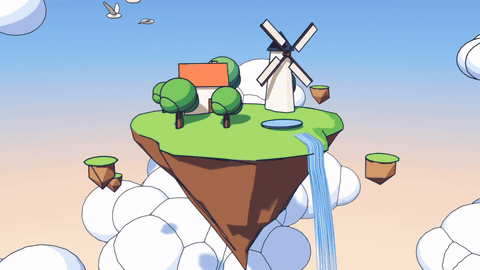 |
| **Procedural walk cycle** | **Neon sign power-on** | **Exploded product view** |
| 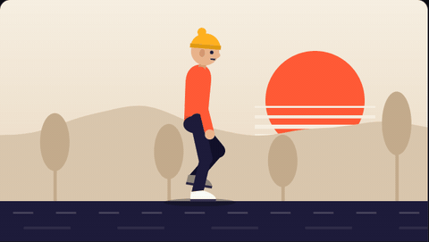 | 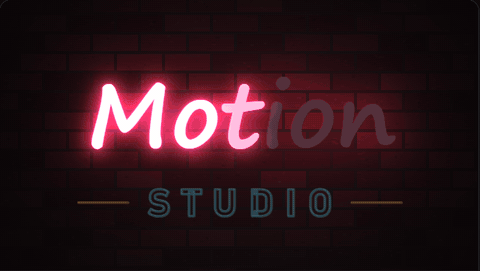 | 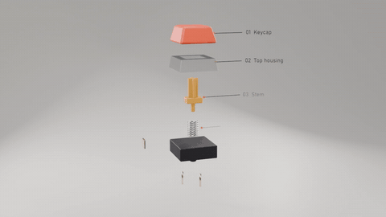 |
| **Software rasterizer** | **Polyrhythm arcs** | **Spectral path tracer in Rust** |
| 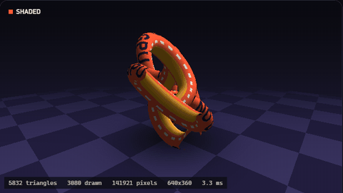 | 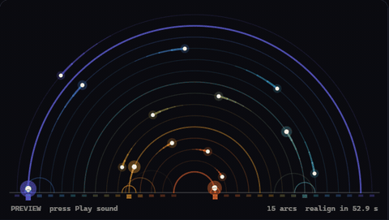 | 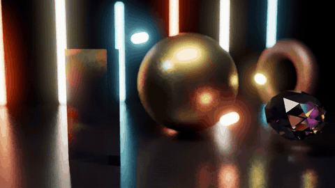 |
| **Dotted globe with flight arcs** | **Strange attractors** | **Lumen daylight time-lapse** |
| 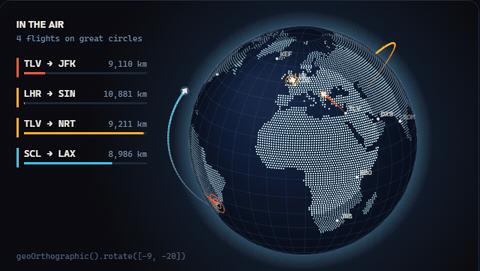 | 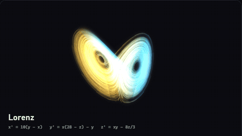 | 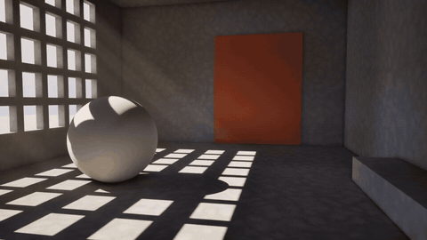 |
| **Lenia creatures** | **Liquid hourglass (FLIP solver in Go)** | **Taichi: water, jelly and snow (MPM)** |
| 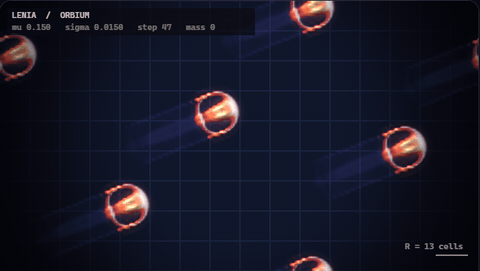 | 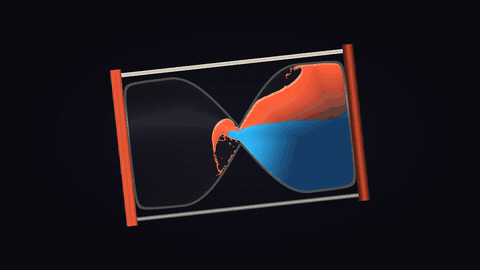 | 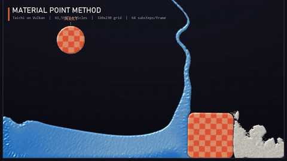 |

The full list below is generated from the same registry the page uses (`scripts/build_readme.py`), so it always matches the site.

<!-- CATALOG:START -->
**332 techniques**: 265 run live in the page (226 with sliders), 67 are rendered clips.


### The reel, scene by scene (9)

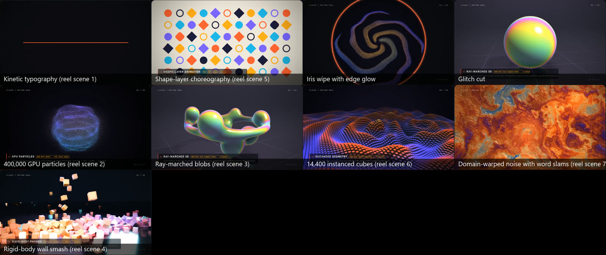

| Technique | Made with | Runs on | Prompt to copy |
|---|---|---|---|
| [Kinetic typography (reel scene 1)](index.html#ex-clip-reel-kinetic) (clip) | Canvas 2D, rendered frame by frame in headless Chrome | CPU | Kinetic type intro: a coral dot pops in with overshoot, stretches into a line, splits into two lines, "MOTION REEL" rises through the gap with a 45 ms stagger, typewriter subtitle, slow letter tracking, 6 s. |
| [Shape-layer choreography (reel scene 5)](index.html#ex-clip-reel-shapes) (clip) | Canvas 2D | CPU | Bauhaus-style shape-layer animation on cream paper: grid of shapes pops in from the center, morphs square to circle in a wave, gathers into a rotating ring, sunburst trim paths, bouncing ball with squash and stretch, 8 s. |
| [Iris wipe with edge glow](index.html#ex-clip-reel-transitions) (clip) | GLSL compositor shader | GPU | Iris wipe from the center with a 2 px coral edge glow, 0.8 s, between scene 1 and scene 2. |
| [Glitch cut](index.html#ex-clip-reel-glitch) (clip) | GLSL compositor shader | GPU | Glitch cut between the two shots: 0.35 s of horizontal slice offsets, RGB split and block shifts, peaking exactly on the cut. |
| [400,000 GPU particles (reel scene 2)](index.html#ex-clip-reel-particles) (clip) | WebGL2 vertex shader | GPU | GPU particle morph: 400k particles swirl in a galaxy, fly into my logo, hold, morph to a sphere and a torus knot, then explode. Additive blending, coral to amber, bloom. |
| [Ray-marched blobs (reel scene 3)](index.html#ex-clip-reel-raymarch) (clip) | GLSL fragment shader | GPU | Ray-marched metaballs that split from one sphere into seven and merge back, iridescent thin-film material, soft shadows, reflections, slow orbit camera. |
| [14,400 instanced cubes (reel scene 6)](index.html#ex-clip-reel-instancing) (clip) | WebGL2 instancing | GPU | Field of 14,400 instanced cubes, heights driven by interfering ripples, colors by height, camera swoops from top-down to a low angle, 8 s. |
| [Domain-warped noise with word slams (reel scene 7)](index.html#ex-clip-reel-noise) (clip) | GLSL fragment shader + Canvas 2D text | GPU | Domain-warped fBm marble background, cosine palette violet and orange, words "ANYTHING / THAT / MOVES." slam in on the beat at 120 BPM with an RGB glitch hit each. |
| [Rigid-body wall smash (reel scene 4)](index.html#ex-clip-reel-physics) (clip) | Blender 5.2: Bullet physics, Eevee | ENGINE | Blender rigid-body sim: 500 glossy cubes in a wall, a chrome wrecking ball hits it at 1 s, half-speed slow motion, Eevee with motion blur and depth of field. |

### Text in motion (36)

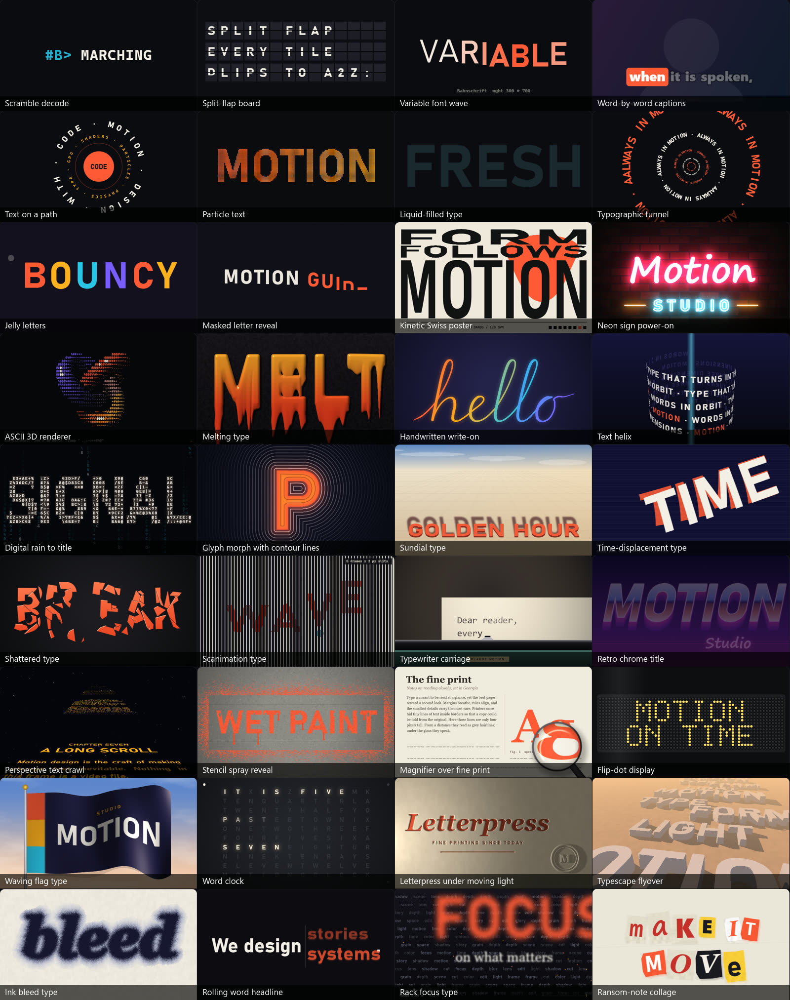

| Technique | Made with | Runs on | Prompt to copy |
|---|---|---|---|
| [Scramble decode](index.html#ex-scramble) | Canvas 2D or CSS + JS | CPU | Scramble-decode the headline "SHIP IT": random glyphs for 0.5 s, letters lock in left to right 0.06 s apart, cyan monospace on near-black. |
| [Split-flap board](index.html#ex-splitflap) | Canvas 2D | CPU | Split-flap departure board, 3 rows x 14 tiles, each flip takes 0.055 s, flips through the alphabet to "NOW BOARDING", columns staggered 40 ms, with a soft click sound per flip. |
| [Variable font wave](index.html#ex-varfont) | Canvas 2D or CSS font-variation-settings | CPU | Animate a variable font: the weight of each letter in "FLUID" waves from 300 to 700, the wave travels left to right every 1.2 s, slight vertical bob. |
| [Word-by-word captions](index.html#ex-captions) | Canvas 2D, Remotion | CPU | Add word-by-word captions to my video using the transcript timings: 3 to 4 words per page, active word pops (ease-out-back) with a coral highlight box, bold 64 px sans. |
| [Text on a path](index.html#ex-textpath) | Canvas 2D or SVG textPath | CPU | Rotating circular text badge: "MOTION · DESIGN · WITH · CODE ·" around a ring, slow clockwise spin, inner ring of small mono text spinning the other way, center logo pulses every 0.5 s. |
| [Particle text](index.html#ex-particletext) | Canvas 2D (pixel sampling) | CPU | My wordmark disintegrates into 4,000 particles that drift 40 px on noise for 1.5 s, then reassemble left to right with ease-out-expo, particles coral to amber across the word. |
| [Liquid-filled type](index.html#ex-liquidtype) | Canvas 2D (compositing: destination-in mask) | CPU | The word "FRESH" fills with sloshing cyan liquid from bottom to top over 2 s (waves up to 9 px), bubbles rise inside the letters, then it drains with a wobble. |
| [Typographic tunnel](index.html#ex-typetunnel) | Canvas 2D (scaled layers) | CPU | Endless typographic tunnel: the phrase "ALWAYS IN MOTION" repeated around rings that zoom toward the camera forever, alternate rings counter-rotate, coral and cream, 120 BPM pulse. |
| [Jelly letters](index.html#ex-jellytype) | Canvas 2D (spring physics per letter) | CPU | Interactive jelly headline: each letter sits on a spring (stiffness 0.08, damping 0.85), the cursor pushes letters away within 120 px, letters squash along their velocity, bright playful colors. |
| [Masked letter reveal](index.html#ex-maskreveal) | CSS overflow mask + Web Animations API | WEB | Headline "MOTION GUIDE" rises letter by letter through a mask, 45 ms stagger, 700 ms per letter with ease-out-expo, then slow letter tracking. |
| [Kinetic Swiss poster](index.html#ex-t2-swissbands) | Canvas 2D (drawImage band slices) | CPU | Kinetic Swiss poster loop: heavy black grotesk stacked "FORM / FOLLOWS / MOTION" justified edge to edge on off-white paper with a coral disc, sliced into 30 horizontal bands; a cosine stretch bump (peak band 6.0x taller than the rest) steps down the poster on every beat at 120 BPM with ease-in-out moves and short holds, total height constant, small mono caption strip, seamless 4 s loop. |
| [Neon sign power-on](index.html#ex-t2-neon) | Canvas 2D (pre-rendered glow layers, additive compositing) | CPU | Neon sign on a dark brick wall powering on: script "Motion" in hot pink tubes and outlined "STUDIO" in cyan, letters strike on one by one with an uneven stutter (flicker amount 0.60), white-hot tube cores with a tight and a wide glow, colored light spill on the bricks that flickers with the sign, the "t" keeps buzzing out, unlit tubes stay visible as dark glass, 8 s loop that cuts to dark. |
| [ASCII 3D renderer](index.html#ex-t2-ascii) | Canvas 2D (z-buffered point splats + glyph atlas) | CPU | ASCII 3D renderer: a trefoil knot tube tumbling slowly in 3D, drawn only with the character ramp " .,:-=+*#%@" on a monospace grid with 6 px wide cells; each cell keeps the nearest surface point (z-buffer), diffuse light picks the character, color runs coral to amber to violet along the knot, specular hot spots turn cream, dark terminal background with a small HUD, seamless loop. |
| [Melting type](index.html#ex-t2-melt) | WebGL2 fragment shaders (vertical smear field + height-field shading) on a canvas-drawn texture | GPU | Melting type shader: the word "MELT" in heavy sans drips like hot wax over 5 s, drips of different lengths (max 0.32 of the frame height) start at different times and taper to rounded points, letters sag slightly, glossy coral-to-amber wax with sharp specular highlights and a soft shadow on a near-black wall, then rewinds back to solid in 1 s with ease-in-out, 8 s loop. Draw the word into a 2D canvas once and upload it as a texture. |
| [Handwritten write-on](index.html#ex-t2-hello) | Canvas 2D (hand-authored Catmull-Rom strokes, variable-width pen) | CPU | Handwritten "hello" write-on like the Apple hello: one continuous cursive stroke drawn by a moving pen over 3.4 s, the pen slows in tight curves, the line is thicker on downstrokes and thinner on upstrokes with tapered ends, a coral-to-amber-to-cyan gradient along the stroke with a soft glow and a bright pen tip on deep navy, hold, then fade and loop. |
| [Text helix](index.html#ex-t2-helix) | Canvas 2D (3D projection, per-glyph affine transforms, depth sort) | CPU | Text helix: the sentence "WORDS IN ORBIT · TYPE THAT TURNS IN THREE DIMENSIONS · MOTION" wraps five times around a rotating vertical cylinder (spin 0.55 rad/s), camera tilted 20 deg down so the rings read as ellipses, glyphs stay upright and foreshorten at the sides, far-side glyphs mirrored and dimmed violet, near-side glyphs cream with "MOTION" in coral, glyphs depth-sorted every frame, a thin cyan light beam through the core, deep navy background. |
| [Digital rain to title](index.html#ex-t2-rainword) | Canvas 2D (column heads, per-cell state, glyph atlas) | CPU | Digital rain that resolves into a title: columns of cyan monospace glyphs fall at different speeds with white heads and fading tails (density 0.75), glyphs flicker; from 1.8 s every cell inside the word "SIGNAL" locks when a falling head passes it, flashing coral then settling to cream, while the rain thins out; hold 1.5 s, then the word releases from the top down back into the rain, seamless 8 s loop on near-black. |
| [Glyph morph with contour lines](index.html#ex-t2-sdfmorph) | WebGL2 fragment shader on signed distance fields built in JavaScript (exact distance transform) | GPU | Glyph morph: one big letter morphs through M, O, R, P, H by blending signed distance fields (hold 0.9 s, morph 0.7 s ease-in-out), filled coral-to-amber with a soft glow, the distance field repeated as thin cream contour lines every 10 px that ripple outward and fade with distance, darker contours inside the letter, deep ink-blue background, small mono caption showing the current pair. |
| [Sundial type](index.html#ex-t2-sundial) | Canvas 2D (shadow as an affine shear of the text) | CPU | Sundial type time-lapse: the words "GOLDEN HOUR" stand as upright cut-out letters on a wide sandy floor while the sun arcs from left to right behind the camera over 8 s; each letter casts a long soft shadow back across the floor (the text drawn through a shear transform, max 4.00x height), the shadows swing from one side to the other and shorten at noon, sky goes from coral dawn to pale noon to amber dusk, letter faces brighten with the sun, warm light wash from the sun side, fade through dusk and loop. |
| [Time-displacement type](index.html#ex-t2-timedisp) | Canvas 2D (per-strip clipping, each strip drawn at its own time) | CPU | Time-displacement effect on the word "TIME": it sways, spins up to 25 degrees and pulses in scale; the frame is cut into 4 px horizontal strips and each strip shows the word up to 0.40 s earlier according to a delay map (top to bottom, from the center, or a moving ripple), so the rigid motion bends like rubber; cream type with a coral echo at twice the delay on deep navy. |
| [Shattered type](index.html#ex-t2-shatter) | Canvas 2D (Voronoi cells by half-plane clipping, per-shard clip and transform) | CPU | Shattered type: the word "BREAK" in heavy coral sans cracks from an impact point (cracks spread over 0.3 s), then breaks into 42 Voronoi shards that fly out ballistically with spin and a slight pop toward the camera, slow motion after the hit, a white flash and shockwave ring at impact, hang for a beat, then the flight rewinds with ease-in-out and the word snaps back together, dark charcoal background, 6 s loop. |
| [Scanimation type](index.html#ex-t2-scanimation) | Canvas 2D (interlaced frames + sliding barrier grid) | CPU | Scanimation (barrier-grid) type: 5 frames of the word "WAVE" with letters bouncing in a wave are interlaced into 2 px wide vertical slits as one coral-on-cream still; a black acetate sheet with one open slit every 5 slits slides over it at 12 frames per second, its edge sweeping in and out with ease-in-out, so the word animates under the sheet and turns to stripes outside it; paper texture, slight sheen on the acetate edge. |
| [Typewriter carriage](index.html#ex-t2-typewriter) | Canvas 2D (keystroke schedule, incremental paper canvas) | CPU | Typewriter animation at 110 wpm: the camera stays on the strike point while the paper moves left one character per keystroke, carriage return slides it back with an ease and feeds a line, human key rhythm with pauses at spaces and punctuation, each letter stamped in a monospace face with a tiny random offset, tilt and uneven ink, a dark platen roller and metal type guide in front, a small shake on every strike, the sheet ejects and a fresh one rolls in to loop. |
| [Retro chrome title](index.html#ex-t2-chrome) | Canvas 2D (pre-rendered chrome face, stacked extrusion copies, source-atop glint) | CPU | 1980s chrome title: "MOTION" in heavy italic sans with a sky-blue to burnt-orange chrome gradient split by a dark horizon line, white rim, extruded 26 px deep from hot pink to deep purple, flies in with ease-out-back while turning, then floats while the extrusion angle drifts like a slow camera orbit, white glint sweeps across every 2.4 s, four-point star sparkles pop on the corners, pink script "Studio" below with a glow, starry purple night background, 6 s loop. |
| [Perspective text crawl](index.html#ex-t2-crawl) | Canvas 2D (row-by-row perspective resampling) | CPU | Perspective text crawl: a justified amber paragraph block with a title ("CHAPTER SEVEN / A LONG SCROLL") recedes on a tilted plane toward the horizon at 46 px/s, plane flatness 0.50, letters shrink and fade into the distance, built row by row from a flat text canvas, slow twinkling starfield behind, seamless endless loop. |
| [Stencil spray reveal](index.html#ex-t2-stencil) | Canvas 2D (accumulated spray dots split by stencil masks) | CPU | Stencil spray reveal: a cardboard stencil with "WET PAINT" cut out (stencil bridges in the letters) sits on a concrete wall; a spray can zigzags across it in three passes over 3 s, soft coral spray dots (flow 1.0) build up on the wall through the cut-outs and as overspray on the card; the card then lifts off with a tilt and a growing shadow, revealing crisp painted letters, a few paint drips run down, then the wall is cleaned and it loops. |
| [Magnifier over fine print](index.html#ex-t2-loupe) | WebGL2 fragment shader (lens mapping with chromatic aberration) on a canvas-drawn page texture | GPU | A magnifying loupe glides over a cream book page: Georgia heading and two columns of body text, a big coral "Ag" specimen, and grey hairline rules that are really 4 px microtext; inside the lens the page is magnified 2.4x with a slight barrel bulge, chromatic fringing near the rim, a dark rim, a glossy highlight arc and a soft shadow with a handle, so the microtext becomes readable as the lens passes; slow Lissajous path with gentle easing. |
| [Flip-dot display](index.html#ex-t2-flipdot) | Canvas 2D (pre-rendered disc faces, scaled per flip angle) | CPU | Flip-dot display: a 60 x 17 board of round discs, yellow on one side and black on the other, on a dark panel with rivets; two-line messages in a 5 x 7 pixel font ("NEXT STOP / STUDIO 7", "MOTION / ON TIME", "GATE 7 / DEPARTS") change every 3 s, only changed discs flip, in a wave from left to right (0.025 s per column plus a little random delay), each flip 0.14 s with a slight rattle, a soft glare sweeps across the board. |
| [Waving flag type](index.html#ex-t2-flag) | WebGL2 fragment shader (procedural cloth waves + slope shading) on a canvas-drawn texture | GPU | Waving flag with lettering: a navy banner with coral, amber and cyan stripes at the hoist and the word "MOTION" in cream, hung from a metal pole against a soft dawn sky with drifting clouds; traveling waves grow toward the free end (wind 1.00), diagonal folds, highlights on crests and shade in the troughs, the type bending with the cloth, slight gravity sag, endless loop, done in one fragment shader. |
| [Word clock](index.html#ex-t2-wordclock) | Canvas 2D (letter grid, word lookup, staggered fades) | CPU | Word clock: a 12 x 10 grid of letters on dark slate where only the words of the current time light up ("IT IS QUARTER PAST SIX"), rounded to five minutes, four corner dots for the minutes in between; when the phrase changes, old letters fade out and new letters fade in with a 40 ms stagger in reading order, lit letters warm white with a soft glow, unlit letters barely visible; time-lapse at 2.5 min/s or real time. |
| [Letterpress under moving light](index.html#ex-t2-letterpress) | WebGL2 fragment shader (height field from blurred text, normals, ray-marched self-shadow) | GPU | Letterpress under a moving light: "Letterpress" in Georgia italic and a small caps line debossed into thick cotton paper (press depth 1.20), plus a raised round seal, lit by a warm low raking light that circles the sheet every 8 s; normals from the height field, sharp self-shadows inside the letter walls and bright rims on the lit side, subtle paper fibers, coral ink in the impressions or blind press, all in one fragment shader. |
| [Typescape flyover](index.html#ex-t2-typescape) | WebGL2 fragment shader (height-field ray marching on a canvas-drawn texture) | GPU | Typescape flyover: big words ("MOTION", "TYPE", "FORM", "LIGHT") extruded as monolithic cream blocks on a warm sand plain, a low golden sun casting long hard shadows, a camera gliding low over the letters with a gentle sway, haze in the distance, ray-marched from a height map drawn in a 2D canvas (letter height 0.40), endless loop. |
| [Ink bleed type](index.html#ex-t2-inkbleed) | WebGL2 fragment shaders (ping-pong float textures: water and pigment) | GPU | Ink bleed type: the word "bleed" in heavy italic serif is stamped in wet indigo ink on cotton paper and feathers outward for 5 s along the paper fibers (wetness 0.70), water spreads faster than pigment so the edges go soft and blue while the cores stay near-black, granulation in the pigment, the spread slows as the paper dries; GPU simulation with water and pigment in a float texture, paper fades back and it restamps every 9 s. |
| [Rolling word headline](index.html#ex-t2-drum) | Canvas 2D (words on a virtual cylinder, ghost copies for motion blur) | CPU | Rolling word headline: "We design [motion / type / shaders / stories / systems]." in large sans on near-black, the bracketed word sits on a 3D drum and rolls up to the next option every 1.6 s with ease-out-back overshoot, words foreshorten and fade as they turn away, motion blur ghosts during the spin (strength 0.60), the period and the line re-center smoothly as the word width changes, coral drum word with an underline that redraws. |
| [Rack focus type](index.html#ex-t2-rackfocus) | Canvas 2D (per-layer blur from a thin-lens formula, drawn bokeh discs, parallax) | CPU | Rack focus title: three layers of type at different depths (a huge coral "FOCUS" close to the lens, "on what matters" in cream in the middle, a far wall of small grey words with warm city lights), slow lateral camera drift with parallax, the focus pulls near, middle, far and back with eased holds, blur per layer from the thin-lens circle of confusion (aperture 1.00), background lights bloom into round bokeh discs when out of focus, small focus-distance readout. |
| [Ransom-note collage](index.html#ex-t2-ransom) | Canvas 2D (pre-cut letter sprites, stepped time at 12 fps, boil jitter) | CPU | Ransom-note collage: "MAKE IT MOVE" built from letters cut out of magazines, each on its own scrap with a different typeface, weight, color and slight tilt, slapped onto off-white paper one by one with a tiny scale-down settle, animated on stepped time at 12 fps like stop motion, every scrap boils with small random jitter on each step, soft drop shadows, then swept off and rebuilt, 7 s loop. |

### 2D motion graphics (33)

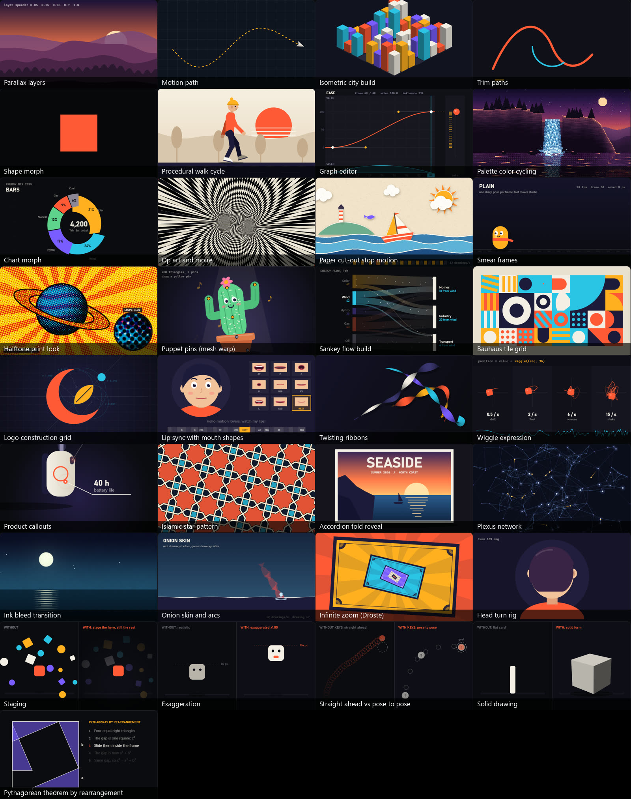

| Technique | Made with | Runs on | Prompt to copy |
|---|---|---|---|
| [Parallax layers](index.html#ex-parallax) | Canvas 2D (or CSS transforms on image layers) | CPU | Parallax landscape with 5 layers (sky, far mountains, mid hills, trees, foreground grass), camera slides right, depth strength 1.00 (0 = flat, everything moves together), haze increases with distance, sunset palette. |
| [Motion path](index.html#ex-motionpath) | Canvas 2D or SVG (offset-path in CSS) | CPU | A paper plane flies along a curvy SVG path from left to right in 3 s, auto-oriented to the path, ease-in-out speed, dashed trail draws behind it, lands on a pin that pops with overshoot. |
| [Isometric city build](index.html#ex-isocity) | Canvas 2D (isometric projection) | CPU | Isometric city builds itself: 8x8 lots, buildings grow from the back to the front with ease-out-back, 40 ms stagger, windows light up randomly at dusk, a car drives along the main road, then everything sinks. |
| [Trim paths](index.html#ex-trimpaths) | SVG stroke-dasharray / stroke-dashoffset | WEB | Draw the logo outline on with trim paths over 1.1 s, ease-in-out, then erase it from the start so the line travels off, coral and cyan strokes. |
| [Shape morph](index.html#ex-shapemorph) | Canvas 2D (rounded rectangle radius + rotation) | CPU | Morph the square button into a circle while it rotates 90 degrees and shifts from coral to violet, 1.2 s, ease-in-out, then morph back. |
| [Procedural walk cycle](index.html#ex-mg2-walk) | Canvas 2D (two-bone IK + phase curves) | CPU | Procedural 2D walk cycle of a flat, stylish character (coral sweater, navy trousers, amber beanie) on a cream backdrop: 1.1 s per cycle, stride 150 px, hip bounce 6.0 px, arm swing 28 deg, two-bone IK legs with planted feet, heel strike and heel peel, head follow-through, the ground and two parallax layers scroll so the walker stays in frame; a rig toggle shows bones, the foot path and labels for contact, down, passing and up. |
| [Graph editor](index.html#ex-mg2-graph) | Canvas 2D (cubic bezier keyframes, solved per frame) | CPU | Teaching animation: a dark graph editor like After Effects or Blender with a value curve over 48 frames at 24 fps, keyframes as diamonds and bezier handles with 33% influence, a cyan playhead, a ball beside the graph that follows the curve with spacing ticks and slight stretch, and a speed graph underneath; cycle through linear, ease in-out, overshoot, bounce and anticipation presets, the new curve draws on from left to right. |
| [Palette color cycling](index.html#ex-mg2-colorcycle) | Canvas 2D (indexed pixels + rotating palette) | CPU | Pixel-art waterfall at dusk in the Mark Ferrari color-cycling style: a 320x180 indexed image built procedurally (Bayer-dithered violet-to-amber sky, cliffs with pines, a waterfall, spray, a lake with glints, twinkling stars), animated only by rotating palette ranges at 12 steps/s, waterfall fastest and lake slowest, scaled 2x with no smoothing, plus a view that shows the 128-entry palette turning. |
| [Chart morph](index.html#ex-mg2-chartmorph) | Canvas 2D (shapes resampled to matching outlines) | CPU | Animated infographic of one dataset (energy mix: six sources in percent and TWh) that morphs pie > donut > stacked bar > bar chart > line chart and back in a seamless loop: each shape resampled to the same number of outline points so slices unroll into bars, 0.90 s per morph with ease-in-out, 0.07 s stagger between items, value labels ride along and count between percent and TWh, axes fade in only for bars and line, dark background with amber, cyan, violet, green and coral. |
| [Op art and moire](index.html#ex-mg2-opart) | Canvas 2D (difference blending, warped grids) | CPU | Bridget Riley style op-art loop in cream and near-black: two sets of concentric rings 9.0 px apart drift around each other with difference blending so moire fringes swim between them, then two counter-rotating 120-spoke sunbursts, then a "Movement in Squares" checkerboard whose columns squeeze toward a sliding fold, then rippling parallel lines whose phase drifts per line; 5 s per piece, iris transitions between them, crisp anti-aliased lines. |
| [Paper cut-out stop motion](index.html#ex-mg2-cutout) | Canvas 2D (stepped time + cached frames + drop shadows) | CPU | Stop-motion paper cut-out loop: a coral paper boat with cream sails rocks on three layers of torn-paper waves, an island with a blinking lighthouse, drifting paper clouds, a sun with turning rays and a violet bird flapping across, each layer with a white torn edge, soft drop shadow and paper grain; animated at 24 fps with a new drawing every 2 frames and 1.0 px of random placement boil per drawing, plus a small film strip that marks which frames get a new drawing. |
| [Smear frames](index.html#ex-mg2-smear) | Canvas 2D (stepped frames + tapered smear shapes) | CPU | Cartoon action study at 24 fps: a round amber bean character with a coral scarf anticipates, zips across the floor in four frames, overshoots and settles, then jumps back in a fast arc and lands with squash; show the same move four ways (plain frames that strobe, motion blur from sub-frame samples, a tapered smear from the last position to the new one with speed lines, and multiples), label each mode and the pixels moved per frame. |
| [Halftone print look](index.html#ex-mg2-halftone) | GLSL fragment shader (four rotated dot screens) | GPU | Pop-art comic panel as a GLSL halftone shader: a banded ringed planet over an orange sunburst on yellow paper, thick black ink outlines, printed as four CMYK dot screens at 15, 75, 0 and 45 degrees with 7.0 px spacing so rosettes appear, dot size follows a light that circles the planet, a 3x loupe shows the dots, plus a view with the four separations side by side. |
| [Puppet pins (mesh warp)](index.html#ex-mg2-puppet) | Canvas 2D (rigid MLS deformation + textured triangles) | CPU | Puppet-pin animation of a flat cactus character in a terracotta pot: a 12x17 triangle mesh over the drawing, seven pins (three fixed on the pot, body, head and both arm tips) keyframed to a 120 BPM two-step with a squash on every beat, the mesh deformed with rigid moving least squares (falloff 1.20, dance amount 1.00) so the face stays undistorted, each triangle texture-mapped with an affine transform, spotlight on a dark stage, a toggle shows the mesh and the pins can be dragged. |
| [Sankey flow build](index.html#ex-mg2-sankey) | Canvas 2D (bezier ribbons + particles along curves) | CPU | Animated Sankey diagram, 12 s loop on a dark background: five energy sources (solar, wind, hydro, gas, oil) flow into homes, industry and transport; nodes grow with a stagger, ribbons with a source-to-target gradient unroll left to right (bezier curvature 0.50), values count up, particles drift along each ribbon at speed 0.30 to show direction, then each source is spotlighted in turn while the other ribbons dim to 18%, and everything retracts at the end. |
| [Bauhaus tile grid](index.html#ex-mg2-bauhaus) | Canvas 2D (tile state machine + wave stagger) | CPU | Bauhaus-style motion poster: an 8x4 grid of square tiles (two of them 2x2) in cream, coral, amber, navy and cyan, each with one flat shape (quarter circle, half circle, circle, ring, corner triangle, stripes, dots, arch); on every beat at 96 BPM a wave spreads from a random tile with 0.045 s delay per tile step, and each tile it reaches turns its shape 90 degrees with ease-out-back, pops to a new shape, or wipes in a new color pair; no gaps, no text, seamless. |
| [Logo construction grid](index.html#ex-mg2-logogrid) | Canvas 2D (arc sweeps, clip paths, even-odd clipping) | CPU | Logo construction reveal, 9 s loop on deep navy: a thin guide grid and 45-degree axis draw out from the center, five construction circles in golden-ratio sizes (1, 0.86, 1/phi twice, 1/phi^4) sweep on with center crosses, radius lines and ratio labels at guide opacity 0.70, then the mark fills from them (a coral crescent from circle minus circle with a conic wipe, an amber leaf from the overlap of two circles popping with overshoot and a vein drawing on, a cyan dot), guides fade, the wordmark LUMEN tracks in, then everything folds away. |
| [Lip sync with mouth shapes](index.html#ex-mg2-lipsync) | Canvas 2D (viseme timeline + mouth shape tween) | CPU | Flat 2D talking head lip-synced to the line "Hello motion lovers, watch my lips!" with nine Preston Blair mouth shapes (AI, E, O, U, MBP, FV, L, CDG, rest) on a viseme timeline, each shape held for its sound and tweened to the next over 0.050 s, upper teeth and tongue visible in open shapes, brows lift on stressed words, a blink in the pause, a mouth chart beside the face that highlights the current shape, captions with the spoken word highlighted, and a dope-sheet strip with a playhead. |
| [Twisting ribbons](index.html#ex-mg2-ribbons) | Canvas 2D (arc-length resampled trail + width times cos(twist)) | CPU | Three two-sided ribbons (coral and amber, cyan and violet, cream and navy) fly in looping paths over a dark background like rhythmic-gymnastics ribbons: each is its head path walked backward and resampled to 110 segments over a fixed length, tapered at the tail, twisting along its length at rate 0.090 so width becomes 18 px times cos(twist) and the back color shows when the cosine flips sign, edge-on parts darkened, a soft offset shadow, seamless and smooth. |
| [Wiggle expression](index.html#ex-mg2-wiggle) | Canvas 2D (1D Perlin noise with octaves) | CPU | Teaching card for the After Effects wiggle expression: four identical coral rounded squares side by side with wiggle frequencies 0.5, 2, 6 and 15 per second, all with amount 36 px and 1 octaves of 1D Perlin noise on x, y and rotation, each with a fading 1.5 s trail, a crosshair at its rest position, a label for the feel (drift, float, nervous, shake), a scrolling graph of its x value underneath, and the expression shown as code at the top. |
| [Product callouts](index.html#ex-mg2-callouts) | Canvas 2D (trimmed leader lines + 2D camera) | CPU | Product feature video for flat-illustrated over-ear headphones on a dark stage with a soft spotlight: four callouts (40 h battery, adaptive noise cancelling, memory foam cushions, USB-C fast charge) appear 0.45 s apart, each a pulsing dot, an elbowed leader line drawn with trim paths and a label that rises out of a mask with its number counting up; then a 2D camera zooms to 1.60x on each callout in turn with the others dimmed, pulls back to show all, and everything retracts; 12 s loop. |
| [Islamic star pattern](index.html#ex-mg2-girih) | Canvas 2D (Hankin's polygons-in-contact method) | CPU | Animated Islamic geometric star pattern built with Hankin's polygons-in-contact method on a 4.8.8 tiling of octagons and squares: from each edge midpoint two rays at a contact angle that sweeps between 28 and 70 degrees and eases at both ends, meeting their neighbors to form eight-point stars; coral stars in the octagons, cyan stars in the squares, cream straps 5.0 px wide with dark outlines on deep navy, the whole field slowly rotating, plus a view that overlays the hidden tiling. |
| [Accordion fold reveal](index.html#ex-mg2-accordion) | Canvas 2D (sliced panels + cos and sin of the fold angle) | CPU | Accordion fold reveal of a travel poster (SEASIDE, sunset over the sea, cliffs, a sailboat) on a dark table: the poster is split into 6 vertical panels folded like a map; the fold angle eases from 88 degrees to flat with a small spring overshoot, each panel drawn cos(angle) wide and sliced so peaks are taller than valleys (perspective 0.12), panels facing the light brighten and the others darken by sin(angle), a soft shadow grows under it, it holds, then folds back up; 6.6 s loop. |
| [Plexus network](index.html#ex-mg2-plexus) | Canvas 2D (3D points, distance links, batched strokes) | CPU | Plexus-style network background: 170 points drifting in a slowly rotating 3D box with perspective, a line between any two points closer than 118 px that fades with distance and depth, cyan to violet by depth, points sized by depth, a dozen amber data packets hopping along the links with short trails, the cursor connects to nearby points in coral, deep navy background, seamless loop. |
| [Ink bleed transition](index.html#ex-mg2-inkwash) | GLSL fragment shader (fbm threshold matte) | GPU | Ink-bleed transition between two flat illustrations (a warm dusk with a sun and layered ridges, and a cool night sea with a moon and a reflected path) as a GLSL shader: the matte is distance from a drop point minus fbm noise with roughness 0.55, compared to a threshold that eases up over 2.2 s, with a dark indigo ink rim on the edge, a faint wet halo outside it and paper grain; hold, then bleed back from another point; 7 s loop. |
| [Onion skin and arcs](index.html#ex-mg2-onion) | Canvas 2D (stepped frames + tinted ghost poses) | CPU | Animation teaching loop at 12 drawings per second: a coral fish leaps out of a navy sea on a parabola, rotating to follow its path, splashes and ripples on exit and entry; onion-skin view shows the 3 previous drawings tinted red and the next ones tinted green; an arc view draws the dotted trajectory with one tick per drawing so slow-in at the apex and fast ends are visible; mode name and a one-line explanation in the corner. |
| [Infinite zoom (Droste)](index.html#ex-mg2-droste) | Canvas 2D (nested frames + exponential scale) | CPU | Seamless infinite-zoom loop (Droste effect) of an art-deco poster that contains itself: each level has a sunburst, a thin inner frame with corner fans and a window holding the next level at 0.45 scale, colors cycle navy, coral, amber, cyan, violet, cream per level; the camera zooms exponentially one level every 2.6 s, each level twisted 10 deg more than the last for a spiral dive, colors shift by one each loop so it never ends. |
| [Head turn rig](index.html#ex-mg2-headturn) | Canvas 2D (features placed on a sphere and projected) | CPU | Flat 2D character head that turns a full 360 degrees in 45-degree steps (ease-in-out turn, then hold 1.4 s) with no extra drawings: eyes, brows, blush, mouth and nose are placed by longitude and latitude on an invisible sphere, so they slide by sin, narrow by cos and hide when facing away; the nose sits outside the sphere to stick out in profile, ears swap layers, the hairline drops toward the back so the back view is all hair; a rig view shows the sphere meridians and the feature anchors. |
| [Staging](index.html#ex-p2-staging) | Canvas 2D | CPU | Staging demo, 640x360 split screen on a near-black background. A coral rounded square hops among 14 amber, cyan, violet and cream shapes. Left half: every shape bobs and spins at the same time. Right half: the other shapes freeze and dim by 0.80, a soft spotlight opens on the hero, then it hops with a small squash on landing. Bahnschrift labels "without" and "with", 3 s loop. |
| [Exaggeration](index.html#ex-p2-exaggeration) | Canvas 2D | CPU | Exaggeration demo, 640x360 split screen on a near-black background. A cream block character with two dot eyes jumps in place every 2.4 s. Left half: a realistic jump, small crouch, 60 px high, almost no squash. Right half: the same timing pushed by 1.00: deep anticipation crouch, stretch along the motion in the air, a higher jump and a big springy squash on landing. Thin tick lines mark each apex height. Bahnschrift labels, seamless loop. |
| [Straight ahead vs pose to pose](index.html#ex-p2-pose-to-pose) | Canvas 2D | CPU | Straight ahead versus pose to pose demo, 640x360 split screen on a near-black background, a dashed goal ring in each half. Left half, straight ahead: a coral ball lays down 30 onion-skin frames one after another, each frame turned a little at random from the last, so the arc wanders and misses the goal differently every loop. Right half, pose to pose: 3 numbered cream key poses pop in first along a planned arc, then eased in-betweens fill the gaps, then the ball plays through and lands on the goal. Bahnschrift labels, 4.5 s loop. |
| [Solid drawing](index.html#ex-p2-solid-drawing) | Canvas 2D (3D projection) | CPU | Solid drawing demo, 640x360 split screen on a near-black background. A cream box makes a quarter turn every 2.4 s with ease in-out and a hold. Left half: a flat card fakes the turn by squashing its width to a sliver. Right half: a real cube projected in 3D with a 22 deg camera tilt, three faces shaded by one upper-left light, and a soft contact shadow. Bahnschrift labels, seamless loop. |
| [Pythagorean theorem by rearrangement](index.html#ex-vp-pythag) | Canvas 2D | CPU | A calm, 3Blue1Brown-style animated proof of the Pythagorean theorem on a near-black background: four equal right triangles (legs a = 3.0 and b = 10 - a) fill a square and leave a tilted c-squared gap, then slide one by one inside the same frame until the gap is an a-squared and a b-squared square. Numbered step captions on the right, soft colors, the equation with real numbers at the end, seamless loop. |

### App and web UI motion (32)


| Technique | Made with | Runs on | Prompt to copy |
|---|---|---|---|
| [Like-button burst](index.html#ex-like) | SVG + JavaScript (also Lottie) | WEB | Like-button micro-interaction: heart scales 1 > 0.7 > 1.25 > 1 with ease-out-back, a coral ring expands and fades, 12 dots burst out, counter digit rolls up. Total 600 ms. |
| [Loaders](index.html#ex-loaders) | Pure CSS @keyframes | WEB | Make a pure-CSS loader: three dots that bounce in a wave (120 ms stagger), ease-in-out, coral, 1 s loop, and respect prefers-reduced-motion. |
| [Gooey merge](index.html#ex-gooey) | SVG filter (blur + alpha threshold) | WEB | Gooey menu button: the main circle splits into 4 smaller circles that slide out with ease-out-back, connected by a liquid SVG goo filter while they separate. |
| [Menu morph and staggered reveal](index.html#ex-menu) | CSS transforms driven by JavaScript (or Framer Motion) | WEB | Mobile menu: hamburger morphs to X in 300 ms, drawer slides in from the right with ease-out-expo, menu items stagger in 40 ms apart with a 16 px slide; reverse on close. |
| [Skeleton loading to content](index.html#ex-skeleton) | CSS gradients + JavaScript | WEB | Skeleton loading state for the feed: grey blocks with a left-to-right shimmer every 1.2 s, then real cards fade and slide up 12 px, 60 ms stagger. |
| [Dashboard count-up](index.html#ex-dashboard) | Canvas 2D (or SVG + CSS) | CPU | Animate the stats card: numbers count up over 1.2 s with ease-out-expo, the progress ring fills to 72%, five bars grow with a 70 ms stagger, sparkline draws on. |
| [3D card flip](index.html#ex-cardflip) | CSS 3D transforms (perspective, rotateY, backface-visibility) | WEB | Three feature cards flip in 3D (rotateY 180, 700 ms, ease-in-out, 120 ms stagger) to reveal details on the back, with 1,000 px perspective and a soft shadow that shifts during the turn. |
| [Magnetic button and cursor follower](index.html#ex-magnetic) | CSS + JavaScript (mix-blend-mode, transforms) | WEB | Add a magnetic hover to the main CTA: within 100 px the button moves 0.30 of the cursor distance toward it with a spring; a custom cursor circle follows with lag and grows to 80 px with mix-blend-mode: difference over buttons. |
| [Toast stack](index.html#ex-toasts) | CSS transforms + spring easing (Framer Motion style) | WEB | Toast notifications: new toast springs up from the bottom (stiffness 400, damping 30), older toasts scale to 0.94 and shift up 10 px each like a stack, max 3 visible, oldest swipes out right after 4 s. |
| [Shared-element expand](index.html#ex-sharedexpand) | JavaScript FLIP technique (or Framer Motion layoutId, View Transitions API) | WEB | When a project card is clicked, expand it into the detail page with a shared-element transition (FLIP / View Transitions API), 450 ms ease-out-expo, image stays continuous, details fade in after 150 ms. |
| [Day/night toggle](index.html#ex-daynight) | SVG + JavaScript | WEB | Dark-mode toggle: knob slides with ease-in-out (400 ms), the sun morphs into a crescent moon by sliding a mask circle, clouds exit left, stars fade in with stagger, page background crossfades. |
| [Liquid glass lens](index.html#ex-ui2-glass) | WebGL2 fragment shader (SDF refraction) over a Canvas 2D page | GPU | Liquid glass UI in WebGL: a round glass lens (radius 62 px) and a pill tab bar float over a slowly scrolling music app. Signed distance fields, edge refraction 18 px sampling outward like thick glass, center magnification 1.35x, chromatic split 0.22 at the rim, specular rim light from the top left, soft drop shadow. The lens follows the cursor on a spring, stretches along its velocity, and melts into the tab bar with a smooth minimum of 42 px. |
| [Dynamic Island morph](index.html#ex-ui2-island) | DOM + JavaScript spring physics (width, height, radius) | WEB | Dynamic Island style morph: a black pill (120 x 34 px) at the top of a phone springs into an incoming-call banner (396 x 76), a compact then expanded music player (396 x 176) and a timer that splits off a small bubble. Width, height and radius use springs (stiffness 230, damping 19); content crossfades with a slight blur and scale 150 ms after the shape moves; album art is a shared element between compact and expanded. Clicking the pill expands or collapses it. |
| [Swipe card deck](index.html#ex-ui2-swipe) | Pointer events + JavaScript (velocity tracking, springs) | WEB | Swipe card deck: the top card follows the pointer with rotation proportional to x (sign flips if grabbed below center), KEEP and NOPE stamps fade in by distance. On release throw the card if it moved more than 110 px or the flick was faster than 650 px/s, keeping its velocity; otherwise spring back (stiffness 320, damping 18). The next card scales from 0.94 to 1 as the top card moves away. Round nope and like buttons swell toward the drag direction. |
| [Submit button states](index.html#ex-ui2-submit) | DOM + JavaScript timeline (SVG stroke drawing) | WEB | Submit button with full async states: on press scale to 0.95, then the 282 x 52 px pill morphs into a 52 px circle (380 ms ease-in-out) while the label fades, a spinner arc rotates for 1.5 s; success turns it green and draws a check mark with stroke-dashoffset, then it springs back to a pill reading "Account created"; failure turns it coral, draws an X, shakes 10 px with a decaying sine, reopens as "Try again" and slides an error message under the password field. Show a small state list that highlights idle, pressed, loading, success or error. |
| [CSS scroll-driven animations](index.html#ex-ui2-scrolltl) | Pure CSS (animation-timeline, animation-range, timeline-scope, @property) | WEB | Build a scroll-driven article page in pure CSS, no JavaScript animation: a reading progress bar on scroll-timeline --page (shared with timeline-scope), a sticky header that shrinks from 96 to 44 px over the first 140 px of scroll with animation-timeline: scroll(), a parallax hero, cards that fade and rise with animation-timeline: view() and animation-range: entry 10% cover 30%, and a percent counter animated through an @property integer. Respect prefers-reduced-motion. |
| [Activity rings](index.html#ex-ui2-rings) | Canvas 2D (conic gradients, arc caps, particles) | CPU | Activity rings in Canvas 2D: three concentric rings (coral Move, green Exercise, cyan Stand, 24 px thick) fill to 132%, 112% and 100% over 1.8 s each with a 0.25 s stagger and ease-out-expo. Use a conic gradient from a dark to a bright shade, round caps, and a drop shadow under the tip once a ring passes 100%. Stats on the right count up in sync. When all three close, spin the set 360 degrees and burst sparkles, then unwind and loop. Hover focuses a ring; dragging around a ring sets its value. |
| [Page curl](index.html#ex-ui2-curl) | WebGL2 fragment shader (cylinder fold) over a Canvas 2D page atlas | GPU | Page turn in a WebGL fragment shader: a two-page magazine spread; the right page curls from its bottom corner around a cylinder (radius up to 38 px) that moves to the spine, showing the back of the page on top, shading by the paper angle, and a soft shadow (0.55) on the page below. The corner follows the mouse when dragged, constrained so the page never stretches past the spine; released past the spine it completes the turn with ease-out, otherwise it falls back. Auto-play one turn every 3.4 s. |
| [Dock magnification](index.html#ex-ui2-dock) | DOM + JavaScript (cosine falloff, smoothed pointer) | WEB | macOS-style dock in HTML and JavaScript: 10 app icons (38 px) in a frosted glass bar; icons scale up to 1.90x near the pointer with a cosine falloff over 140 px, measured from the resting layout so the row does not jitter; the bar widens to fit; a label fades in above the hovered icon. Clicking an icon bounces it three times with decaying height over 1.2 s, then a small dot appears under it. |
| [Bottom sheet with detents](index.html#ex-ui2-sheet) | Pointer events + JavaScript (velocity projection, spring, rubber band) | WEB | Bottom sheet with three detents (peek, half, full) on a map screen. Track pointer velocity while dragging; on release project the landing point as y + velocity x 0.16 s and snap to the detent nearest to that projection, animating with a spring (stiffness 320) that starts with the release velocity. Rubber-band past the top and bottom with (1 - 1 / (x * 0.55 / h + 1)) * h. Dim the map as the sheet reaches full height. |
| [Elastic tab indicator](index.html#ex-ui2-tabs) | DOM + JavaScript (two springs per indicator edge) | WEB | Tab bar with an elastic pill indicator: the left and right edges of the pill are separate springs; the edge moving toward the new tab uses stiffness 700, the trailing edge 160, so the pill stretches and then contracts. Pages below sit in one horizontal strip that can be dragged; the indicator interpolates between tab rectangles with the drag progress, and on release a velocity projection picks the page. Labels crossfade from grey to dark as the pill passes under them. |
| [Pull to refresh](index.html#ex-ui2-pull) | Pointer events + SVG + JavaScript (rubber band, springs) | WEB | Pull to refresh on a mobile feed: the list follows the finger through a rubber band, offset = (1 - 1 / (travel x 0.55 / 330 + 1)) x 330. A grey gum drop above the list stretches with the pull (two circles joined by curved sides, the lower one shrinking); past 80 px the label says release, and on release the drop snaps into an 8-bar spinner while the list springs to a 56 px hold. After loading, two new posts expand in at the top with a stagger and the list springs back to 0. |
| [Cover flow carousel](index.html#ex-ui2-coverflow) | CSS 3D transforms + JavaScript (momentum, friction, snap spring) | WEB | Cover-flow carousel in CSS 3D: 8 album covers, the centre one flat and forward, the others rotateY(60 deg) and stacked 48 px apart behind it, perspective 900 px, -webkit-box-reflect reflections on a dark floor. Dragging moves the row one cover per 150 px; on release keep the velocity and decay it with friction 2.6 /s, then snap the nearest cover to the centre with a spring. The row wraps around forever. Title and artist fade up when the centre cover changes. |
| [Command palette](index.html#ex-ui2-cmdk) | DOM + JavaScript (fuzzy match, springs per row) | WEB | Command palette (Ctrl K) over a dimmed app: opens with scale 0.94 to 1 and fade in 180 ms; a fuzzy subsequence match ranks 10 commands on every keystroke, matched letters bold coral; rows are absolutely positioned and each slides to its new rank on its own spring (stiffness 380); rows that stop matching fade and shrink; the list height springs to fit; the selection highlight glides between rows; Enter flashes the row coral, closes the palette and shows a small toast. |
| [Holographic tilt card](index.html#ex-ui2-holo) | CSS 3D transforms + blend modes driven by CSS variables | WEB | Holographic trading card hover effect in CSS: the card rotates up to 18 deg toward the pointer with perspective 900 px and a spring; a repeating rainbow gradient layer in mix-blend-mode color-dodge (opacity 0.70) shifts its background-position with the tilt; a dotted glitter mask limits the foil to sparkles; a radial white glare follows the pointer in overlay; the drop shadow moves opposite the tilt. JavaScript only updates CSS variables. Click lifts the card with a spring. |
| [Chat send and reply](index.html#ex-ui2-chat) | DOM + JavaScript (FLIP from input to bubble, springs) | WEB | Chat UI motion: when a message is sent, the new bubble starts at the text field position and size (FLIP) and eases into the thread over 0.42 s with ease-out, older bubbles spring up by its height; status changes Delivered to Read; a typing indicator with three dots in a sine wave appears, then the reply bubble scales in from its bottom-left corner with a spring (overshoot); a heart tapback pops onto the reply. Bubbles have a tail on the latest message of each run. |
| [Spotlight card grid](index.html#ex-ui2-spotlight) | CSS radial gradients + mask-composite, driven by CSS variables | WEB | Spotlight hover for a grid of dark feature cards: set --x and --y on every card to the pointer position relative to that card; a ::before layer draws radial-gradient(260 px circle at var(--x) var(--y), amber, transparent 60%) on a 1 px border cut out with mask-composite: exclude, and an ::after layer adds a faint inner glow, so neighbouring borders light up across the gaps. Ease the light toward the pointer, and ripple out from the click point. |
| [Slider with a swinging bubble](index.html#ex-ui2-slider) | Pointer events + JavaScript (pendulum spring, rubber band, magnetic snapping) | WEB | Two custom sliders. Volume: the value bubble above the thumb is a damped pendulum driven by the thumb acceleration (swing 1.2), it scales in on press and out on release, and the thumb rubber-bands past the ends. Room size: five labelled stops; while dragging pull the thumb toward the nearest stop with strength 0.60 inside 30 px, light the stop it is near, and on release snap with a spring. Thumbs squash slightly on press. |
| [Drag to reorder](index.html#ex-ui2-reorder) | Pointer events + JavaScript (live reorder, one spring per row) | WEB | Sortable playlist: on press the row scales to 1.03 with a larger shadow and tilts up to 4 degrees with its vertical velocity; while dragging, compute the slot under the row and reorder the array live; every row springs to its slot (stiffness 420, slight overshoot); on release the dragged row springs into place and the numbers update. Rubber-band the row at the top and bottom of the list. |
| [Native CSS open and close](index.html#ex-ui2-cssnative) | Pure CSS (interpolate-size, ::details-content, @starting-style, transition-behavior, sibling-index()) | WEB | Build with modern CSS only: an exclusive FAQ (details name="faq") whose ::details-content transitions height from 0 to auto using interpolate-size: allow-keywords, plus content-visibility with allow-discrete; the chevron rotates. Filter chips enter with @starting-style (opacity 0, scale 0.8), exit to display: none with transition-behavior: allow-discrete, and stagger with transition-delay: calc(sibling-index() * 40ms). A selected chip transitions its width to auto to make room for a check mark. |
| [Form field micro-interactions](index.html#ex-ui2-fields) | DOM + JavaScript (springs driven by input state) | WEB | Form micro-interactions: floating labels rise 20 px and scale to 0.78 on focus with a spring; a 2 px underline grows from the click x position with scaleX; invalid email shakes (decaying sine, 8 px) and slides a hint down on blur, valid email draws a check with stroke-dashoffset; a 4-bar password meter fills with a 60 ms stagger, coral to amber to green; a bio counter ring fills to the 40 character limit, turns amber at 80% and coral past it. |
| [Lightbox with drag to dismiss](index.html#ex-ui2-lightbox) | Pointer events + JavaScript (shared element, gesture-driven progress, springs) | WEB | Photo lightbox: on tap the thumbnail animates from its grid rect to a 280 px centred viewer (shared element, spring) while a black backdrop fades to 85%. Dragging the open photo moves it with the pointer, scales it down by distance (up to 40%) and fades the backdrop by distance; on release, if it moved more than 90 px or faster than 700 px/s, animate it back into its original cell, otherwise spring it back to the centre. Hide the source cell while the photo is out. |

### Simulation and generative art (57)


| Technique | Made with | Runs on | Prompt to copy |
|---|---|---|---|
| [Flow field](index.html#ex-flowfield) | Canvas 2D (GPU version: WebGL) | CPU | Flow-field animation: 5,000 particles follow slowly changing Perlin noise (noise scale 0.0035), each moves 1.6 px per frame, trails fade by 0.06 per frame, warm-to-cool palette by direction, loopable. |
| [Flocking](index.html#ex-boids) | Canvas 2D (JavaScript) | CPU | Boids flocking simulation, 300 agents: separation 0.05, alignment 0.05, cohesion 0.0009, small triangles colored by heading, the flock avoids the mouse cursor. |
| [Cloth (Verlet)](index.html#ex-cloth2d) | Canvas 2D (JavaScript physics) | CPU | Cloth banner pinned along the top, Verlet physics, gusty wind at 1.0x strength, gravity 0.35, shading from the fold angle, my logo printed on it. In Blender for a realistic version. |
| [Spring chain](index.html#ex-springtail) | Canvas 2D (spring physics) | CPU | A glowing ribbon follows the cursor with spring physics: 30 segments, each springs toward the previous one (stiffness 0.25, damping 0.82), gravity 0.35, tapering width, coral to violet. |
| [Growing tree](index.html#ex-tree) | Canvas 2D (recursion) | CPU | Procedural tree grows from a seed in 3 s (recursive branching, 9 levels, branch angle 0.42 rad, each branch 0.76 as long as its parent), sways in wind, coral blossoms pop at the tips with ease-out-back. |
| [Circle packing](index.html#ex-packing) | Canvas 2D (JavaScript) | CPU | Circle packing animation that fills the word "GROW": circles spawn inside the letters and grow until they touch, palette coral/amber/cyan, 6 s, then dissolve. |
| [Ridgelines](index.html#ex-ridges) | Canvas 2D (noise) | CPU | Joy-plot ridgeline animation: 45 stacked lines of flowing noise, peaks up to 120 px tall in the center, flowing at speed 0.60, black fill hides lines behind, cream strokes, loopable. |
| [Harmonograph](index.html#ex-harmono) | Canvas 2D (math curves) | CPU | Harmonograph line drawing: four damped sine pendulums (frequencies 2, 3, 3.01, 2), line draws on over 5 s with a gradient stroke, then fades and redraws with new ratios. |
| [Warp-speed starfield](index.html#ex-warp) | Canvas 2D (3D projection) | CPU | Starfield that ramps from cruise to warp speed 80 over 2 s: star streak length scales with speed, white flash at the jump, then cuts to my title. |
| [Bar chart race](index.html#ex-barrace) | Canvas 2D (D3 or Remotion also work) | CPU | Bar chart race from my CSV (years 2015 to 2025, top 8 items): bars re-sort with smooth sliding, values count up, big year counter bottom right, 20 s total. |
| [Balls in a spinning hexagon](index.html#ex-hexballs) | Canvas 2D (JavaScript physics) | CPU | 2D physics: 14 balls bounce inside a hexagon spinning at 0.8 rad/s, gravity 0.18, restitution 0.85, ball-to-ball collisions, motion trails, colors from my palette. |
| [Slime mold network](index.html#ex-physarum) | JavaScript agents + trail map (GPU version: compute shader) | CPU | Physarum slime-mold simulation with 200k agents on the GPU: sensor angle 0.52 rad, sensor distance 9 px, turn 0.40 rad, trail fades 0.012 per step, glowing amber-to-violet veins that slowly connect points of my logo. |
| [Soft-body blobs (2D)](index.html#ex-softblob) | JavaScript (springs + pressure) | CPU | Three soft-body blobs (spring ring + internal pressure 2.4) hop in turn with jump strength 9.0, squash on landing and wobble, cute eyes that follow the motion, pastel colors on a dark floor. |
| [Falling sand](index.html#ex-sand) | JavaScript grid (cellular automaton) | CPU | Falling-sand cellular automaton: three moving spouts pour coral, amber and cyan sand that piles into striped dunes, then the floor opens and it all drains, pixel-art look, 12 s loop. |
| [Lightning](index.html#ex-lightning) | Canvas 2D (midpoint displacement + glow) | CPU | Storm scene: procedural lightning bolts (midpoint displacement with branches) strike every 0.40 s or a bit more, sky flashes, bolt glows cyan-white then fades over 300 ms, light rain streaks. |
| [Fireworks](index.html#ex-fireworks) | Canvas 2D particles (gravity, drag, fade) | CPU | Fireworks show over a city skyline: rockets launch with sparkling trails, burst into 90-particle peonies with gravity 0.045 and air drag, some crackle, colors from my palette, long exposure trails. |
| [Pendulum wave](index.html#ex-pendulumwave) | Canvas 2D (math only) | CPU | Pendulum wave of 20 balls: each swings slightly faster than the one before so they form traveling waves, splits and chaos, then realign after 24 s; seen from above, soft shadows. |
| [Field lines](index.html#ex-fieldlines) | Canvas 2D (numerical integration) | CPU | Animated field-line visualization: two positive and two negative charges orbit slowly, 20 field lines per positive charge traced with RK2, flowing dashes show direction, cyan to coral by strength. |
| [Orrery](index.html#ex-orrery) | Canvas 2D (3D orbits projected to 2D) | CPU | Elegant orrery: six planets on tilted orbits seen at a 25-degree angle, inner planets faster (Kepler), faint orbit rings, one planet with a moon and a ring, sun glow, labels that fade in. |
| [Double pendulum chaos](index.html#ex-s2-dblpend) | Canvas 2D (RK4 integration) | CPU | Double pendulum chaos: 360 double pendulums from one pivot, started 10^-4 degrees apart, integrated with RK4. They move as one bright white arm for a few seconds, then split into a coral-to-violet rainbow fan and then full chaos, additive blending, fading tip trails, a small log-scale graph of the spread, 24 s loop. |
| [Strange attractors](index.html#ex-s2-attractors) | Canvas 2D (Euler integration + 3D projection + float light buffer) | CPU | Strange attractor gallery: 6,000 glowing particles flow along the Lorenz, Aizawa, Thomas and Halvorsen attractors (Euler steps, flow speed 1.0x), each leaving an additive trail that fades 0.08 per frame. Slow orbit camera with perspective, colour by depth from amber (near) to violet (far). Every 10 s the particles fly to the next attractor with a 1.6 s ease-in-out morph; name and equations in small type. |
| [Chladni sand figures](index.html#ex-s2-chladni) | Canvas 2D (particles on a standing-wave field) | CPU | Chladni plate seen from above: 18,000 cream sand grains on a dark steel square plate. The plate shape is cos(n pi x) cos(m pi y) - cos(m pi x) cos(n pi y). Each grain gets a random kick scaled by the plate motion under it plus a small slide downhill toward the nodal lines, so the sand forms the pattern in about two seconds. Cycle modes every 5 s, current mode m = 3, n = 5, with a small heat map of the vibration and the mode label beside the plate. |
| [Differential growth](index.html#ex-s2-diffgrowth) | Canvas 2D (node springs + spatial hash repulsion) | CPU | Differential growth: a small closed loop grows into a brain-coral pattern inside a circle. Points attract their two neighbours, repel every point within 8.0 px (spatial hash), long edges split, about 2 random splits per step add growth. Draw it as a ribbon: dark wide stroke, then a radial coral-to-amber stroke, then a thin cream highlight, inside of the loop filled violet. Grow for 16 s to 2,600 points, hold, fade and regrow from a new seed. |
| [Snowflake growth](index.html#ex-s2-snowflake) | JavaScript hex grid (Reiter cellular automaton) + Canvas 2D affine draw | CPU | Snowflake growing on a 160-cell hexagonal grid with Reiter's cellular automaton: alpha 1, background vapour beta 0.40, vapour supply gamma 0.0001. Frozen cells and their neighbours are receptive and keep their water plus gamma; the rest diffuse to the mean of their six neighbours. Draw the grid sheared into hexagons, ice from white tips to pale blue cores by freeze time, a darker depletion halo in the vapour, soft bloom, deep navy background. Grow over about 13 s, hold, fade, then grow the next habit (fern, stellar, star, sectored plate). |
| [Lichtenberg growth (DLA)](index.html#ex-s2-dla) | JavaScript grid (random walkers) + Canvas 2D | CPU | Diffusion-limited aggregation as a Lichtenberg figure: random walkers launched on a circle just outside the cluster (big jumps while far away), stick with probability 1.00 when they touch it, record their parent. Draw each particle as a line to its parent, width from the number of descendants, colour by depth from cream at the seed through coral to violet tips, soft bloom. Light pulses travel from the seed out along the branches every 1.4 s. Grow for 12 s, hold, fade and regrow. |
| [Magnetic pendulum fractal](index.html#ex-s2-magpend) | WebGL2 fragment shader (one pendulum per pixel, shared context) + Canvas 2D | GPU | Magnetic pendulum basin fractal: a pendulum (spring pull 0.45, friction 0.16, magnet height 0.25) over three magnets in a triangle. A fragment shader simulates one pendulum per pixel for up to 600 steps and colours the pixel coral, amber or cyan by the magnet it ends on, darker the longer it took. Friction breathes slowly so the fractal borders morph. On top, five white bobs released at random leave glowing trails, then take the colour of the magnet they land on. |
| [Galaxy collision](index.html#ex-s2-galaxies) | Canvas 2D (leapfrog N-body + float light buffer) | CPU | Galaxy collision with a restricted N-body model: two disk galaxies of 5,000 stars each on circular orbits around heavy cores, disks tilted 25 deg to the orbit plane, on a parabolic encounter. Leapfrog steps; only cores attract. Draw stars as additive glowing points with short trails (cyan-violet galaxy and amber-coral galaxy), bright cream cores, slow orbiting camera. The close pass throws out long tidal tails and a bridge, then the cores merge. 22 s loop. |
| [Fireflies that synchronize](index.html#ex-s2-fireflies) | Canvas 2D (pulse-coupled phase oscillators) | CPU | Fireflies in a night meadow that synchronize: 240 pulse-coupled oscillators (Mirollo-Strogatz), each with its own rate near 1 Hz; a flash advances the phase of every firefly within 170 px by about 0.06 times its phase (shared among the neighbours), chains can fire in the same frame. Yellow-green glows with additive blending, grass silhouettes in front and behind, the meadow lights up a little with every flash, and a strip at the bottom plots flashes per frame. Random start, full sync in about 10 s, 26 s loop. |
| [Magnet domains (Ising model)](index.html#ex-s2-ising) | JavaScript lattice (Metropolis sweeps) + Canvas 2D | CPU | 2D Ising model on a 320 x 180 grid with Metropolis checkerboard sweeps (lookup table for exp(-dE/T)), external field 0.00. Temperature drifts from 3.6 down through the critical point 2.27 to 1.4, holds while domains coarsen, then heats up again, 24 s loop. Up spins in a coral-amber gradient, down spins in deep violet-navy, upscaled with smoothing so domains look like soft liquid blobs. A thermometer bar marks the critical point and shows the magnetisation. |
| [Water tank (SPH)](index.html#ex-s2-sph) | JavaScript particles (Clavet double density relaxation) + density-field render | CPU | 2D SPH water tank: 1,200 particles with Clavet double density relaxation (rest density 2.0, stiffness 0.35, near stiffness 0.6), gravity, 3 substeps per frame, spatial hash. A gate lifts and a dam-break wall of water collapses, splashes against the right wall and sloshes; at 8 s a second blob falls in. Render a smoothed density field with a deep-blue to cyan gradient, a soft bright rim and white foam where speed is high, inside a dark glass tank. 17 s loop. |
| [River networks from rain](index.html#ex-s2-erosion) | JavaScript heightmap (particle droplet erosion) + Canvas 2D hillshade | CPU | Hydraulic erosion on a 256 x 144 heightmap: start from 5-octave noise terrain, then simulate 160 rain droplets per frame (inertia 0.08, capacity from slope x speed x water, erode with a radius-2 brush, deposit bilinearly, evaporation). Hillshade from the north-west with height tints from deep navy valleys to cream peaks, and draw the water flow as glowing cyan rivers that build up as the network forms. 20 s per landscape, then a new one. |
| [Leaf venation](index.html#ex-s2-venation) | Canvas 2D (space colonization + pipe-model widths) | CPU | Backlit leaf whose veins grow by the space colonization algorithm: 2,000 attraction points inside a leaf outline, each pulls its nearest vein node within 55 px, nodes step 4 px toward the mean pull, points die within 9 px of a vein. Vein width from the number of tips it carries (pipe model), glowing cream-amber veins on a deep green translucent leaf, soft vignette. Grow from the stem over 9 s, hold, fade, regrow with a new leaf. |
| [Phantom traffic jam](index.html#ex-s2-traffic) | Canvas 2D (optimal velocity car-following model on a ring) | CPU | Ring-road phantom traffic jam with the optimal velocity model: 22 cars on a 260 m loop, each accelerates toward V(gap) = 7 (tanh((gap - 8) / 3) + tanh(8 / 3)) m/s with driver sensitivity 0.9 /s per second; one car brakes briefly at 3 s. Cars are small rounded rectangles on a dark elliptical road coloured by speed (coral stopped, cream medium, cyan fast), brake lights when stopped. Inside the ring, a scrolling space-time chart shows the stop-and-go waves as bands drifting backwards. 30 s loop. |
| [Sandpile avalanches](index.html#ex-s2-sandpile) | JavaScript grid (toppling stack) + Canvas 2D | CPU | Abelian sandpile growing from the centre of a 179 x 179 grid: drop 3600 grains per second on the middle cell, topple every cell with 4 or more grains (one grain to each neighbour) using a stack, up to 50,000 grains. Colour by grain count: 0 amber, 1 coral, 2 violet, 3 deep indigo, toppling cells white, slight bloom. Show the grain counter and a colour legend beside the square. Hold the finished fractal, fade, repeat (18 s). |
| [Crowd at a narrow exit](index.html#ex-s2-crowd) | Canvas 2D (Helbing social force model + spatial hash) | CPU | Top-down evacuation with Helbing's social force model: 200 people (radius 4.5 to 6 px) in a room with one 30 px door; each accelerates toward the door at desired speed 110 px/s with 0.5 s relaxation, repels others with an exponential social force, and gets a stiff body force when overlapping, walls likewise. Spatial hash, 4 substeps. People drawn as circles with a heading tick, cyan when relaxed to coral when squeezed, a glowing exit, an evacuated counter and timer. Loop when the room is empty. |
| [Foxes, rabbits and grass](index.html#ex-s2-ecosystem) | Canvas 2D (agent-based model on a regrowing grass grid) | CPU | Agent-based predator-prey ecosystem on a regrowing grass grid (128 x 72 cells, regrow 0.0040 per step): rabbits random-walk, eat grass, split when well fed, starve when not; foxes steer to the nearest rabbit within 34 px (spatial hash), eat, split and starve. Dark map with grass in deep green shades, rabbits as cream dots, foxes as glowing coral dots, a population chart along the bottom showing the lagging boom-and-bust cycles. Runs continuously. |
| [Road to chaos (logistic map)](index.html#ex-s2-bifurcation) | Canvas 2D (iterated map + density buffer) | CPU | Animated bifurcation diagram of the logistic map x -> r x (1 - x): a glowing scan line sweeps r from 2.8 to 4 over 12 s; for every pixel column, iterate 300 times to settle, then plot the next 1200 values into a density buffer drawn cream to amber with a soft glow. Mark the period-doubling points 3, 3.449, 3.544 and the onset of chaos 3.5699 with thin ticks. On the right, a cobweb plot for the current r: parabola, diagonal and the last 40 steps of the iteration. Hold, fade, repeat. |
| [Spiral waves from noise](index.html#ex-s2-spirals) | JavaScript grid (cyclic cellular automaton) + Canvas 2D | CPU | Cyclic cellular automaton on a 320 x 180 grid: 15 states in a cycle, a cell advances to the next state when any of its 4 neighbours already has it, 80 steps per second, random start. Draw each wave front bright amber-white fading through coral and violet into dark navy, upscaled with smoothing and a soft bloom, so the noise organises into rotating spiral waves within seconds. A Disturb button scrambles a disc to seed new spirals. Reseed every 25 s. |
| [Maze carve, flood and solve](index.html#ex-a2-maze) | Canvas 2D (depth-first search + breadth-first search) | CPU | Maze in three acts, 13 s loop on near-black: a recursive backtracker carves 20 px corridors drawn as thick rounded navy tubes, its stack shown as a glowing coral trail with a bright head; then 6% of the walls pop open with small flashes; a breadth-first flood spreads from the top-left in a coral, amber, cyan, violet distance wave; the shortest path draws on in cream with a dot head and a traveling pulse; fade out and start again with a new seed. Small mono HUD with the phase name and counters. |
| [Wave function collapse map](index.html#ex-a2-wfc) | Canvas 2D (wave function collapse, simple tiled model) | CPU | Wave function collapse building a hand-inked paper map, 16 x 9 tiles of 40 px: grass, forest, crop fields, roads with dashed center lines, a river with bends, bridges, ponds and houses at road ends. Undecided squares show all remaining tiles as faint overlays, a coral cursor flickers through the options of the lowest-entropy square, each collapse pops in with overshoot, collapsing takes 7.0 s, hold, then the map dissolves back to the blur and a new seed plays. Small navy HUD with collapsed count and options left. |
| [Weighted Voronoi stippling](index.html#ex-a2-stipple) | Canvas 2D + D3 (d3-delaunay) | CPU | Weighted Voronoi stippling with d3-delaunay, a 14 s loop on near-black: 2200 dots are rejection-sampled from a ringed planet drawn in an offscreen canvas and fly in from random noise, then Lloyd relaxation (each step moves 1.00 of the way to the brightness-weighted centroid of the Voronoi cell, 40 steps per second, faint Voronoi web visible) turns the clumpy scatter into an even stipple. After 7 s the target becomes a big Georgia italic ampersand: dots are paired by Hilbert-curve order and fly there with a staggered ease-in-out, then relax again. Dot size and color follow brightness from violet to coral to cream, a small target thumbnail and a mono HUD with the phase and iteration count. |
| [Pathfinding race](index.html#ex-a2-pathrace) | Canvas 2D (priority-queue graph search) | CPU | Pathfinding race in three side-by-side panels on the same 28 x 38 grid with 15% obstacles: Dijkstra (cyan), A* (coral) and greedy best-first (amber), 8-way moves, each expands 170 squares per second. Open set as bright squares, closed set dimmer and shaded by distance, small gaps between squares, muted slate walls with three long barriers that force a zigzag. When a search reaches the goal its path draws on in cream and a 1st, 2nd or 3rd badge pops in with overshoot; counters under each panel show squares explored and path length. Hold, fade, new map. |
| [Traveling salesman, annealed](index.html#ex-a2-tsp) | Canvas 2D (simulated annealing with 2-opt moves) | CPU | Traveling salesman solved live by simulated annealing with 2-opt moves: 300 evenly spaced cities in an elliptical ring pop in with overshoot, a random tour draws on as a tangled star, then the temperature cools exponentially over 7.0 s while thousands of moves per frame untangle it into one clean loop. The tour line has a soft glow and a coral, amber, cyan, violet gradient along its order, so it looks chaotic while tangled and smooth when solved. HUD with temperature, tour length and acceptance rate, a log-scale sparkline of the length, then a bright comet runs around the final loop before the next set of cities. |
| [Langton's ant time-lapse](index.html#ex-a2-turmite) | Canvas 2D (ImageData grid, rule string) | CPU | Langton's ant time-lapse gallery, 7 to 9 s per rule on near-black: a turmite on a 512 x 512 grid follows a rule string (RL, LLRR, LRRRRRLLR, RRLLLRLLLRRR: on color i turn as letter i says, paint color i+1, step). Start zoomed in at 28 px per cell with faint grid lines and a glowing ant, step slowly, then double the speed every 0.3 s up to thousands of steps per second while the camera eases out to fit the pattern. Colors per state from coral, amber, cream, cyan, violet; the rule shown as colored letter tiles and a step counter in a mono HUD. |
| [Fourier epicycles](index.html#ex-a2-epicycles) | Canvas 2D (contour tracing + discrete Fourier transform) | CPU | Fourier epicycles drawing glyphs, a 9 s loop per glyph on near-black: trace the outer outline of a Georgia italic bold ampersand, section sign and question mark from an offscreen canvas (Moore neighbor tracing, resampled to 400 points), take the discrete Fourier transform and draw 160 rotating circles chained tip to tail, largest first, thin cream circles and arms, a glowing coral pen tip, the traced line in a coral to amber to cyan gradient. After one full turn, remove circles smallest first so the drawing simplifies back into one circle, then the next glyph grows from it. Mono HUD with the circle count. |
| [Quadtree mosaic](index.html#ex-a2-quadtree) | Canvas 2D (quadtree + summed-area tables) | CPU | Quadtree mosaic reveal, a 14 s loop: a sunset lake scene (flat poster colors: banded sky, layered violet mountains, a big amber sun, striped reflections, three birds) is drawn in a hidden canvas; start from one block of its average color and split the block with the largest color error into four, 2400 times, the rate doubling from about one split per second so the first splits read clearly. Tiles have 1 px gaps and small rounded corners, new tiles flash, a mono HUD shows cell count and RMS error. Hold, a vertical wipe compares mosaic and source, then the tree merges back to one block. |
| [Bezier curve, built by lerps](index.html#ex-a2-casteljau) | Canvas 2D (repeated linear interpolation) | CPU | Animated de Casteljau construction of a degree-4 Bezier curve on near-black: control points labeled P0, P1 and so on drift slowly on noise; at parameter t, lerp points slide along every segment and each nested level of lines gets its own color (violet, cyan, green, amber), the final glowing coral point draws the curve as t eases from 0 to 1 in 2.6 s; earlier passes stay as fading ghost curves that build a ribbon. A slider at the bottom shows t with its value. |
| [Fortune's sweep line](index.html#ex-a2-fortune) | Canvas 2D + D3 (d3-delaunay for the finished cells) | CPU | Visualize Fortune's sweep-line Voronoi algorithm, a 10 s loop on near-black: 26 evenly spread sites, a glowing coral sweep line moves down at constant speed, each site above it shows its faint parabola, the lower envelope is a bright cream beach line, and the finished Voronoi cells (deep coral, amber, cyan and violet tones with cream edges) are revealed only above the beach line. Sites light up with a ring when the line passes them; a circle flashes at each circle event where a Voronoi vertex is fixed. Hold the full diagram, fade, new sites. |
| [Sudoku by backtracking](index.html#ex-a2-sudoku) | Canvas 2D (recursive backtracking, replayed) | CPU | Sudoku solved live by backtracking, a 12 s loop per puzzle on near-black: givens in cream Bahnschrift, guesses in amber, the newest guess in coral with a glow, erased guesses flash red; the move rate doubles from a few per second to thousands so the whole search fits in 8 s. A depth chart on the right draws the sawtooth of the search as it happens, with counters for digits placed and backtracks. When solved, a green wave runs over the grid with a small bounce on every digit, then the guesses clear in a wave. A toggle switches to the fewest-options-first heuristic. |
| [Living topographic map](index.html#ex-a2-topo) | Canvas 2D (marching squares on a noise height field) | CPU | A living topographic map on a night palette: a drifting two-octave noise height field on a 97 x 55 grid, 16 contour levels traced every frame with marching squares (thin cream lines, every fourth one thicker), elevation bands tinted from deep navy through violet and coral to amber and cream peaks, water below a sea level that rises and falls by 0.09 with a bright cyan coastline, small triangle markers with heights on the peaks. Slow, calm, seamless. |
| [Self-balancing tree](index.html#ex-a2-rbtree) | Canvas 2D (red-black tree, snapshots tweened) | CPU | Red-black tree insertion animated, on near-black: 20 unique keys are inserted one at a time; each new node drops from above the root as a coral (red) circle, then every fix-up step (recolor when the uncle is red, rotate left or right otherwise) is its own snapshot and nodes glide between snapshots with an ease-out-back over 0.40. Black nodes are dark with a cream ring, edges thin cream, the nodes in the current step get an amber ring, a big label names the step (insert 42, recolor, rotate left at 17). All nodes slide sideways to make room. HUD with key count, tree height and log2. Hold, fade, new keys. |
| [K-means clustering](index.html#ex-a2-kmeans) | Canvas 2D (k-means, assign and update steps) | CPU | K-means clustering animated on near-black, a loop of about 12 s: 900 points sampled from five elongated Gaussian blobs pop in as gray dots, 5 centers drop onto random points as large rings with a cross; each round, points recolor to their nearest center with a ripple that spreads out from the centers and soft colored regions show the nearest-center areas, then the centers glide to the mean of their points with a trail. Stop when nothing moves, show the round count and inertia, fade, new data. |
| [Hilbert curve unfolding](index.html#ex-a2-hilbert) | Canvas 2D (Hilbert index to x, y) | CPU | Hilbert curve unfolding from order 1 to order 6 in a 320 px square on near-black: order 1 draws on, then each deeper order morphs out of the previous one (every point slides from its parent square to its own quarter with an ease-in-out and a wave of delay along the line) and holds briefly; line width shrinks with the cell size, a coral, amber, cyan, violet gradient runs along the line. A big order number flips on the left, cell count and length on the right; a bright comet runs the full curve, then everything folds back to order 1 and undraws. |
| [Minimum spanning tree constellations](index.html#ex-a2-mst) | Canvas 2D + D3 (d3-delaunay for candidate edges) | CPU | Kruskal's minimum spanning tree as a night-sky constellation, a 14 s loop: 170 twinkling stars in five loose groups, candidate links from a Delaunay triangulation checked from shortest to longest at a rate that doubles every second; kept links glow in their group's color and the smaller group's stars blend to the larger group's color, links that would close a loop flash red and vanish. When the tree is complete, the longest links snap one by one with a white spark until 5 clusters remain, each recolored. Mono HUD with links kept, links skipped and total length. |
| [Wireworld circuit board](index.html#ex-a2-wireworld) | Canvas 2D (cellular automaton on a typed-array grid) | CPU | Wireworld cellular automaton as an animated circuit board, 160 x 90 cells at 4 px: five clock loops of different lengths on the left each hold one circulating electron and emit a pulse per lap into procedurally routed PCB traces (straight runs with 45-degree bends, branches, round pads drawn at the ends, traces never touch so no feedback loops form). Wire cells dim violet, electron heads white, tails amber, a blurred additive glow under the electrons, 2 generations per frame. Mono HUD with the generation count and live electrons. |
| [Dragon curve unfolding](index.html#ex-gn-dragonfold) | Canvas 2D | CPU | Heighway dragon curve that builds itself fold by fold: start from one line, then 12 times copy the whole curve and swing the copy 90 degrees around its end point with an eased rotation, 1.2 folds per second. Color each fold differently (coral, amber, cream, cyan, violet), zoom the camera out smoothly to keep the curve framed, hold, then repeat. |
| [Strandbeest leg linkage](index.html#ex-mc-strandbeest) | Canvas 2D + circle-intersection kinematics | CPU | A Theo Jansen Strandbeest leg linkage walking, solved with real kinematics from Jansen's holy numbers (crank length 15.0), the crank turning at 0.45 rev/s, two mirrored legs plus a dim back pair, the foot path traced in coral, clean technical-illustration line style on a dark background. |

### GPU shaders (48)


| Technique | Made with | Runs on | Prompt to copy |
|---|---|---|---|
| [Reaction-diffusion](index.html#ex-reaction) | WebGL2 fragment shaders, ping-pong float textures | GPU | Reaction-diffusion (Gray-Scott, feed 0.0545, kill 0.0620) that grows patterns out of my logo shape, 15 s, lit by its own gradient, palette violet to coral. |
| [Fluid simulation](index.html#ex-fluid) | WebGL2 fragment shaders (advection, pressure solve, vorticity) | GPU | Interactive 2D fluid simulation (stable fluids, vorticity 28) as a website hero: cursor pushes colored ink with force 320, brand colors coral/amber/violet, dye persistence 0.991 per frame. |
| [Fractal zoom](index.html#ex-mandelbrot) | GLSL fragment shader | GPU | Mandelbrot deep zoom into the seahorse valley, smooth iteration coloring with a cosine palette, 20 s zoom in and back out, seamless loop. |
| [Kaleidoscope](index.html#ex-kaleido) | GLSL fragment shader | GPU | Kaleidoscope with 8 mirrored segments over flowing fractal noise, slow rotation, rings pulse at 120 BPM, palette violet/coral/cyan. |
| [Infinite tunnel](index.html#ex-tunnel) | GLSL fragment shader | GPU | Endless neon tunnel: polar-coordinate tunnel with glowing grid lines, camera sways gently, speed ramps on each beat, fade to my logo at the end. |
| [Voronoi cells](index.html#ex-voronoi) | GLSL fragment shader | GPU | Animated Voronoi cells like stained glass: points drift slowly, dark borders, each cell a color from my palette, gentle glow at cell centers. |
| [Synthwave landscape](index.html#ex-synthwave) | GLSL fragment shader | GPU | Synthwave scene: neon magenta grid scrolling toward the camera, striped gradient sun, noise mountains on the horizon, scanlines, 10 s seamless loop. |
| [Water caustics](index.html#ex-caustics) | GLSL fragment shader (layered cellular noise) | GPU | Underwater pool floor with animated caustic light webs, tiles warped by refraction, aqua palette, soft god rays, seamless 8 s loop. |
| [Metaballs](index.html#ex-metaballs) | GLSL fragment shader | GPU | Lava-lamp metaballs: 8 blobs at 1.00x size drift and merge with smooth edges, color blends between blobs, soft rim light, dark background, 12 s loop. |
| [Mesh gradient](index.html#ex-meshgrad) | GLSL fragment shader | GPU | Soft animated mesh gradient for a website hero in my brand colors, very slow movement (20 s cycle), noise warp 0.14, film grain 0.045, low contrast so text stays readable. |
| [SDF shape morph](index.html#ex-sdfmorph) | GLSL fragment shader | GPU | SDF morph between circle, rounded square, star and cross, 1.6 s per shape with ease-in-out, coral fill with soft glow, then show the distance-field rings for one second. |
| [Infinite repetition](index.html#ex-repeat) | GLSL fragment shader (ray marching) | GPU | Ray-marched fly-through of an endless lattice of rounded cubes (domain repetition), cubes pulse in size with a wave, colored per cell, fog in the distance, camera rolls slowly. |
| [Domain-warped noise](index.html#ex-domainwarp) | GLSL fragment shader | GPU | Seamless 10 s loop: domain-warped fBm noise (warp strength 3.5, scale 3.2), slow drift, cosine palette in deep violet and orange, lit by its own gradient. |
| [Post-processing lab](index.html#ex-fxlab) | GLSL fragment shader on an image or video | GPU | Apply a post-processing stack to my video: ordered (Bayer) dithering in two brand colors, plus a CRT pass with scanlines, slight barrel distortion and RGB mask. Keep the original timing. |
| [Ocean waves](index.html#ex-ocean) | GLSL fragment shader (height-field ray marching) | GPU | Ray-marched open ocean at golden hour: layered directional waves (height 0.55), Fresnel sky reflection, sun glitter path, foam on crests, slow forward camera drift, 10 s. |
| [Black hole](index.html#ex-blackhole) | GLSL fragment shader (artistic lensing approximation) | GPU | Black hole with gravitational lensing of a starfield, a glowing accretion disk brighter on the approaching side, the far side of the disk arched over the top, slow camera drift, film grain. |
| [Aurora](index.html#ex-aurora) | GLSL fragment shader (layered noise curtains) | GPU | Aurora borealis over a mountain lake at night: layered green-to-violet light curtains drift and ripple, twinkling stars, mirror reflection with gentle ripples, 15 s seamless loop. |
| [Fire](index.html#ex-fire) | GLSL fragment shader (scrolling noise + color ramp) | GPU | Procedural campfire shader: scrolling fBm flames inside a teardrop mask (flame size 1.60), black to red to orange to white color ramp, rising embers, 8 s seamless loop. |
| [Liquid chrome blob](index.html#ex-chrome) | GLSL fragment shader (ray marching + environment reflection) | GPU | Liquid chrome blob rotating slowly, surface ripple 0.09 like mercury, reflects a studio with two softbox strips and coral/violet floor glow, soft shadow. |
| [LED matrix board](index.html#ex-ledboard) | Canvas 2D content + GLSL LED shader | GPU | Dot-matrix LED sign: my message scrolls right to left in amber LEDs at 96x54 resolution, unlit LEDs faintly visible, bloom around lit ones, an equalizer row below reacts to the music. |
| [Hologram](index.html#ex-hologram) | GLSL fragment shader (ray marching + Fresnel rim) | GPU | Holographic projection of a rotating torus knot: cyan Fresnel rim light only, horizontal scanlines scrolling up, random flicker and glitch offsets, projector cone and grid base below. |
| [Live GPU particles](index.html#ex-liveparticles) | WebGL2 vertex shader (own context) | GPU | GPU particle background for my website: 120k particles in a WebGL2 vertex shader morph between a galaxy, a sphere and a ring every 3 s, point size 1.6 px, additive blending, coral to violet. |
| [Mandelbulb fractal](index.html#ex-g2-mandelbulb) | GLSL fragment shader (ray marching a distance estimator) | GPU | Ray-marched Mandelbulb 3D fractal, power 8.0 breathing by 1.20, orbit-trap coloring in coral, amber and violet on deep navy, warm key light with soft shadows, cool fill, ambient occlusion, slow orbiting camera, 20 s seamless loop. |
| [Living planet](index.html#ex-g2-planet) | GLSL fragment shader (ray-sphere hits + single-scattering atmosphere) | GPU | A procedural Earth-like planet turning slowly in space (spin 1.0x): noise continents with deserts, forests and ice caps, sea level 0.500, a drifting cloud layer with shadows, ocean sun glint, Rayleigh and Mie atmospheric scattering at density 1.00 with a blue rim and orange terminator, amber city lights on the night side, starfield, 20 s. |
| [Golden-hour cloud flight](index.html#ex-g2-clouds) | GLSL fragment shader (volume ray marching + light marching) | GPU | Volumetric cloud flythrough at golden hour: ray-marched noise clouds, cloud cover 0.50, light marched toward a low sun at 7.0 deg for dark bellies and glowing tops, silver lining from forward scattering, violet shadows, warm haze on the horizon, camera skims the cloud tops at speed 1.00 with a gentle bank, 15 s. |
| [Diamond with fire](index.html#ex-g2-gem) | GLSL fragment shaders (analytic polyhedron tracing + glare pass) | GPU | A round brilliant-cut diamond turning at 0.50 rad/s in a dark studio: exact facet refraction with total internal reflection, chromatic dispersion 1.6x (red, green and blue traced with separate indices of refraction) for rainbow fire, softbox and point lights in amber, coral and cyan, four-point star glints at 1.00 strength, 10 s. |
| [Mountain flyover at sunset](index.html#ex-g2-terrain) | GLSL fragment shader (height-field ray marching + soft shadows) | GPU | Ray-marched procedural mountain flyover at sunset: eroded fBm terrain, snow above 2.70 that only sticks to gentle slopes, low sun at 13.0 deg with long soft shadows, warm aerial fog toward the sun and blue haze away from it, valley mist, camera glides low over the ridges at speed 1.00, 15 s. |
| [Rain on a night window](index.html#ex-g2-rain) | GLSL fragment shader (procedural droplets + lens refraction) | GPU | Rain on a window at night, 12 s: city lights behind the glass as soft bokeh in amber, coral, cyan and violet (blur 0.80), drops slide down in stop-and-go hops and leave clear trails through foggy condensation (0.60 fog), static droplets fade in and out, rain amount 0.75, each drop refracts a sharp upside-down view of the lights, small specular glints, slow traffic lights drifting at the bottom. |
| [Neon city flythrough](index.html#ex-g2-city) | GLSL fragment shader (ray marching repeated boxes + reflection bounce) | GPU | Ray-marched neon city flythrough at night: endless procedural skyscrapers on a grid (tower height from a hash per block), lit windows in warm and cool tones (0.42 lit), coral, cyan and violet neon tubes with glow, flying traffic lights in lanes, wet street that mirrors the skyline, violet fog, camera glides down the avenue at speed 1.00, 15 s. |
| [Soap bubbles, thin-film color](index.html#ex-g2-bubbles) | GLSL fragment shader (ray-sphere hits + spectral thin-film interference) | GPU | Soap bubbles drifting up through a dark studio, 15 s: spectral thin-film interference (film about 520 nm, thinner at the top where it turns dark, swirling at speed 1.00), each bubble reflects a window and a warm floor glow on its front and, mirrored, on its inner back, soft bokeh background in teal and violet. |
| [Emission nebula](index.html#ex-g2-nebula) | GLSL fragment shader (volume ray marching, emission + absorption) | GPU | Volumetric emission nebula, 20 s: domain-warped 3D noise gas that glows in coral, violet and cyan (glow 1.00), dark dust lanes with density 1.20 that block the light behind them, three young blue-white stars inside that light up the gas around them with diffraction spikes, faint star field, camera slowly circles the cloud at speed 1.00. |
| [Bioluminescent gyroid cave](index.html#ex-g2-cave) | GLSL fragment shader (ray marching a gyroid + carved tunnel) | GPU | Ray-marched flight through an endless bioluminescent cave made from a gyroid surface, a tunnel carved along a winding camera path, wet dark rock with a headlamp light, cyan and violet glowing veins where a finer gyroid crosses the rock (vein glow 1.20), light pulses running along them, drifting glowing spores, teal fog, speed 1.00, 20 s. |
| [Kelp forest with light shafts](index.html#ex-g2-underwater) | GLSL fragment shader (ray marching + volumetric light shafts) | GPU | Ray-marched underwater kelp forest, 15 s: swaying kelp stalks on rippled sand, moving caustic light webs on the floor, volumetric god rays (strength 1.20) shining down through the water, wavy Snell window of the sky overhead, water absorbs red first so distance fades to blue-green (clarity 1.00), drifting marine snow, slow forward glide. |
| [Ray-traced Newton's cradle](index.html#ex-g2-cradle) | GLSL fragment shader (analytic ray tracing: spheres, capsules, box) | GPU | Ray-traced Newton's cradle on a black lacquer base in a dark studio, 8 s: five chrome balls on thin strings, the end balls swing out 32 deg and click back (sine timing at speed 1.00x), mirror balls reflect each other and a softbox above, coral and cyan rim strips, soft contact shadows, camera slowly orbits at desk height. |
| [Glowing jellyfish](index.html#ex-g2-jelly) | GLSL fragment shader (ray marching a pulsing SDF + volumetric glow) | GPU | Ray-marched bioluminescent jellyfish rising through deep blue water, 12 s: translucent bell that contracts and springs back every 2.00 s (squash and stretch, ease-out push upward), eight trailing tentacles and frilly oral arms that lag behind the bell (follow-through), cyan-violet Fresnel rim glow (strength 1.00) with soft inner light, drifting marine snow, faint light from above, camera slowly circles. |
| [Snow globe, shaken](index.html#ex-g2-snowglobe) | GLSL fragment shader (ray-sphere refraction + ray marching inside + analytic snowflakes) | GPU | A snow globe on a dark wooden base in a cozy room, 16 s: glass sphere with Fresnel reflections and real refraction (the warm bokeh room behind appears upside down), inside a small snowy village with pine trees and a cottage with a glowing window, every 8.0 s the globe jolts and 60 snowflakes burst up, swirl and slowly settle with a long ease-out, camera slowly drifts. |
| [Lava lamp](index.html#ex-g2-lavalamp) | GLSL fragment shader (ray marching smooth-min blobs through refracting glass) | GPU | Ray-marched 1970s lava lamp in a dark room, 20 s: seven wax blobs rise, merge with a smooth union (blend 0.16), stretch and pinch apart, wax color 0.97 lit from the bulb below with subsurface glow, violet liquid, slightly refracting glass, chrome base and cap, warm light pool on the wall, slow camera drift, flow speed 1.00x. |
| [Clockwork gear train](index.html#ex-g2-gears) | GLSL fragment shader (ray marching polar-repeated SDFs) | GPU | Ray-marched clockwork: six meshing brass and steel gears on a dark plate, teeth made by polar repetition, gear speeds set by their radius ratios so the teeth stay meshed (drive speed 1.00x), spokes and hubs, warm key light with soft shadows, ambient occlusion, slow camera pan across the mechanism, 15 s. |
| [Lenia creatures](index.html#ex-h2-lenia) | WebGL2 fragment shaders, ping-pong float textures (ring kernel convolution) | GPU | Lenia artificial life on the GPU: Orbium gliders (kernel radius 13, growth center 0.150, width 0.0150, dt 0.1) drift on a wrapping petri dish, glowing coral bodies with cyan growth fronts and faint violet trails, microscope vignette and HUD, 30 s ambient loop. |
| [Ripple tank](index.html#ex-h2-ripple) | WebGL2 fragment shaders, ping-pong float textures (finite-difference wave equation) | GPU | GPU ripple tank: finite-difference 2D wave equation on a 320x180 grid, plane waves (wavelength 14 cells) pass a double slit 40 cells apart, shadowgraph lighting with bright crests on deep teal, absorbing edges, a detector strip on the right that shows the time-averaged interference bands in amber. |
| [Burn-away transition](index.html#ex-h2-burn) | GLSL fragment shader (noise threshold, emissive edge ramp, analytic sparks) | GPU | Burn-away transition between three title cards: fire starts at one point and spreads along a noisy front over 2.8 s, scorched brown paper ahead of a glowing ember edge 0.014 wide, black char, rising sparks, heat haze, next card revealed behind, hold 1.6 s per card, seamless loop. |
| [Ink drop in water](index.html#ex-h2-ink) | GLSL fragment shader (volume ray marching, Beer-Lambert absorption, 3D noise) | GPU | Macro shot of violet and coral ink drops falling into clear water on a white studio backdrop, ray-marched volume: each drop forms a rolling vortex ring that widens and breaks into 6 hanging lobes with fine turbulent wisps, Beer-Lambert absorption with ink strength 10, colors subtract where they overlap, slow camera drift, 10 s seamless loop. |
| [Meadow in the wind](index.html#ex-h2-grass) | WebGL2 instanced drawing (110,000 blades built in the vertex shader) + GLSL sky | GPU | Golden-hour meadow with 110,000 instanced grass blades built in the vertex shader, gusts of wind (strength 0.80, gust size 1.2x) rolling across in visible waves, blades glow amber where backlit by a low sun, layered violet hills in haze, coral sky, the cursor parts the grass, slow 12 s loop. |
| [Living oil painting](index.html#ex-h2-oilpaint) | GLSL multi-pass: ray-marched scene, structure tensor, anisotropic Kuwahara, canvas and impasto pass | GPU | Turn a slow 3D still life (vase, oranges, lemon on a draped table, window light sweeping across like a time-lapse) into a living oil painting: anisotropic Kuwahara filter with brush radius 7.0 px and sector sharpness 8, strokes follow the edges, canvas weave and impasto relief, warm Dutch-master palette, 12 s loop. |
| [Video feedback echoes](index.html#ex-h2-feedback) | WebGL2 fragment shader (feedback through ping-pong float textures) | GPU | Analog video-feedback loop: a morphing neon polygon outline on a Lissajous path, each frame the previous frame is scaled by 1.035, rotated 0.035 rad and hue-shifted 0.040, fading slowly, so it leaves spiral and tunnel echoes, soft bloom, 12 s seamless loop. |
| [Paper marbling (ebru)](index.html#ex-h2-marbling) | GLSL fragment shader (exact inverse of every drop, comb and wave stroke, applied per pixel) | GPU | Turkish paper marbling, made in a shader with the exact inverse of each stroke: 30 ink drops in coral, amber, cream, cyan and violet fall on a navy bath and push each other into rings, then a comb with tines 0.14 apart drags across, back again, then a fine vertical comb and a wave, sharp anti-aliased lines, subtle gloss, the paper lifts and it starts over, 20 s loop. |
| [Watercolor blooms](index.html#ex-h2-watercolor) | WebGL2 fragment shaders on ping-pong float textures (water flow over a paper height map, pigment transport and deposition) | GPU | Wet-in-wet watercolor on cold-press paper simulated on the GPU: drops of coral, amber, violet, cyan and navy pigment land every 0.9 s, water bleeds along the paper fibers with ragged edges, pigment collects at the rims into dark edges (strength 1.4), granulation in the paper texture, colors mix where wet washes meet, 24 s then a fresh sheet. |
| [WebGPU flow silk: a million particles](index.html#ex-w2-flow-silk) | WebGPU, WGSL compute shaders | GPU | Live WebGPU hero background: 1.00 million particles moved by a WGSL compute shader through 2D curl noise (scale 2.2, speed 1.2) plus a gather term of 0.60 that pulls them into glowing filaments. Rasterize in compute with atomic adds into a pixel buffer, fade it into trails, color by flow direction in coral, amber, cyan and violet on near-black with a soft glow. When WebGPU is missing, fall back to a CPU preview of the same flow with fewer particles and a note on the stage that says why. |

### Sound and motion (19)


| Technique | Made with | Runs on | Prompt to copy |
|---|---|---|---|
| [Audio-reactive visuals](index.html#ex-reactive) | Web Audio API (analyser) + Canvas 2D | CPU | Audio-reactive visual for my track (path): circular spectrum bars, the center pulses on the kick, particle bursts on every snare, colors shift each bar. Render 1080p60 synced to the audio. |
| [Oscilloscope music](index.html#ex-oscilloscope) | Web Audio (stereo buffer) + Canvas 2D | CPU | Oscilloscope-music clip: generate a stereo audio track where left = x and right = y of a beam that draws a rotating wireframe logo, then render the matching green phosphor-glow XY scope video in sync. |
| [Polyrhythm arcs](index.html#ex-au2-polyrhythm) | Web Audio API (scheduled oscillators) + Canvas 2D | CPU | Polyrhythm visual with sound: 15 nested semicircles over one baseline. Each dot travels its arc back and forth at a whole-number speed (the inner arc fastest), so all dots line up again every 60 s. When a dot touches the line it plays its note from a major pentatonic scale (outer arcs low, inner arcs high), panned to the side it hits; its arc and end key flash and a ripple leaves the hit point. Schedule the notes ahead on the Web Audio clock and drive the picture from the same clock. Dark background, arc colors from coral to violet, a countdown to the next realignment. |
| [Spectrum terrain](index.html#ex-au2-waterfall) | Web Audio API (AnalyserNode FFT) + Canvas 2D perspective | CPU | Spectrum terrain for a synth loop: analyse the audio with a Web Audio AnalyserNode (FFT 2048) every frame, map 40 Hz to 12 kHz on a log axis, and draw each spectrum as a ridge line. Ridges slide back toward a horizon over 3.0 s with perspective strength 1.8; draw back to front and fill under each ridge with the background so near ridges hide far ones (Unknown Pleasures style). Lines colored coral at the bass to cyan at the highs, fading with distance, vanishing point swaying slowly. The loop: 100 BPM, Am F C G, kick, clap, hats, saw bass, pad and a sixteenth-note arpeggio. |
| [Karaoke lyric sync](index.html#ex-au2-karaoke) | Web Audio API (formant-filter voice) + Canvas 2D | CPU | Karaoke lyric video with a synthesized singer: four lines of original lyrics at 96 BPM, each syllable on its own note. Sing them with a formant voice (sawtooth into three band-pass filters per vowel, glide and vibrato). Each syllable fills from cream to coral over the exact length of its note; a ball hops from syllable to syllable (hop height 1.0) and lands on each one at its note start; the next line waits below and slides up during the rest. Above, a pitch lane scrolls the notes toward a playhead (3.0 s of look-ahead), fills each bar as it is sung and traces the sung pitch with its glide and vibrato. |
| [Sound of sorting](index.html#ex-au2-sorting) | Web Audio API (stepped oscillators) + Canvas 2D | CPU | Sound of sorting race: four panels (insertion sort, quicksort, merge sort, heap sort) sort the same 48 bars, colored by value from coral to violet. Log every compare, swap and write ahead of time, then replay them at 300 steps per second; highlight the bars each step touches and play a short triangle-wave ping per step with pitch from the value (150 Hz to 2 kHz), one oscillator per panel, panned to its side. When a panel finishes, a green band sweeps up the sorted bars playing a rising scale, and it gets a rank badge. Rounds cycle through random, reversed and nearly sorted input with step counters on each panel. |
| [Doppler effect, heard](index.html#ex-au2-doppler) | Web Audio API (beeps scheduled at wave arrival) + Canvas 2D | CPU | Doppler effect you can hear: a source crosses the screen at Mach 0.50 and beeps 7 times a second at 440 Hz. Each beep leaves a circular wavefront that grows at the speed of sound (240 px/s here) from where it was emitted, so rings bunch up ahead and spread out behind. A listener sits below the path: schedule each beep with Web Audio to play at the moment its ring reaches the listener, at f = 440 / (1 - M cos theta) for the angle at emission, louder when near and panned to the side it came from; flash the listener on each arrival. Below, a strip chart plots every heard beep against a dashed 440 Hz line. |
| [Falling-notes piano](index.html#ex-au2-pianoroll) | Web Audio API (PeriodicWave piano) + Canvas 2D | CPU | Falling-notes piano video (Synthesia style) for Bach's Prelude in C, bars 1 to 8, at 66 BPM: a three-octave keyboard (C3 to C6) at the bottom, rounded note bars falling at 150 px/s so each one lands on its key exactly when the note plays; the key presses down and glows, sparks jump from the hit, and the bar drains into the key while it sounds. Left hand violet, right hand coral, dark background with faint lanes at every C. Synthesize the piano with Web Audio: a PeriodicWave with falling harmonics, a low-pass filter that closes after the strike, and a soft hammer click. |
| [Vinyl scratch routine](index.html#ex-au2-scratch) | Web Audio API (rendered AudioBuffer + gain automation) + Canvas 2D | CPU | Vinyl scratch explainer: a top-down turntable with a spinning record, grooves, a coral label and a sticker that shows the angle, beside scratch notation (time across, record position up). Write the routine as keyframes of record position per beat at 96 BPM (forward, baby, transformer, tear, scribble, chirp) with cosine easing, make the record a synthesized "ahh", and render the scratched audio by reading the sample at that position curve, so the platter angle equals the sample position. Loop it with a boom-bap beat, apply crossfader cuts live with gain automation (cuts 1), and show the technique name, a needle on the waveform and the crossfader knob. |
| [Talking formant synth](index.html#ex-au2-formants) | Web Audio API (sawtooth, three band-pass filters, noise) + Canvas 2D | CPU | Talking formant synthesizer with a live picture: speak "Hello! I am Motion. Every sound has a shape." phoneme by phoneme with Web Audio (a sawtooth at pitch x1.00 through three band-pass filters set to each phoneme's formants, gliding over 25 ms; band-passed noise for h, s, sh, v; a falling intonation). Left: an F1/F2 vowel chart (front vowels left, open vowels low) with landmarks for see, bed, father, go, too and a glowing dot with a trail at the current formants, a ring for hiss sounds. Right: a scrolling spectrogram (0 to 4 kHz) with the three formant tracks drawn over it. Below: the sentence with the current word lit. |
| [Data sonification](index.html#ex-au2-sonify) | Web Audio API (scheduled plucks, stereo panning) + Canvas 2D | CPU | Sonified line chart: hours of daylight across one year for Quito, Madrid and Reykjavik, computed from the solar declination. A playhead sweeps the year in 9 s; each line draws itself behind it, a dot with a value label rides each line, and every week each city plucks a note whose pitch maps 0 to 24 hours onto three octaves (snap to a pentatonic scale: 1), panned left to right with the date. Ring a bell and flag the chart at the equinoxes and solstices. Dark background, cyan, amber and coral lines, month ticks, a legend with live values. |
| [Drum hits as motion](index.html#ex-au2-drummotion) | Web Audio API (synth drums) + Canvas 2D | CPU | Drum hits as motion at 104 BPM, a two-bar beat of synthesized kick, snare, clap, hats and bass, each sound with its own motion principle in its own zone: a ball thrown by each kick so gravity lands it exactly on the next kick, squashing by 0.45 and shaking the frame; a snare ring that bursts into shards; two clap hands that pull back for 0.22 s (anticipation), slam shut on the hit, hold contact for 90 ms and spring open with overshoot; a hat dial that steps 30 degrees per hat with no easing (stutter), flaring on open hats; a bass wave along the floor. Label each zone with its principle and show the pattern in a read-only lane with a playhead. Schedule the drums ahead on the Web Audio clock and drive every motion from the same clock. |
| [Echoes from mirror sources](index.html#ex-au2-echoes) | Web Audio API (scheduled echo taps) + Canvas 2D | CPU | Room echoes with the image-source method: a top-down rectangular room the size of a canyon (1 px = 1 m, sound at 343 m/s), a source and a listener inside. Every 3-bounce-or-fewer reflection is a mirror copy of the source across the walls; draw each echo as a circle growing from its mirror source, clipped to the room and colored by bounce count. Clap every 4 s and schedule each echo with Web Audio at distance / speed after the clap, gain = reflectivity (0.70) to the power of the bounce count over distance, a low-pass that closes with each bounce. Flash the listener on every arrival and draw an echogram (time across, level up) with a playhead. |
| [FM synthesis, explained](index.html#ex-au2-fm) | Web Audio API (oscillator driving another oscillator's frequency) + Canvas 2D | CPU | Explain FM synthesis live: an electric-piano arpeggio at 90 BPM where each note is a carrier sine whose frequency is pushed by a modulator sine at 1.0 x the carrier, with a modulation index that starts at 4.0 and decays to a quarter over 0.35 s. Draw the modulator and the bent carrier waveform in two module boxes joined by an "x index" cable, the index envelope with a moving dot, and the spectrum: sidebands at carrier plus and minus k times the modulator, height /J_k(index)/ from Bessel functions, blooming on every attack and collapsing toward the carrier. |
| [Endless rising tone](index.html#ex-au2-shepard) | Web Audio API (8 oscillators with frequency and gain automation) + Canvas 2D | CPU | Shepard-Risset glissando with a matching visual: eight sine partials an octave apart from 33 Hz glide together (8 s per octave, direction 1), each weighted by a raised-cosine bell over log frequency so partials fade in at the bottom and out at the top. Automate oscillator frequency and gain with Web Audio ramps from the same formulas the picture uses. Left: a 3D pitch helix (one turn per octave) with a glowing dot per partial climbing it, back half dimmer. Right: a log-frequency spectrum with the bell curve and one bar per partial gliding through it. Caption: always rising, never higher. |
| [3D sound orbit (headphones)](index.html#ex-au2-orbit3d) | Web Audio API (PannerNode with HRTF) + Canvas 2D 3D projection | CPU | Spatial audio demo for headphones: a plucked pentatonic melody and a soft shaker orbit the listener once every 8 s, swinging between 1.2 and 3.4 m and rising and falling 0.9 m, through a Web Audio PannerNode set to HRTF. Ramp the panner position along the same path that is drawn: a 3D view from behind and above a simple head (ears, nose pointing away), a floor grid of distance rings, the orbit path in perspective, a glowing sound source with a drop line to its floor shadow and a ripple on every note, plus a top-down radar with azimuth, elevation and distance readouts. |
| [Music box](index.html#ex-au2-musicbox) | Web Audio API (comb-tooth tones) + Canvas 2D | CPU | Mechanical music box playing Twinkle, Twinkle, Little Star at 92 BPM: a shaded brass cylinder seen from the front turns slowly, its pins drawn in perspective (smaller and squashed toward the edges), one column of pins per comb tooth (C4 to A5). When a pin reaches the steel comb it bends the tooth, releases it, and the tooth quivers with a decaying wobble and a glint, at the exact moment its note plays: a Web Audio sine plus an overtone at 6.27 times the pitch that fades fast, panned by tooth. Warm wooden box around it, note names under the teeth. |
| [Granular cloud](index.html#ex-au2-granular) | Web Audio API (AudioBufferSourceNode grains) + Canvas 2D | CPU | Granular synthesis you can see: synthesize a 2.5 s A minor 9 chord, show its waveform as a strip, and move a scan head across it 8 times slower than real time. Cut 28 grains per second of 140 ms with a fade in and out, each from the head position plus up to 0.12 s of random spray, some shifted up a fifth or an octave, and play each with a Web Audio AudioBufferSourceNode at a scheduled time. Draw every grain as a particle born on the strip where it was cut, rising and fading, bright while it sounds, colored by its pitch shift; shade the spray window around the head. |
| [Marble xylophone](index.html#ex-au2-marbles) | Web Audio API (struck bars) + Canvas 2D ballistics | CPU | Animusic-style marble xylophone: two launchers (left plays the melody of Ode to Joy, right plays a bass note per bar) at 108 BPM. Solve each throw backwards: a marble leaves 1 s before its note on the ballistic arc (gravity 900 px/s^2) that lands it on the right bar exactly when the note plays. Bars are rosewood with metal resonator tubes; a struck bar rings (Web Audio sine plus a 4x partial), glows and dips, and the marble bounces away and falls out of frame. Launchers ease round to aim at the next target and recoil on each shot. Dark stage, marbles colored by bar. |

### Animation libraries (25)


| Technique | Made with | Runs on | Prompt to copy |
|---|---|---|---|
| [Product configurator](index.html#ex-three-configurator) | Three.js (MeshPhysicalMaterial transmission, clearcoat and sheen, RoomEnvironment, LatheGeometry) | GPU | Using Three.js, build a product configurator: a perfume bottle made with LatheGeometry and MeshPhysicalMaterial (transmission, ior 1.50, thickness 1.2, clearcoat, sheen), RoomEnvironment reflections at intensity 1.00, a soft contact shadow, drag to rotate with inertia, auto-spin 0.5 rad/s, and finish and color swatch buttons (glass, frosted, ceramic, velvet) that tween the material over 0.6 s. |
| [Koi pond](index.html#ex-pixi-koi) | PixiJS (MeshRope, DisplacementFilter, BlurFilter, TilingSprite) | GPU | Using PixiJS v8, make a top-down koi pond: 9 koi made from generated textures on MeshRope with a swimming sine wave at 1.0x speed, blurred drop shadows, a DisplacementFilter (scale 16) over the water, scrolling caustic light, lily pads, and fish that swim to where I click. |
| [Truchet tile flip](index.html#ex-p5-truchet) | p5.js (instance mode, arc, rotate, noise, lerpColor) | CPU | Using p5.js in instance mode, draw a grid of Truchet tiles (40 px cells) made of two quarter-circle arcs. Every 1.8 s flip 35% of the tiles by 90 degrees with an eased rotation that spreads out from a random tile. Color the strokes with noise() and lerpColor between coral, amber, cyan and violet on near-black. |
| [Scroll-scrubbed story](index.html#ex-gsap-scrub) | GSAP (timeline, SplitText, MorphSVGPlugin, progress scrubbing) | WEB | Using GSAP with ScrollTrigger, SplitText and MorphSVGPlugin, build a pinned scroll story: the headline splits into characters that fly in with a 0.04 s stagger, a circle morphs into a star while a counter runs 0 to 100%, three panels scroll sideways, then the end title drops in with bounce. Use scrub: 0.6 s so it follows the scrollbar smoothly in both directions. |
| [Spring layout shuffle](index.html#ex-motion-springs) | Motion (motion.dev animate with type: spring, stagger) | WEB | Using Motion (motion.dev) animate(), move 20 tiles between a word grid, a scatter, a ring and a stack every 2.2 s. Animate x, y, rotate and scale with type: spring, stiffness 260, damping 14, and delay: stagger(0.030, { from: "center" }). |
| [Grid stagger ripple](index.html#ex-anime-grid) | anime.js v4 (createTimeline, stagger with grid, from and axis) | WEB | Using anime.js v4, make a 25 x 12 grid of dots. Every 2.2 s pick a start cell and run createTimeline with delay: stagger(45 ms, { grid: [25, 12], from: index }), scale up and back with outElastic, translateX and translateY with stagger(4.0, { grid, from, axis }) so dots push away, and change color each wave. Clicking a dot starts a wave there. |
| [Animated icon set](index.html#ex-lottie-icons) | Lottie (lottie-web SVG player, animation JSON written by hand) | WEB | Write a Lottie JSON file (no After Effects) with three icons in a 640 x 360, 30 fps, 3 s loop: a sun rotating behind a drifting cloud with rain, a bell that swings 20 degrees and pops a coral badge with ease-out-back, and a circle that draws itself with a trim path, then a 7 px check mark. Play it with lottie-web as SVG. |
| [Force layout that reorganizes](index.html#ex-d3-force) | D3 (d3-force simulation, data join, scales, axis) | WEB | Using D3 v7, draw 90 nodes in 5 colored groups with links. Run a d3.forceSimulation with forceLink (distance 24), forceManyBody (strength -30) and forceCollide. Every 5.0 s switch the forces: network, clusters pulled to group centers with forceX and forceY, then a beeswarm placed by value on an axis. Fade the links out in the beeswarm. |
| [Galton board](index.html#ex-matter-galton) | Matter.js (Engine, Bodies, Composite, fixed time step) | CPU | Using Matter.js, build a Galton board on a canvas: 13 rows of static peg circles, 14 bins with walls, and 160 balls dropped from the top at 14 per second with restitution 0.20. Step Engine.update at a fixed 60 Hz, damp the sideways speed of each ball a little every step, draw it yourself in a dark palette, color balls in bands, and overlay the expected binomial curve as a dashed line. Restart when full. |
| [Hand-drawn diagram](index.html#ex-rough-sketch) | Rough.js (rough.canvas, generator, fillStyle, seed) | CPU | Using Rough.js on a paper-colored canvas, draw a whiteboard diagram "Idea > Prompt > Motion" with boxes, arrows, an ellipse and an ease curve. Reveal each shape with a left-to-right wipe, use roughness 1.4, hachureGap 7, cycle fillStyle through hachure, zigzag, cross-hatch and dots, and change the seed 5 times per second for a boiling line effect. |
| [Step sequencer](index.html#ex-tone-sequencer) | Tone.js (Transport, Sequence, MembraneSynth, NoiseSynth, PolySynth, FeedbackDelay, Waveform) | CPU | Using Tone.js, build a 16-step sequencer on a canvas: rows for kick (MembraneSynth), snare and hats (NoiseSynth through filters), bass (MonoSynth), chords (PolySynth) and a lead with a FeedbackDelay (feedback 0.32). Tone.Sequence at 112 BPM with swing 0.15. Light each cell when it plays, let me click cells to toggle them, and draw the live Waveform under the grid. |
| [Dotted globe with flight arcs](index.html#ex-l2-d3-globe) | D3 (d3-geo: geoOrthographic, geoPath, geoGraticule10, geoInterpolate, geoDistance) | CPU | Using D3 (d3-geo) on a canvas, draw a dotted globe: Natural Earth land sampled into about 8,000 dots on a 1.2 degree grid, d3.geoOrthographic tilted 20 degrees and spinning 9 degrees per second, a faint geoGraticule10 and an atmosphere glow. Fly 12 routes between real airports along great circles from d3.geoInterpolate, lifted 0.30 of the radius at mid-flight, with a fading trail, a plane at the head and a landing ring. List the flights in the air with distances from d3.geoDistance. Drag to spin. |
| [Words that fall and spring back](index.html#ex-l2-matter-words) | Matter.js (Bodies.rectangle with chamfer, Constraint springs, collisionFilter, Query.point) | CPU | Using Matter.js on a canvas, set a 3-line sentence as rounded word chips. After 1 s drop the words one after another from the last word back, with gravity 1.0 and restitution 0.30, so they tumble and pile on the floor. At 6 s turn gravity off, stop word-to-word collisions, and attach two Constraint springs (stiffness 0.020) per word to its home slot so it flies back, overshoots and levels out. Show the springs and the empty slots, let me drag loose words, and loop every 11 s. |
| [Wrecking ball in slow motion](index.html#ex-l2-matter-wreck) | Matter.js (Constraint rope, Bodies, Events collisionStart, engine.timing.timeScale) | CPU | Using Matter.js on a canvas, hang a heavy ball (density 20 times the bricks) on a Constraint rope from a crane, pull it back 70 degrees, and release it into a running-bond tower of 70 bricks. Listen to Events collisionStart and spawn dust puffs where pairs hit harder than a threshold. Start the bricks asleep. On the first ball hit, ease engine.timing.timeScale down to 0.25, hold it 1.4 s, then ease back to 1. Draw a dusk sky, the crane, the rope as chain links, and rebuild the tower every 9 s. |
| [One line, four drawings](index.html#ex-l2-anime-lineart) | anime.js v4 (createDrawable, morphTo, createMotionPath, createTimeline, stagger) | WEB | Using anime.js v4, build an SVG line drawing on a dark navy background: one path with 4 retro offset stripes (cream, coral, amber, cyan, violet). Draw it as an ECG pulse with createDrawable (draw 0 0 to 0 1) and a pen dot moving along it with createMotionPath, then morphTo a mountain range with a looping sun, a looping phone cord and a city skyline, 1100 ms per morph, stripes delayed with stagger(80 ms). Erase it at the end and loop. All four drawings share the same point count so the morphs stay clean. |
| [Treemap that retiles](index.html#ex-l2-d3-treemap) | D3 (d3.hierarchy, sum, sort, d3.treemap with treemapSquarify, Binary, Slice, Dice, SliceDice) | CPU | Using D3 on a canvas, lay out a two-level disk-usage tree (6 folders, about 25 files) with d3.hierarchy, sum and sort, then d3.treemap with paddingInner 2.0 and paddingTop for folder labels. Every 3.0 s switch the tile method (treemapSquarify, treemapBinary, treemapSlice, treemapDice, treemapSliceDice) and every second step change the sizes, then morph each file's rectangle from its old x0, y0, x1, y1 to the new one over 1.1 s with cubic easing. Color by folder, shade files, and label boxes that are big enough. |
| [Streamgraph that restacks](index.html#ex-l2-d3-stream) | D3 (d3.stack with stackOffsetWiggle, Expand, Silhouette and None, d3.area with curveBasis drawn to canvas) | CPU | Using D3 on a canvas, draw a streamgraph of 8 music genres over 52 weeks from smooth random bumps. Build it with d3.stack and draw each layer with d3.area().curve(d3.curveBasis).context(ctx). Every 3.5 s restack with the next offset (stackOffsetWiggle with stackOrderInsideOut, stackOffsetSilhouette, stackOffsetExpand, stackOffsetNone) and morph every layer to its new shape over 1.3 s with cubic easing. Label each layer at its thickest point, add a month axis, highlight the layer under the pointer, and draw new data every full cycle. |
| [Hand-drawn treasure map](index.html#ex-l2-rough-map) | Rough.js (generator.path with SVG path data, polygon, ellipse, curve, fillStyle hachure, zigzag, cross-hatch, solid) | CPU | Using Rough.js on a parchment canvas, draw a treasure map: an island from an SVG path (rough generator.path, hachure fill, roughness 1.3), offset coastline ripples, zigzag-filled mountains, cross-hatched woods, a solid lake, a ship, sea waves and a compass rose, with Segoe Print labels. Stamp each piece in with a small overshoot, one after another, then animate a dashed route from the ship across the island to an X that is crossed out and circled. Change the seed 3 times per second for a gentle line boil and loop every 12 s. |
| [Momentum time picker](index.html#ex-l2-motion-picker) | Motion (inertia generator with modifyTarget, min and max bounce, sampled with next(t)) | WEB | Using Motion (motion.dev), build an iOS-style time picker with hour, minute and AM/PM wheels in CSS 3D (items on a cylinder with rotateX and translateZ, fading toward the edges). Every 2.4 s flick one wheel: create Motion.inertia({ keyframes: [value], velocity, power: 0.80, timeConstant: 325 ms, modifyTarget: Math.round }), with min and max on the AM/PM wheel so it bounces, and sample it each frame with next(ms). Let me drag and throw any wheel, show the resulting time, and plot the last flick against its snapped target. |
| [Robot walk cycle rig](index.html#ex-l2-lottie-walk) | Lottie (lottie-web SVG player, parented shape layers, rotation keyframes, written by code) | WEB | Write a Lottie file in code (no After Effects): a 640 x 360, 30 fps, 96-frame loop of a robot walking. Make every body part a shape layer and chain them with the parent field: hips, thighs, shins with feet, torso, upper arms, forearms with hands, head and antenna. Key the joint rotations from a walk-cycle function (thigh swing 26 degrees, knees bending in the swing phase, arms opposite to the legs, hips bobbing twice per stride, antenna lagging for follow-through), scroll ground dashes in sync with the stride and add a blink. Play it with lottie-web at 1.00x and offer a toggle that draws the bones. |
| [Velocity marquee poster](index.html#ex-l2-gsap-marquee) | GSAP (quickSetter, utils.wrap, utils.clamp, SplitText) | WEB | Using GSAP, build a kinetic poster on paper color: five rows of huge condensed type, tilted 6 degrees, alternating outlined, black and coral rows, each scrolling forever in the opposite direction to its neighbor. Move each row with gsap.quickSetter on x, wrapped with gsap.utils.wrap over one text width, at 60 px per second. Every 3.5 s add a speed flick that decays, drag to throw the rows yourself, skew each row by its velocity with gsap.utils.clamp (max 14 degrees), and wave the coral row's SplitText characters with the speed. |
| [Ad spot from nested timelines](index.html#ex-l2-gsap-adspot) | GSAP (nested timelines, addLabel, position parameter, SplitText, stagger, attr tweens, yoyo) | WEB | Using GSAP, build an 11 s product spot for "ORBIT" headphones at 640 x 360 from four scene timelines added to a master timeline with addLabel: intro (coral circle wipe, SplitText letters rising with back.out and a 0.06 s stagger), product (an SVG headband drawing itself with an attr tween on stroke-dashoffset, ear cups popping in, then floating with yoyo), features (three chips sliding in staggered and out), and call to action (price, a pre-order button with elastic scale and a light sweep). Overlap scenes with "-=0.4", play at 1.00x, and draw a timeline strip with scene blocks, labels and the playhead. |
| [50,000 sprites that change shape](index.html#ex-l2-pixi-particles) | PixiJS v8 (ParticleContainer, Particle, dynamicProperties, additive blend, shared WebGL context) | GPU | Using PixiJS v8, put 50000 small soft-dot sprites in a ParticleContainer with dynamicProperties position and color and additive blending. Sample the text 50,000 and the word PixiJS from a canvas, and build a two-arm spiral galaxy procedurally. Hold each shape 2.2 s, then fly every sprite to the next shape over 1.6 s with a per-sprite delay from left to right and a curved path. Rotate the galaxy, give the text a slight shimmer, and push sprites away from the pointer. |
| [Low-poly island, day to night](index.html#ex-l2-three-island) | Three.js (DirectionalLight shadows, PCFShadowMap, flatShading, vertex colors, InstancedMesh, ACES tone mapping) | GPU | Using Three.js, build a low-poly island: a PlaneGeometry displaced by noise with an island falloff, made non-indexed so every triangle gets one vertex color by height (sand, grass, forest, rock, snow), MeshStandardMaterial with flatShading, a transparent water disc and about 260 cone trees in an InstancedMesh. Run a 16 s day: a DirectionalLight sun on an arc with PCFShadowMap shadows, warm at sunrise and sunset, a sky and fog color ramp, a moon light and Points stars at night, ACES tone mapping, and a camera orbiting at 0.08 rad/s. Show the clock. |
| [Camera flight along a spline](index.html#ex-l2-three-flight) | Three.js (CatmullRomCurve3, getPointAt, TubeGeometry, InstancedMesh, FogExp2, Points) | GPU | Using Three.js, build a closed CatmullRomCurve3 (centripetal) through 12 random points in a wide loop with height changes, and fly the camera along it at 22 units per second with getPointAt. Look at the point 9.0 units ahead and bank up to 0.50 radians from the change in tangent. Place 90 neon square gates (a 4-segment TorusGeometry in an InstancedMesh, plus an additive canvas-texture glow) along the curve, show the spline as a thin TubeGeometry rail just under the path, add 5,000 dust Points, a GridHelper floor and FogExp2 (density 0.030), and a top-down mini-map of the path. |

### 3D engines (Blender, Unreal) (24)


| Technique | Made with | Runs on | Prompt to copy |
|---|---|---|---|
| [Cloth simulation](index.html#ex-clip-cloth) (clip) | Blender 5.2: cloth modifier, wind force field, Eevee | ENGINE | 5-second Blender clip: a silky coral cloth napkin, a little smaller than the sphere, falls onto a glossy violet sphere on a dark reflective studio floor and drapes over its top half so the sphere still shows below, cloth simulation with self-collision and light wind, warm key, cyan rim and violet back light (light-linked so they skip the cloth), slow orbit, shallow depth of field, Eevee 1280x720. |
| [Soft-body jelly](index.html#ex-clip-softbody) (clip) | Blender 5.2: cloth with pressure, Eevee | ENGINE | 5-second Blender clip: four rounded jelly cubes (coral, amber, cyan, violet) drop one after another onto a dark studio floor, squash and wobble on impact, then a cream cube drops late, cloth with pressure so they keep their volume, translucent gummy material (subsurface scattering in each cube's own color, low back light linked to the cubes), camera drifting until the last frame, Eevee 1280x720. |
| [Geometry nodes field](index.html#ex-clip-geometry-nodes) (clip) | Blender 5.2: Geometry Nodes built in Python, Eevee | ENGINE | Blender Geometry Nodes (built in Python): 90x90 grid of beveled columns on a glossy floor, heights from a ripple spreading from the center plus slow 4D noise, violet-cyan-coral-amber gradient, 5 s Eevee, slow 45-degree orbit, shallow depth of field. |
| [Photoreal product turntable](index.html#ex-clip-cycles-photoreal) (clip) | Blender 5.2 Cycles on the GPU (AMD HIP) | ENGINE | Photoreal Blender Cycles product turntable on my AMD GPU (HIP): clear glass sphere, brushed anisotropic metal ring with visible circumferential streaks and glossy coral sphere on a cream stone pedestal, dark seamless studio, softbox and strip lights linked so they skip the pedestal, two low side softboxes linked to the pedestal only so its sides stay lit, a small caustic light so the glass throws a bright MNEE caustic into its shadow, 160 samples with denoising, 70 mm lens at f/3.5, slow 75-degree turn, 5 s. |
| [3D logo reveal](index.html#ex-clip-3d-logo) (clip) | Blender 5.2: text objects, bevel modifier, keyframes with BACK easing, Eevee | ENGINE | Blender Eevee 3D logo reveal of my wordmark in a bold font: each letter extruded and beveled, coral faces with chrome-gold bevels, letters rise out of a dark reflective floor 6 frames apart with BACK overshoot and the first one already rising on frame 1, glint sweep across the bevels, seamless curved backdrop with a soft violet glow behind, slow push-in, 5 s. |
| [Shatter in slow motion](index.html#ex-clip-shatter) (clip) | Blender 5.2: custom Voronoi fracture (bmesh), rigid bodies, force field, Eevee | ENGINE | Blender 5.2, 5-second slow-motion clip: a chrome ball smashes a black obsidian slab pre-fractured into about 85 Voronoi pieces (denser near the impact), rigid bodies released just before the hit, time scale 0.3, short force-field blast, inner faces glow amber and coral and cool down, debris settles on a dark mirror floor, world shader that is near-black to the camera but shows reflections a soft sky with two softbox strips, low three-quarter camera pushing in, Eevee. |
| [Grease Pencil doodle to logo](index.html#ex-clip-grease-pencil) (clip) | Blender 5.2: Grease Pencil v3 from Python, Build and Noise modifiers | ENGINE | Blender 5.2 Grease Pencil v3 from Python, 5-second flat 2D doodle on cream paper in navy and coral ink: a loopy pen line enters from the left with its tail chasing the head and wraps into a circle, then a hatched sun, waves, rays, an underline swoosh and sparkles draw themselves with Build modifiers, Noise modifier step 3 for boiling lines, orthographic camera. |
| [Ocean with a floating buoy](index.html#ex-clip-ocean) (clip) | Blender 5.2: Ocean modifier, world-shader sky, scripted buoy tracking, Cycles on the GPU (AMD HIP) | ENGINE | Blender 5.2 Cycles on my AMD GPU (HIP), 5-second stylized sunset ocean: Ocean modifier with keyframed time and moderate choppiness, gradient sunset sky with a low sun disk, sun glitter path, foam on the crests from wave height and streaky noise, an animated foam ring with outward ripples around a coral and cream buoy with a blinking lamp that bobs and tilts with the waves (read the ocean surface each frame), path-traced reflections so the buoy mirrors in the water without screen-space artifacts, 128 samples with denoising, low drifting camera. |
| [Fur-ball character](index.html#ex-clip-particles-fur) (clip) | Blender 5.2: particle hair with children, hair dynamics, turbulence field, Eevee | ENGINE | Blender 5.2 Eevee, 5 seconds: a fluffy coral fur-ball character with two glossy eyes on a dark glossy floor, particle hair with interpolated children, clumping and roughness, violet-to-coral-to-amber root-to-tip gradient, hair dynamics that collide with the floor and soft turbulence, drops in, bounces twice with squash and stretch, then shakes like a wet dog with wide swings while the hair stiffness is keyframed down so the fur flings out, motion blur, cyan and violet rim lights. |
| [Liquid pour](index.html#ex-clip-liquid) (clip) | Blender 5.2: Mantaflow FLIP liquid with inflow, collision sphere, fluid mesh with speed vectors, Cycles on the GPU (AMD HIP) | ENGINE | 5-second Blender liquid simulation: a thick glossy coral paint stream pours onto a cream sphere on a dark reflective floor, coats it and splashes outward, Mantaflow FLIP with an inflow and the sphere as a collision object, pre-rolled so the stream lands on frame 1 and pouring until near the end, 3 particles per cell and a larger mesh radius with extra smoothing so the thin sheets stay whole, domain resolution 160 with open sides, mesh speed vectors (UNI cache) for motion blur, Cycles on my AMD GPU (HIP) with motion blur, warm key with cyan and violet rims light-linked to the liquid only, slow orbiting push-in, shallow depth of field. |
| [Ring of fire and smoke](index.html#ex-clip-smoke-fire) (clip) | Blender 5.2: Mantaflow gas (fire + smoke), Principled Volume with Blackbody, Eevee volumetrics | ENGINE | 5-second Blender ring of fire: a dark metal torus emits Fire+Smoke into a Mantaflow gas domain with a noise texture on the emission and light turbulence, resolution about 128, pre-rolled so it is already burning, Principled Volume with light grey smoke and Blackbody-colored flame emission, volume-only back lights so the smoke glows without colored floor pools, faint backdrop glow, Eevee volumetrics with the Standard view transform, flickering point light for floor glow, slow push-in. |
| [Niagara particle vortex](index.html#ex-clip-unreal-niagara) (clip) | Unreal Engine 5.8: Niagara GPU particles, Lumen, Sequencer, Movie Render Queue, built through the Unreal MCP | ENGINE | Open Unreal Engine 5.8 on a blank project with the Unreal MCP plugin enabled and wait until its MCP server is connected. Then, through the MCP tools: build a dark studio level with a glossy near-black floor, a glowing coral emissive core and Lumen lighting; create a Niagara system with two GPU emitters (about 45,000 particles), coral-to-amber sparks spawned on a ring that orbit and spiral into the core plus a wider cyan-to-violet ring, curl noise, vortex and point attraction forces, velocity-aligned sprites stretched by speed into light streaks; add a cine camera in a Level Sequence that orbits down from a top view to a grazing view with look-at tracking on the core; render 5 s at 1280x720, 30 fps with Movie Render Queue (8 temporal samples, warm-up frames) and encode an MP4. |
| [CNC engraving](index.html#ex-clip-engrave) (clip) | Blender 5.2: Geometry Nodes (Geometry Proximity to a timed toolpath, Set Position), text outlines sampled with interpolate_bezier, scripted chips, Eevee | ENGINE | Blender 5.2 Eevee, 9 s CNC engraving: the word MOTION in a bold font, outlines sampled into one timed toolpath (plunge, trace each closed outline, lift, travel 3x faster), a spinning carbide V-bit in a collet and spindle follows it. Carve with Geometry Nodes on a dense grid (about 400k vertices): keep only toolpath points whose stored frame is at or before Scene Time, Geometry Proximity to those edges, push vertices down into a 90 degree V groove with a slightly rounded lip, and store the depth as an attribute that turns coral satin anodized metal into bright bare aluminium. Chips fly from the tip as ballistic arcs and fade. Camera follows a smoothed tool position at 50 mm with shallow depth of field, then cranes up to show the whole engraved block. Dark studio, wide softbox for reflections, cool rim light. |
| [Exploded product view](index.html#ex-clip-exploded-view) (clip) | Blender 5.2: parts built from primitives (bmesh, Solidify, Bevel), staggered QUINT keyframes, billboard call-outs, raytraced refraction, Eevee | ENGINE | Blender Eevee exploded product view, 9 s: a mechanical keyboard switch modeled from primitives (coral keycap, clear plastic top housing, amber cross stem, steel spring, black base, gold contacts and pins). The parts fly apart along clean axes (contacts sideways, pins down) with a QUINT ease-in-out, 5 frames apart, while the camera pulls back. Numbered call-out labels with a coral dot and a thin leader line draw on one by one and hold while the camera orbits at constant speed. Then the labels fade, the parts reassemble in reverse order, and the keycap presses once with a springy release. Light seamless studio cyc, soft key light and two rim strips. |
| [Anime floating island](index.html#ex-clip-toon-line-art) (clip) | Blender 5.2: Shader to RGB with constant color ramps, Grease Pencil Line Art modifier, Eevee | ENGINE | Blender 5.2 from Python, 8 s anime-style shot: a floating island (grass dome over a jagged rock cone) with a cottage, a windmill with turning sails, round trees, a pond spilling into a waterfall, bobbing rocks and puffy clouds below. Toon materials: Diffuse BSDF into Shader to RGB into a constant color ramp with 3 hand-picked bands per material; one crisp sun. Navy outlines from a Grease Pencil Line Art modifier (contour, crease, intersection) on the whole scene. Flat sky gradient seen only by the camera, Standard view transform, Eevee, slow 60-degree orbit with a slight push in. |
| [Lumen daylight time-lapse](index.html#ex-clip-unreal-lumen) (clip) | Unreal Engine 5.8: Lumen GI, Sky Atmosphere, volumetric fog, Sequencer, Movie Render Queue, built through the Unreal MCP | ENGINE | Open Unreal Engine 5.8 on a blank project with the Unreal MCP plugin enabled and wait until its MCP server is connected. Then, through the MCP tools: copy the default template level and keep its sun, sky atmosphere and sky light; build a 12 x 8 x 5 m concrete room from scaled cubes, with one wall a perforated screen of 11 x 5 square openings, a coral-painted panel on the far wall, a long low bench and a white plaster sphere; give the concrete a world-space noise mottle so the cubes need no UVs; turn on volumetric fog so the sun draws beams through the openings; in a Level Sequence, key the sun's rotation along a dawn-to-dusk arc over 8 s (low in the east, high at noon, low in the west) and slide a 17 mm cine camera slowly, like a motion-control time-lapse; use histogram auto exposure and fast Lumen update speeds in a post-process volume; render 1280x720 at 30 fps with Movie Render Queue (8 temporal samples, warm-up frames) and encode an MP4. |
| [Neon light installation](index.html#ex-clip-unreal-neon) (clip) | Unreal Engine 5.8: Lumen GI from emissive meshes only, Lumen reflections, Sequencer, Movie Render Queue, built through the Unreal MCP | ENGINE | Open Unreal Engine 5.8 on a blank project with the Unreal MCP plugin enabled and wait until its MCP server is connected. Then, through the MCP tools: copy the default template level and remove every light, the sky and the fog; build an 8 x 8 x 4 m gallery from scaled cubes with matte white walls and a dark polished floor; make five unlit-looking emissive materials (coral, cyan, amber, violet, warm white) with an emissive strength of about 26; add six 14 cm tubes along the edges of one corner (a vertical one in the corner, two on the floor, two on the ceiling, one diagonal on a wall); in a Level Sequence, make each tube draw itself from one end with an ease-out over about 1.3 s, staggered so they switch on one after another, keep unstarted tubes hidden, and arc a 19 mm cine camera slowly around the corner; manual exposure, bloom, high Lumen scene detail and final gather quality so the thin tubes light the room; render 8 s at 1280x720, 30 fps with Movie Render Queue (16 temporal samples) and encode an MP4. |
| [3D light painting with ribbons](index.html#ex-clip-unreal-ribbons) (clip) | Unreal Engine 5.8: Niagara ribbon renderer, additive unlit material, Sequencer, Movie Render Queue, built through the Unreal MCP | ENGINE | Open Unreal Engine 5.8 on a blank project with the Unreal MCP plugin enabled and wait until its MCP server is connected. Then, through the MCP tools: copy the default template level and delete everything in it for a black void; make an unlit additive ribbon material whose emissive is the particle color, soft across the width and fading toward the tail along the ribbon UV; create five Niagara systems from the LocationBasedRibbon emitter template, set the emitter to world space, loop it forever, add a Spawn Rate module (240 per second), and set lifetime 3.4 s, width 5 cm and one palette color each (coral, amber, cyan, violet, warm white, HDR gain 4 to 7); place each system on a Niagara actor and key its location in a Level Sequence along its own 3D Lissajous curve (amplitudes about 1.5 m, 0.2 to 0.4 Hz); orbit a 28 mm cine camera slowly around the knot; manual exposure and strong bloom; render 11.5 s with Movie Render Queue (8 temporal samples) and keep the last 8 s at 1280x720, 30 fps as the MP4. |
| [Speaker that dances to its own beat](index.html#ex-clip-beat-speaker) (clip) | Blender 5.2: numpy synthesis and FFT, keyframes baked from Python, Eevee; FFmpeg muxes the AAC audio | ENGINE | Blender 5.2 from Python, 8 s with sound: synthesize a 180 BPM drum-and-bass loop in numpy (sine-sweep kick on steps 1 and 11, noise snare on 5 and 13 with a fill, hats, a crash, a detuned sub bass ducked by the kick) and write it as a WAV. Analyze it per video frame with an FFT into 24 log bands. Scene: a woofer facing up in a glossy black cabinet, coral dust cap, 120 glossy beads and rounded dice resting on the cone, a ring of 48 segmented LED bars around it (bands mirrored, coral to violet). Bake keyframes: the cone pumps on kicks, beads hop in ballistic arcs with small bounces on kicks and snares, bar lengths and colors follow the bands, a top light flashes on snares. Eevee with ray-traced reflections and motion blur, slow orbit, shallow depth of field; mux the WAV as AAC. |
| [Domino spiral chain reaction](index.html#ex-clip-domino) (clip) | Blender 5.2: Bullet rigid bodies (start deactivated), kinematic nudge, wave front read from the baked cache, Eevee | ENGINE | Blender 5.2 Eevee, 10 s: about 240 glossy beveled dominoes on an Archimedean spiral (arms 1.55 apart, spacing half the domino height), colored along the chain from coral through amber, cream and cyan to violet. Bullet rigid bodies that start deactivated, the first domino tipped about its front edge by a short keyframed kinematic nudge and then released, rigid-body time scale 3.3 so the wave reaches the center in about 8 s. Camera starts low behind the first domino, rises into a slow high three-quarter orbit aimed between the center and the wave front (read from the bake every frame), then cranes up to a top-down view of the whole fallen spiral. Low warm key sun for long shadows, cool rim, dark floor, AgX. |
| [Light shafts through blinds](index.html#ex-clip-god-rays) (clip) | Blender 5.2: Eevee volumetrics with sun shadows, Principled Volume, Geometry Nodes dust motes | ENGINE | Blender 5.2 from Python, 8 s Eevee shot: a dim room with a plank floor, a window with 22 venetian blind slats that tilt from 72 to 40 degrees over the shot, a wooden chair, a side table with books and a potted plant. A strong low warm sun through the window, a room-filling Principled Volume with slowly drifting 4D noise density and anisotropy 0.55, so the slats cut the light into crisp volumetric shafts. 3,000 dust motes as Geometry Nodes points moved by 4D noise (translucent, so the backlit ones glint), the sun as the only light. Volumetric tile size 1:2, 128 steps, AgX, slow dolly toward the window, shallow depth of field. |
| [Skipping stone at dusk](index.html#ex-clip-skipping-stone) (clip) | Blender 5.2: height-field wave equation solved in NumPy, frame-change handler writes the pond mesh, procedural dusk sky and tree line in the world shader, Eevee | ENGINE | Blender 5.2 Eevee, 8 s: a flat dark stone skims across a mirror-still pond at dusk, touching the water seven times with hops that shrink by 0.72 each time, then glides and sinks. Solve a 2D wave equation on a 400 x 400 height field with NumPy (3 sub-steps per frame, absorbing border band); each touch is an oscillating source at 3 Hz that follows the stone while it skims, so it sends out a train of rings; rescale so the first ring is about 0.02 units high. A frame-change handler writes the heights into a subdivided water plane, interpolating for motion-blur sub-frames. World shader: dusk gradient from amber at the horizon to plum and navy, soft sun glow, tree-line silhouette from 1D noise over the azimuth, so the water reflects it. Bright droplets as ballistic arcs at each touch, low camera with a slow drift, AgX Punchy. |
| [Rack focus and bokeh](index.html#ex-clip-unreal-focus) (clip) | Unreal Engine 5.8: Cine Camera depth of field (75 mm, f/1.4, 7-blade diaphragm), tracking focus, Sequencer, Movie Render Queue, built through the Unreal MCP | ENGINE | Open Unreal Engine 5.8 on a blank project with the Unreal MCP plugin enabled and wait until its MCP server is connected. Then, through the MCP tools: copy the default template level and delete everything in it for a black void; make emissive bulb materials in amber, warm white, coral and cyan; hang four strands of about 24 small glowing spheres across the view at 1.6, 3, 5.5 and 11 m, each sagging like a catenary, with spacing and size proportional to depth and a little seeded jitter; add a cine camera with a 75 mm lens at f/1.4, a 7-blade diaphragm and tracking focus on an invisible target point; in an 8 s Level Sequence, key the target point to hold on the near strand, pull to the 5.5 m strand, hold, then pull to the far strand, with eased moves, while the camera trucks slowly sideways; manual exposure; render 1280x720 at 30 fps with Movie Render Queue (8 temporal samples) and encode an MP4. |
| [Ivy grows over a vase](index.html#ex-clip-vine-growth) (clip) | Blender 5.2: Geometry Nodes simulation zone built in Python, Points to Curves, Curve to Mesh, Eevee | ENGINE | Blender 5.2 from Python, 8 s Eevee: a Geometry Nodes simulation zone grows ivy over a glossy navy amphora on a cream cyclorama. 30 tips start around the foot with random delays, speeds and spiral directions; each frame a tip moves along the surface (upward pull, a spiral around the vase and 4D noise, projected onto the tangent plane, snapped back with Geometry Proximity plus the normal from Sample Nearest Surface) and adds a point with its birth time to a trail. Outside the zone: Points to Curves by tip id ordered by birth time, radius tapering at the young end, Curve to Mesh stems colored young to old, leaves and coral berries instanced on random trail points that scale in after the tip passes. Slow orbit that rises with the growth. |

### Code-to-video tools (10)


| Technique | Made with | Runs on | Prompt to copy |
|---|---|---|---|
| [Remotion: React to video](index.html#ex-clip-remotion) (clip) | Remotion (React components rendered frame by frame) | CPU | Use Remotion to make a 7-second 1280x720 social video: kinetic title words spring up from behind a mask, three glass stat cards spring in one after another with count-up numbers and mini charts (line draw, spring bars, progress ring), gradient progress bar, coral/amber/cyan/violet, Bahnschrift. |
| [Manim: math animation](index.html#ex-clip-manim) (clip) | Manim Community (Python) | CPU | Manim Community scene, 720p30, 8 s: a sine wave on clean axes morphs with ReplacementTransform into square-wave Fourier approximations (1, 2, 3, 5, 9, 24 terms), term counter in the corner, dashed target square wave, growing bar chart of amplitudes, dark background, cyan/violet/amber. |
| [Three.js rendered to video](index.html#ex-clip-threejs-render) (clip) | Three.js (MeshPhysicalMaterial, InstancedMesh, UnrealBloomPass), rendered in headless Chrome | GPU | Three.js scene rendered frame by frame to a 7 s 1280x720 MP4: glass torus knot (transmission, clearcoat, iridescence) with a glowing core over an InstancedMesh field of rippling rounded columns, RoomEnvironment lighting, orbiting chrome spheres, UnrealBloom, slow orbit camera. |
| [WebGPU: one million particles](index.html#ex-clip-webgpu) (clip) | WebGPU (WGSL compute shader) | GPU | WebGPU page with 1,000,000 particles updated by a WGSL compute shader: burst from a ball, flow through 3D curl noise, then settle onto the Thomas strange attractor, additive points with fading trails and glow, violet/cyan/amber/coral ramp, render 8 s 1280x720. |
| [HyperFrames: HTML to video](index.html#ex-clip-hyperframes) (clip) | HyperFrames (HeyGen, open source): timed HTML clips + one GSAP timeline, rendered by its CLI | CPU | Use HyperFrames to make an 8-second 1280x720 launch video for my app in one index.html: kinetic headline with masked word reveals, a dashboard mockup that builds itself (rolling counter, chart drawing on, cursor clicking a button, toast), a logo end card, and a karaoke caption track. One paused GSAP timeline, seek-safe tweens only. Run npx hyperframes check until it passes, then render at 30 fps. |
| [Motion Canvas: code explainer](index.html#ex-clip-motion-canvas) (clip) | Motion Canvas (TypeScript generators, Code node, FFmpeg exporter) | CPU | Use Motion Canvas to make a 7-second 1280x720 code explainer: highlight a sequential await loop next to a network timeline where three request bars run one after another to 360 ms, morph the code into Promise.all, re-run the bars in parallel to 120 ms, end with a '3x faster' badge popping in with easeOutBack. Export with the FFmpeg exporter. |
| [FFmpeg filter graph: motion graphic with no code](index.html#ex-clip-ffmpeg-graph) (clip) | FFmpeg 8 (mandelbrot, life, gradients, aevalsrc, showwaves, avectorscope, xfade, drawtext, pseudocolor) | CPU | Make an 8 s 1280x720 motion graphic with sound using only one ffmpeg command and a filter graph file: a mandelbrot source zooming 750x mapped through pseudocolor magma, xfade circleopen into a life source (amber cells, violet mold, scaled up with nearest neighbor), xfade radial into a spiral gradients background with a showwaves cline and an avectorscope Lissajous of a 2:3 aevalsrc chord. drawtext title and lower-third labels that slide in with ease-out written as expressions, a running timecode, fade out at the end, AAC audio. |
| [Matplotlib: optimizers race down a valley](index.html#ex-clip-matplotlib) (clip) | Matplotlib (FuncAnimation, mplot3d, FFMpegWriter) | CPU | Matplotlib animation, 8 s 1280x720 at 30 fps, saved with FFMpegWriter: SGD (lr 0.0012), momentum (0.9, lr 0.0004) and Adam (lr 0.06) from (-1.7, 2.6) on the Rosenbrock function, 3 steps per frame. Left: 3D surface of log10(1 + loss) with a custom navy-violet-coral colormap, trails and glowing heads, camera orbiting with view_init. Right: contour map with the paths and a star at (1, 1), and loss per step on a log axis. Dark background, Bahnschrift, amber/cyan/coral, live step and loss readout. |
| [Taichi: water, jelly and snow (MPM)](index.html#ex-clip-taichi-mpm) (clip) | Taichi (Python kernels compiled for the GPU, Vulkan backend) | GPU | Write a 2D MLS-MPM simulation in Taichi on the Vulkan backend, 9 s at 1280x720 30 fps: a water column collapses (dam break) into a checkered coral jelly block, a snowball hits the floor and fractures, later a jelly ball, a snow slab and a jelly block drop in. About 60k particles, 64 substeps per frame. Render on the GPU too: splat particles into one density buffer per material, blur, shade as glossy surfaces with a rim light, dark background with a faint grid, labels that follow each body. |
| [PyVista: flow past a sphere](index.html#ex-clip-pyvista) (clip) | PyVista + VTK (ImageData vector field, stream tracer, tube filter, offscreen OpenGL) | GPU | PyVista offscreen render, 8 s 1280x720 at 30 fps: a velocity field on a 3D grid (potential flow past a sphere of radius 0.72 plus a swirl around the flow axis), 120 streamlines from a golden-angle spiral of seeds upstream with streamlines_from_source, clipped by integration time each frame so they grow downstream, tubes colored by speed (navy, cyan, cream, amber, coral), cream PBR sphere, dark gradient background, SSAA, camera orbiting 95 degrees with ease-in-out, title and a speed legend. |

### Editing and post-production (17)


| Technique | Made with | Runs on | Prompt to copy |
|---|---|---|---|
| [Speed ramp](index.html#ex-clip-speed-ramp) (clip) | FFmpeg minterpolate (motion-compensated) + Python speed curve | CPU | Speed ramp on my clip: normal speed, ease down to 0.2x at the impact (0:03.4) with optical-flow frame interpolation (ffmpeg minterpolate, mci), hold 3 s, ramp up to 2x, motion blur on the fast part, live speed label in the corner. |
| [Datamosh](index.html#ex-clip-datamosh) (clip) | FFmpeg (MPEG-4 Part 2) + Python byte editing | CPU | Datamosh the cut between clip A and clip B: re-encode as MPEG-4 Part 2 with no B-frames and one keyframe each, delete clip B's I-frame so its motion smears A, repeat one P-frame about 40 times for a bloom, export H.264. |
| [Split-screen montage](index.html#ex-clip-split-screen) (clip) | Python (Pillow) compositing fed by FFmpeg | CPU | 2x2 split-screen montage from these four clips: tiles slide in one by one with slight overshoot, 0.2 s apart, rounded corners and labels, hold 2 s, then the top-right clip expands to full screen while the others fade out. |
| [Color grade before and after](index.html#ex-clip-color-grade) (clip) | Python-generated .cube LUT + FFmpeg lut3d | CPU | Grade my clip with a teal-and-orange film look as a 3D LUT (.cube): S-curve, teal shadows, warm highlights, slightly lifted blacks, apply with ffmpeg lut3d; make a before/after version with a moving wipe line labeled BEFORE and AFTER. |
| [Boomerang and stutter edit](index.html#ex-clip-boomerang) (clip) | FFmpeg + Python frame ordering | CPU | Punchy boomerang from 0:01.2 to 0:02.3 of my clip at 1.5x: forward, reverse, forward, reverse with no doubled frame at the turns; stutter a 4-frame chunk 4 times on the beat with a zoom punch; end on a freeze frame with a white flash and slow push-in. |
| [Beat-synced auto edit](index.html#ex-clip-beat-cut) (clip) | Python (NumPy synth, STFT spectral flux) + Pillow, FFmpeg encode and AAC mux | CPU | Make a 9 s beat-synced montage with sound: synthesize a 120 BPM drum-and-bass loop in NumPy (kick each beat, claps, hats, crash every bar, snare fill at the end), then detect the hits from the audio only (STFT spectral flux in low, mid and high bands; downbeat = beat with a ringing crash), cut to a new clip on every hit, white flash and 13% zoom punch on downbeats, 5% punch on beats, end card on the last hit. Show the onset curve with hit markers and a playhead at the bottom. Mux the audio as AAC. |
| [Optical flow, made visible](index.html#ex-clip-optical-flow) (clip) | OpenCV (calcOpticalFlowFarneback) + NumPy, fed by FFmpeg | CPU | Visualize dense optical flow on my clip, 7 s 1280x720: OpenCV Farneback at half resolution between each pair of frames. Start on the footage, diagonal wipe to flow as color (HSV: hue = direction, brightness = speed, color-wheel key in the corner), cross-fade to arrows every 40 px colored by direction over the dimmed footage, then 2,400 particles advected by the flow with 12-frame glowing trails. Label each view. |
| [Photomosaic zoom-out](index.html#ex-clip-photomosaic) (clip) | Python (NumPy nearest-color matching, OpenCV tile placement) fed by FFmpeg | CPU | Make a living photomosaic from my clip library, 8 s 1280x720: a 40x40 grid of 32x18 tiles that draws a target frame; describe each cell and each library frame by 3x3 average colors, pick the nearest with a small cost per reuse of a clip, tint each tile 70% toward its cell, and keep every tile playing. Start on one tile at full screen, pull back 40x eased in log space, hold, then fade the target frame in at 70%. Labels for each step. |
| [Pixel sorting](index.html#ex-clip-pixel-sort) (clip) | Python (NumPy argsort per row and column) fed by FFmpeg | CPU | Pixel-sort my clip, 7 s 1280x720: show the mask first (pixels with brightness between lo and 0.985 stay lit, the rest dim), then sort each run of masked pixels along rows from dark to bright while lo sweeps from 0.55 to 0.18 and back, wipe to sorting columns, then close the band so the clean frame returns. Show a brightness bar with the band and the lo value. |
| [Slit-scan time displacement](index.html#ex-clip-slit-scan) (clip) | Python (NumPy per-pixel frame gather) fed by FFmpeg | CPU | Slit-scan time displacement on my clip, 7 s 1280x720: a delay map picks the source frame per pixel (white = now, dark = up to 2 s ago). Ease in from no delay, then rows (bottom lags), cross-fade to radial (edges lag), then a moving sine pattern, ease back to zero. Blend the two nearest frames per pixel so there are no bands. Show the live delay map as an inset and a label for each map. |
| [Video stabilization](index.html#ex-clip-stabilize) (clip) | OpenCV (Lucas-Kanade features, estimateAffinePartial2D with RANSAC, warpAffine) + NumPy | CPU | Stabilize my shaky clip with OpenCV and show a before/after, 9 s 1280x720: track 300 Shi-Tomasi corners frame to frame with Lucas-Kanade, fit estimateAffinePartial2D with RANSAC, accumulate x, y and roll into a camera path, smooth it with a 31-frame moving average, warp each frame by (smooth - raw), zoom 15% to hide edges. Side-by-side panels labeled SHAKY INPUT and STABILIZED, a graph of raw vs smoothed x path with a playhead. |
| [Super 8 film look](index.html#ex-clip-super8) (clip) | Python (NumPy + OpenCV film model) fed by FFmpeg | CPU | Make my clip look like Super 8 film, 8 s 1280x720: 18 fps cadence held inside 30 fps, gate weave per film frame (about 1.5 px and 0.08 degrees), film-stock tone (soft highlight shoulder, lifted warm blacks, cyan shadows, 14% less saturation), red-orange halation around highlights, grain that changes each film frame, exposure flicker, dust specks and hairs, a scratch that wanders for a second, orange film burns at head and tail, rounded gate with a sprocket hole on black, small caption under the gate. |
| [Motion tracking with a pinned callout](index.html#ex-clip-track-callout) (clip) | OpenCV (Lucas-Kanade optical flow, template matching) + Python (Pillow overlay) fed by FFmpeg | CPU | Track the chrome ball in my clip with OpenCV and pin a callout to it, 8 s 1280x720 at 0.5x (minterpolate to 60 fps first): flash Shi-Tomasi feature points with Lucas-Kanade tails for the first second, then template-match the ball forward from the first frame and backward from a later frame, bridge the occluded gap with a Hermite curve. Corner brackets that snap in, a leader line to a dark label box (name, x/y, speed in px/s, state TRACKING / OCCLUDED / REACQUIRED in green, amber, cyan), a fading motion trail, and the box flips sides near the frame edge. |
| [VFX composite: fire behind 3D letters](index.html#ex-clip-vfx-comp) (clip) | Python (NumPy + OpenCV compositing) fed by FFmpeg | CPU | Composite a fire element shot on black behind the 3D letters of my title clip, 8 s 1280x720, both at about half speed with frame blending: lift the element's black level, unmultiply (alpha = brightest channel), scale and place the ring of fire at the letters' base, pull a letter matte from the plate so the fire stays behind, screen it over the backdrop, add flickering warm interactive light from a wide blur of the fire, heat haze above the flames with cv2.remap, warm grade and vignette. Open on a labeled 4-up breakdown (plate, element, matte, comp), then grow the comp to full screen. |
| [VHS tape look](index.html#ex-clip-vhs) (clip) | Python (NumPy model of a VHS deck in YIQ) + Pillow on-screen display, FFmpeg | CPU | Turn my clip into a 9 s 4:3 VHS home video (pillarboxed in 1280x720): work at 480x360 in YIQ, blur chroma sideways and shift it right, soften luma and add a sharpening halo, jitter each line, add a rolling tracking band full of snow, head-switching tear on the bottom lines, dropouts, grain, scanlines and vignette. Script it like a VCR: blue screen with PLAY, tracking settles, REW at 3x with noise bars, PLAY, blinking PAUSE with frame wobble. Blocky white OSD with drop shadow: PLAY/REW/PAUSE icons, SP, tape counter, date and time. |
| [3D video wall fly-in](index.html#ex-clip-video-wall) (clip) | Python (NumPy pinhole camera, OpenCV warpPerspective) fed by FFmpeg | CPU | Build a 3D video wall from my clips without a 3D engine, 8 s 1280x720: 27 playing 16:9 cards in 3 rows on the inside of a cylinder (radius 6, 17 degrees apart), a pinhole camera that trucks sideways with a slow yaw, then eases into the center card until it fills the frame exactly and that clip plays at full resolution. Warp each clip with cv2.warpPerspective onto its projected corners, draw far to near, depth fog, staggered fade-up, thin card outlines, faint floor reflection, a label that fades before the fly-in. |
| [Auto match cuts on a circle](index.html#ex-clip-match-cut) (clip) | OpenCV (HoughCircles, warpAffine) + NumPy, fed by FFmpeg | CPU | Make an auto match-cut montage, 7 s 1280x720: for each of my 7 shots find the round subject in every frame with cv2.HoughCircles (search radius per shot, nearest to the last hit, smoothed over 5 frames), order the shots from small circle to big, and warp each frame so its circle sits at the screen center with a virtual radius that grows log-linearly through each shot's own radius. Hard cuts every 26 frames, a thin coral guide ring with ticks that flashes at each cut, label with shot name, detected radius and scale. |

### Built from scratch (22)


| Technique | Made with | Runs on | Prompt to copy |
|---|---|---|---|
| [Software rasterizer](index.html#ex-x-raster) | Plain JavaScript writing pixels into an ImageData (no WebGL) | CPU | Write a software 3D rasterizer in plain JavaScript (no WebGL): model and view matrices, near-plane clipping, back-face culling, edge-function triangle fill with a z-buffer, Gouraud lighting and texture mapping with perspective correction set to 1 (1 = on, 0 = PlayStation-style affine wobble), writing into an ImageData with a pixel size of 1 px and a 58 deg field of view. Scene: a textured (3,4) torus knot spinning above a checker floor with fog. Buttons for wireframe, depth buffer and shaded views, and a 12 s tour that wipes between them. |
| [Path tracer](index.html#ex-x-pathtrace) | WebGL2 fragment shader written from scratch, float accumulation buffer | GPU | Write a progressive path tracer from scratch in a WebGL2 fragment shader: a Cornell box with coral and cyan walls, a glass ball (Fresnel reflection and refraction), a glossy gold ball and a matte violet ball, an area light with next-event estimation, 5 bounces, 2 samples per pixel per frame averaged in a float ping-pong buffer, thin-lens depth of field (aperture 0.05) focused on the glass ball, ACES tone mapping. The camera holds 5.5 s per view then glides 1.5 s to the next; reset the average while it moves and show the sample count. |
| [Rigid-body physics engine](index.html#ex-x-rigid) | Plain JavaScript physics (SAT, contact clipping, sequential impulses) + Canvas 2D | CPU | Write a 2D rigid-body physics engine from scratch in JavaScript, no library: convex polygons, separating axis test, reference/incident edge clipping for up to two contact points, sequential impulses with 10 solver passes, warm starting, friction 0.60, Baumgarte position correction, gravity 14.0 m/s2, fixed 60 Hz step. Scene: dominoes, a temple of pillars and slabs, a pyramid of crates and a crate tower; from 2.5 s to 6.3 s the ground shakes sideways at 2.6 Hz (the ground velocity feeds the friction), a seismograph traces it, then at 9.5 s every block flies back to its place with a staggered overshoot and the loop restarts. A debug view shows contact points and impulses. |
| [Voxel engine](index.html#ex-x-voxel) | JavaScript height map + WebGL2 fragment shader (DDA grid traversal) | GPU | Write a voxel engine from scratch: a 256 x 256 tiling height map from value noise (water at level 14, sand, grass, rock, snow), rendered in a WebGL2 fragment shader by DDA grid traversal (up to 200 steps per ray), a second DDA toward the sun for hard shadows (sun height 0.36 rad), per-corner ambient occlusion, faint block edges, a wavy water plane with Fresnel sky reflection and distance fog. The camera glides over the terrain and keeps its height above the peaks; the sun circles slowly. Add a view that colors each pixel by its step count. |
| [Ray tracer in a worker](index.html#ex-x-bucket) | Plain JavaScript ray tracer in a Blob Web Worker + Canvas 2D | CPU | Write a Whitted-style ray tracer from scratch in plain JavaScript that runs in a Web Worker made from a Blob URL: spheres and a checker floor, two soft area lights with shadow rays, Blinn highlights, chrome reflection, glass refraction with Fresnel, 3 x 3 jittered rays per pixel, recursion depth 4. Render 640 x 360 in 32 px buckets ordered from the center outward, two buckets in flight, painted over the previous frame with amber corner brackets on the active buckets. Hold each finished image 2.5 s, then orbit the camera and render the next. |
| [Synth from raw samples](index.html#ex-x-synth) | Plain JavaScript DSP into a Float32Array, played as a Web Audio AudioBuffer | CPU | Write a synth from scratch in plain JavaScript that computes every sample into a Float32Array (44.1 kHz, 7.7 s loop at 124 BPM) and plays it as a looping AudioBuffer after a "Play sound" click: a PolyBLEP sawtooth acid bassline through a resonant state-variable low-pass (cutoff 300 Hz, resonance 0.84), filter envelope 3.6 oct with decay 0.17 s, accents, a dotted-eighth feedback delay, a sine kick with a pitch drop, noise hats and a clap, soft clipping. Draw it live: a triggered oscilloscope of the bass, the 16-step grid with the playhead, the filter envelope with a moving dot, and the filter frequency response with its resonant peak. Re-render the buffer when a slider moves. |
| [Raycaster (1992 style)](index.html#ex-x-raycast) | Plain JavaScript writing pixels into an ImageData (no WebGL) | CPU | Write a Wolfenstein-style raycaster from scratch in plain JavaScript into an ImageData: a 16 x 16 grid map, one DDA ray per screen column with fish-eye correction, four 64 px wall textures drawn on a canvas (brick, tech panel, wood, stone), row-by-row floor and ceiling casting, glowing orb sprites clipped by a per-column depth buffer, distance light with reach 1.0x, field of view 70 deg. The camera walks a smooth loop through the halls with a gentle head bob; a minimap shows the ray fan. Buttons for a top-down rays view and a fish-eye view. |
| [Image codec (JPEG style)](index.html#ex-x-codec) | Plain JavaScript DCT codec on Canvas 2D pixels | CPU | Write a JPEG-style codec from scratch in plain JavaScript and run it live on an animated 320 x 180 picture (dusk gradient, striped sun, mountains, bold title text): RGB to YCbCr, 4:2:0 chroma subsampling, 8 x 8 DCT, the standard quantization tables scaled to quality 50, rounding, then inverse DCT back to pixels, shown at 2x with crisp blocks. Show kept coefficients and estimated size, an inset with one block's 8 x 8 coefficient grid, and buttons for the amplified error image and a per-block coefficient heat map. Sweep quality from 100 to 2 and back over 12 s until the user moves the slider. |
| [Neural network from scratch](index.html#ex-x-neural) | Plain JavaScript (forward pass, backpropagation, Adam) + Canvas 2D | CPU | Write a neural network from scratch in plain JavaScript, no library: 2 inputs, two tanh hidden layers of 16 neurons, a sigmoid output, binary cross-entropy, backpropagation by hand and the Adam optimizer at learning rate 0.012, 150 full-batch steps per second. Train it live on 240 points of two interleaved spirals (coral and cyan), then rings, then a checkerboard, restarting from random weights each time. Draw the decision field as a soft coral-to-cyan gradient with a cream boundary line, the network diagram with edge thickness by weight and nodes lit by activation, and the loss curve. |
| [Line-breaking engine](index.html#ex-x-typeset) | Plain JavaScript line breaker (boxes, glue, dynamic programming) + Canvas 2D | CPU | Write a line-breaking engine from scratch in plain JavaScript: words as boxes, spaces as glue that can stretch 0.60 em and shrink, a greedy first-fit breaker and a Knuth-Plass breaker (dynamic programming over all breakpoints, demerits = (1 + 100 /r/^3)^2, last line ragged). Show both side by side in 13 px Georgia, justified, while the column width eases between 150 and 270 px (1 s moves, 2.2 s holds); every word springs to its new position (stiffness 320), a bar beside each line shows its stretch, and the total demerits of both layouts are compared. |
| [Mode 7 racer](index.html#ex-x-mode7) | Plain JavaScript writing pixels into an ImageData (no WebGL) | CPU | Write a SNES Mode 7 style racer from scratch in plain JavaScript into an ImageData: a 1024 x 1024 track picture drawn on a canvas (mowed grass stripes, sand run-off, coral and cream curbs, asphalt with a dashed center line), and for every row below the horizon compute its distance from camera height 22 and field of view 80 deg, then sample the picture along that row's rotated line, with fog toward the horizon. Parallax mountains in the sky, trees and cones as distance-scaled sprites, a small kart at the bottom that leans into turns. The camera laps the track. A second view shows the flat texture with the camera's view trapezoid. |
| [2D light and shadow engine](index.html#ex-x-shadows) | Plain JavaScript ray casting to segment corners + Canvas 2D (additive light) | CPU | Write a 2D light and shadow engine from scratch in plain JavaScript: walls as line segments (a frame, rotating squares and triangles, a few slabs), visibility polygons built by casting rays at every segment corner and 0.0001 rad to each side, sorted by angle. Three lights (coral, cyan, amber) drift on Lissajous paths; each light is drawn as three offset visibility polygons (10 px apart) filled with a radial glow of reach 340 px, blended additively, walls drawn dark with a lit rim on top. A debug view draws one light's rays and polygon outline. |
| [Plucked-string model](index.html#ex-x-strings) | Plain JavaScript physical model into a Float32Array, played as a Web Audio AudioBuffer | CPU | Write a Karplus-Strong plucked-string harp from scratch in plain JavaScript: 8 strings tuned to A minor pentatonic from A2 to D4, each a delay line filled with low-passed noise (brightness 0.60) on a pluck and fed back through a two-sample average times 0.9970. Render a 7.2 s arpeggio loop sample by sample into a Float32Array with a light feedback echo and play it as a looping AudioBuffer after a "Play sound" click. Draw each string as its own delay line laid along a horizontal string with fixed ends, glowing with its energy, a flash where it is plucked, and re-render when a slider moves. |
| [Tiny 2D game engine](index.html#ex-x-platformer) | Plain JavaScript (tile map, collision, camera, sprites) + Canvas 2D at 320 x 180 | CPU | Write a tiny 2D platformer engine from scratch in plain JavaScript, rendered at 320 x 180 and scaled 2x with crisp pixels: a generated 16 px tile map (grass ground with dirt, gaps up to 3 tiles, steps up to 2 tiles, floating brick platforms with coins), axis-separated tile collision, gravity, an auto-running hero at 95 px/s with a jump of 300 px/s that jumps when a wall or gap is one tile ahead, coins with a sparkle and a counter, a smoothed camera with look-ahead, three parallax layers, squash on landing and stretch on take-off, and a debug view with tile grid, hitboxes and the look-ahead probes. Loop back to the start when the level ends. |
| [Rotozoomer](index.html#ex-ds-rotozoom) | Plain JavaScript writing pixels into an ImageData (no WebGL) | CPU | Write a classic demoscene rotozoomer from scratch in plain JavaScript: draw a seamless 128x128 tile once (navy checker, coral disc, amber ring, cream letters), then every frame fill a 320x180 ImageData by inverse mapping each screen pixel through a rotation and scale back into the tile, stepping the texture position by a constant per pixel and wrapping with a bit mask. Spin speed 1.00, zoom swing 1.00 (scale breathing in and out on a sine), a slow drifting center, scaled up 2x with no smoothing and faint scanlines. |
| [Liquid hourglass (FLIP solver in Go)](index.html#ex-clip-go-flip-hourglass) (clip) | Go with the standard library only: FLIP solver on a MAC grid, rotating-frame forces, metaball liquid renderer | CPU | Write a 2D FLIP liquid solver from scratch in Go (standard library only) and render 8 s at 1280x720 30 fps: a glass hourglass on a dark backdrop holds a cyan layer under a lighter coral layer, then turns over twice with eased half turns. Simulate in the glass frame: gravity rotates, add Coriolis, centrifugal and Euler forces, the glass is a signed distance function, 27k particles, 60 to 80 pressure iterations, drift correction, 88 percent FLIP, slight buoyancy so coral rises through cyan. Render particles as metaballs with depth shading from a distance transform, rim light, specular, marbled dye, spray droplets, coral end caps and cream pillars. |
| [How a font becomes pixels (TrueType rasterizer)](index.html#ex-clip-rust-font-rasterizer) (clip) | Rust with the standard library only: TrueType parser (cmap, loca, glyf) and a signed-area coverage rasterizer | CPU | Write a TrueType rasterizer from scratch in Rust (std only) and use it to render an 8 s 1280x720 30 fps explainer: parse georgia.ttf (cmap format 4, loca, glyf with flags, implied on-curve midpoints), take the ampersand, then animate four steps with labels drawn by the same rasterizer from bahnschrift.ttf: 1 points pop in with overshoot in contour order (cream dots on the curve, coral squares off it) with a faint control polygon, 2 the quadratic curves trim on in cyan, 3 a coral scanline sweeps down, marking crossings and amber inside spans (nonzero winding) while the cream fill appears above it, 4 the outline fades and a magnified 34x34 grid of the glyph at text size fills row by row with its coverage values, plus the actual-size glyph. Signed-area accumulation coverage, dark background. |
| [Diffraction starbursts from a hand-written FFT](index.html#ex-clip-rust-fourier-diffraction) (clip) | Rust with the standard library only: radix-2 FFT, 2D Fourier transform, 12-wavelength spectral scaling | CPU | Write a Fourier optics renderer from scratch in Rust (std threads only, own radix-2 FFT) and render 8 s at 1280x720 30 fps: a 512x512 aperture mask morphs (blended signed distances, eased) from a circle to a hexagon, a square, a triangle and a five-slit grating while turning slowly. Each frame, take the 2D FFT, shift it, and sample the intensity at 12 wavelengths from 420 to 680 nm, each scaled by its wavelength, summed to RGB. Log tone map, near-black background, the aperture shown as a cream inset in the lower left. |
| [Wind tunnel: a wing stalls (lattice Boltzmann in Rust)](index.html#ex-clip-rust-lbm-windtunnel) (clip) | Rust with the standard library only: D2Q9 lattice Boltzmann with a Smagorinsky eddy viscosity, particle streaklines | CPU | Write a 2D lattice Boltzmann wind tunnel from scratch in Rust (std threads, no crates): D2Q9 BGK on an 800x450 grid with a Smagorinsky eddy viscosity, inflow at 0.1 lattice speed, a sponge before the outlet, a NACA 2412 airfoil voxelized by scanline fill with bounce-back walls. Hold the wing at 4 degrees, then ease it up to 24 degrees so it stalls and sheds vortices. Show 27 smoke streaklines (particles released at the inlet, RK2 advection) in cream over a coral and cyan vorticity tint, a coral wing and a small angle gauge, dark background, 8 s 1280x720 30 fps. |
| [Newton's prism, traced in 2D](index.html#ex-clip-rust-light2d-prism) (clip) | Rust with the standard library only: 2D spectral light tracer (Fresnel, Snell, Cauchy dispersion), anti-aliased line splatting | CPU | Write a 2D spectral light tracer from scratch in Rust (std threads only) and render 8 s at 1280x720 30 fps: a white beam enters from the left and its front travels across the frame, an equilateral glass prism (Cauchy dispersion, exact Fresnel, reflections kept) fans it into a spectrum that paints a rainbow on a thin screen at the right, then a biconvex lens slides up into the fan and focuses it back to white on the screen. 600,000 rays per frame, one wavelength each, drawn as additive anti-aliased lines with brightness per unit length, glow from two blurs, thin cream outlines on the glass, dark background. |
| [Spectral path tracer in Rust](index.html#ex-clip-rust-pathtracer) (clip) | Rust with the standard library only (no crates): SAH BVH, GGX metals, next event estimation with MIS, spectral dispersion, a-trous denoiser | CPU | Write a path tracer from scratch in Rust with no crates (std threads only) and render a 7 s 1280x720 30 fps shot: a slowly spinning flint-glass prism and a faceted gem with a wavelength-dependent index (Cauchy, one wavelength per path), a rough gold sphere and a copper torus (GGX), a glossy dark floor, neon bar lights in coral, cream and cyan, three emissive moons orbiting fast enough to motion blur, a camera arc with a thin-lens focus pull from the prism to the sphere. BVH with binned SAH, next event estimation with MIS, 64 samples per pixel, edge-avoiding a-trous denoiser guided by albedo and normals, bloom and ACES. Write PPM frames and encode with FFmpeg. |
| [A word hidden in sound (spectrogram)](index.html#ex-clip-rust-spectrogram-word) (clip) | Rust with the standard library only: TrueType reader, additive synthesizer, WAV writer, FFT spectrogram | CPU | Write a Rust program from scratch (std only) that hides the word MOTION in sound and shows it, 8 s 1280x720 30 fps with the audio track: rasterize the word from bahnschrift.ttf into a 220-row image, play each row as a sine tone from 7.6 kHz down to 0.9 kHz whose loudness follows the image columns (190 columns per second), add a rising chirp at the start and a soft 110/165 Hz drone, write a 16-bit WAV, then draw a scrolling spectrogram with your own FFT (2048 Hann window, one column per pixel at 162 px/s) up to a coral playhead, decibels mapped through navy, violet, coral, amber and cream, a waveform strip below, faint 1 kHz grid. Mux the audio as AAC. |
<!-- CATALOG:END -->

## Cheat sheet

**Prompt template**

```
Make [what it is for].
Deliverable: [N] seconds, [1920x1080 / 1080x1920], [60] fps, MP4 on my desktop.
Look: [mood], palette [hex codes], font [name], references [anything].
Techniques: [names from the catalog], built with [tool if it matters].
Timeline:
  0-2 s   [what happens]
  2-5 s   [what happens]
Motion: [easing], [stagger], [timing].
Camera: [static / orbit / push-in / fly-over], [depth of field?]
Transitions: [iris wipe / glitch cut / crossfade / match cut].
Post: [bloom, grain, vignette, motion blur].
Text on screen: "[exact words]" at [time].
Sound: [none / synthesized at N BPM / my track at path, cut to the beat].
Show me test frames as a contact sheet before the full render.
```

**Which tool for which job**

| You want | Ask for |
|---|---|
| Titles, logo reveals, lower thirds | Kinetic type and shape layers in Canvas 2D, Remotion or HyperFrames |
| A logo made of particles | GPU particles in WebGL2, or WebGPU for millions |
| Abstract looping backgrounds | A procedural fragment shader, seamless loop |
| Liquid, melting 3D blobs | Ray-marched SDFs |
| Falling, crashing, cloth, water, smoke | A Blender simulation |
| A realistic product shot | Blender Cycles, studio lighting, turntable |
| A math or data explainer | Manim, Motion Canvas, or D3 |
| Social videos from data or templates | Remotion |
| Motion inside your app or site | CSS, Motion (Framer Motion), GSAP |
| Changes to footage you already have | FFmpeg: speed ramp, grade, split screen, datamosh |
| Tracking, stabilizing or annotating footage | OpenCV tracking with a pinned callout, or stabilization |
| Something no tool does | A renderer or solver written from scratch (see Built from scratch) |

**Habits that save time**

1. Give times in seconds: "at 3 s the logo lands".
2. Ask for test frames before the full render.
3. Name the technique, and the tool when it matters.
4. Point at a card: "like the fluid simulation card, in my brand colors".
5. Change one thing at a time once the base looks right.
6. Say what to avoid: "no lens flares, no text under 28 px".

## Tools used here

Every tool below made something in the catalog on one Windows 11 PC (Ryzen 9 9950X, Radeon RX 9070 XT, no NVIDIA GPU).

| Tool | What it is | Used for |
|---|---|---|
| Canvas 2D, SVG, CSS | Browser drawing and animation | Type, UI motion, 2D simulations |
| WebGL2 + GLSL | GPU shaders in the browser | Particles, fluids, fractals, ray marching, post effects |
| WebGPU + WGSL | Compute shaders in the browser | One million particles, as a rendered clip and as a live card |
| Three.js, p5.js, GSAP, Motion, PixiJS, Matter.js, D3, Lottie, anime.js | Animation and graphics libraries | The Animation libraries section |
| Remotion | React components rendered to video | Stat-card social video |
| HyperFrames | HTML compositions rendered to video | Product-launch sequence |
| Motion Canvas | TypeScript animation with generators | Code explainer |
| Manim | Python math animation | Fourier series |
| Blender 5.2 (Eevee, Cycles on AMD HIP) | 3D suite, scripted with Python | Physics, cloth, liquid, fire, fur, ocean, geometry nodes, photoreal |
| Unreal Engine 5.8 (Niagara, Lumen, Sequencer, Movie Render Queue) | Game engine, driven through its built-in MCP server | Niagara vortex, Lumen time-lapse, neon room, ribbon light painting, rack focus |
| FFmpeg + Python | Video processing | Encoding, speed ramp, datamosh, color grade, split screen, a whole motion graphic from one filter graph |
| OpenCV | Computer vision in Python | Motion tracking, stabilization, optical flow, match cuts |
| Taichi (Vulkan) | Python that compiles physics kernels to the GPU | Material point method: water, jelly and snow |
| Matplotlib, PyVista (VTK) | Python plotting in 2D and 3D | Optimizer race, streamlines around a sphere |
| Rust, Go (standard library only) | Native programs written from scratch | Path tracer, FLIP fluid, lattice Boltzmann, prism, diffraction, font rasterizer, spectrogram |
| Web Audio API | Sound synthesis and analysis in the browser | Every live card in Sound and motion |
| Python + NumPy + SciPy | Audio synthesis | The reel's soundtrack |
| Headless Chrome + Playwright | Browser driven by code | Rendering web scenes to frames, site checks |

Unreal Engine 5.8 was driven through its built-in MCP server (the experimental Unreal MCP plugin): Claude opened the editor, waited until the MCP was connected, built the whole scene with MCP tool calls and rendered it with Movie Render Queue. See `source/unreal/README.md`.

## Reproduce

| What | How |
|---|---|
| The reel | `source/reel/README.md`: render the Blender shot, render 3,600 web frames, synthesize audio, encode |
| The second reel | `uv run --with numpy --with scipy source/reel2/make_reel2.py` (cuts the finished clips to its synthesized track; see `source/reel2/README.md`) |
| Blender clips | `blender -b -P source/blender/<name>.py -- <out_dir>` (each script has a usage line) |
| Unreal clips | `source/unreal/README.md`: open the project in the editor, wait for the MCP, then run the build script of the scene (`build_scene.py`, `lumen_build.py`, `neon_build.py`, `ribbons_build.py`, `focus_build.py`) and render it |
| Tool clips | `source/tools/<tool>/README.md` |
| Editing tricks | `source/edit/<trick>` scripts, rerunnable from that folder |
| Built-from-scratch clips | `source/scratch/README.md`: one Rust or Go project per clip, `cargo run --release` or `go run` |
| Site catalog | `python scripts/build_catalog.py` (fails if any clip is missing from the site) |
| Site check | `cd scripts && npm i && node check_site.mjs` (links, coverage, console errors, every card renders) |
| README tables and GIFs | `node scripts/export_catalog.mjs`, `node scripts/make_readme_media.mjs`, `python scripts/build_readme.py` |
| Add a technique | `site/README.md` explains the card API, sliders, and how to add a clip |

## Repository map

```
index.html            Motion Studio: the whole resource in one offline page
README.md             this tutorial and cheat sheet
media/
  reel/               the two reels (web versions; the full-quality master of the first is a Release asset)
  clips/              scenes cut from the reel
  engine/             Blender and Unreal clips
  tools/              Remotion, HyperFrames, Motion Canvas, Manim, Three.js, WebGPU, Taichi, Matplotlib,
                      PyVista and FFmpeg-graph clips, plus the native Rust and Go clips
  edit/               FFmpeg editing tricks
  readme/             GIFs and posters used in this README
site/
  site.css, site.js   page styles and wiring
  learn/              the Learn section demos
  catalog/            every live demo, the clip catalog, the card runtime (core.js)
  vendor/             third-party libraries (with their licenses)
source/
  reel/               how the reel was made
  reel2/              how the second reel was cut to the beat
  blender/            Blender scripts for the Blender clips
  unreal/             Unreal project, MCP client, build and render scripts
  tools/              projects for the code-to-video tools
  edit/               editing trick scripts
  scratch/            Rust and Go programs written from scratch for the Built from scratch clips
  libs/               source of the bundled Three.js demo
scripts/              catalog build, site check, README generation
```

## Credits and licenses

Everything in this repository was written and rendered by Claude (Opus 5.5) in Claude Code. The third-party libraries in `site/vendor/` (Three.js, PixiJS, p5.js, GSAP, Motion, anime.js, lottie-web, D3, Matter.js, Rough.js, Tone.js) keep their own licenses; each license file sits next to its library. The land shapes of the dotted globe come from Natural Earth, which is in the public domain.
